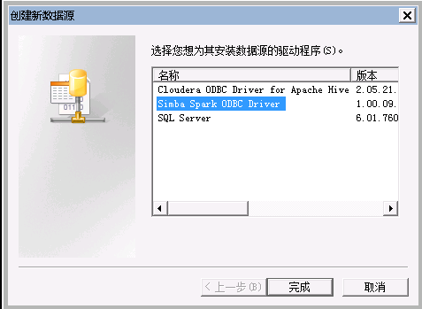
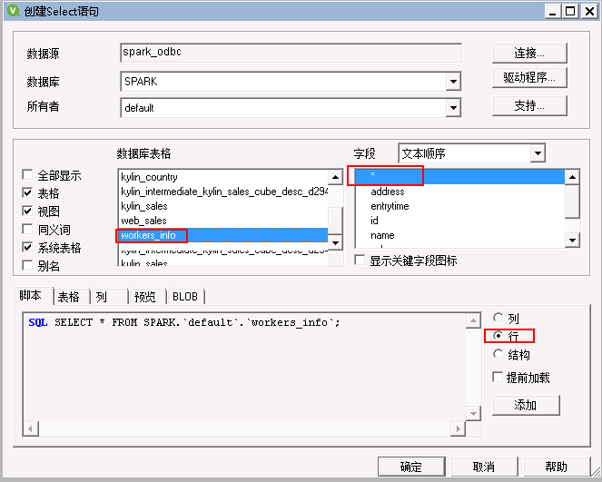

# QlikView对接FusionInsight

## 适用场景

> QlikView 12 <-> FusionInsight HD V100R002C60U20

## 配置Windows的kerberos认证

* 下载并安装MIT Kerberos，地址：<http://web.mit.edu/kerberos/dist/#kfw-4.0>

* 版本与操作系统位数保持一致，本文版本kfw-4.1-amd64.msi。

* 确认客户端机器的时间与FusionInsight HD集群的时间一致，时间差要小于5分钟

* 设置Kerberos的配置文件

  在FusionInsight Manager创建一个角色与“机机”用户，具体请参见《FusionInsight HD管理员指南》的**创建用户**章节。角色需要根据业务需要授予Hive的访问权限，并将用户加入角色。例如，创建用户“sparkdemo”并下载对应的keytab文件user.keytab以及krb5.conf文件，把krb5.conf文件重命名为krb5.ini，并放到C:\ProgramData\MIT\Kerberos5目录中。

* 设置Kerberos票据的缓存文件

  * 创建存放票据的目录，例如`C:\temp`。

  * 设置Windows的系统环境变量，变量名为“KRB5CCNAME”，变量值为`C:\temp\krb5cache`

    

  * 重启机器。

* 在Windows上进行认证

  * 使用命令行进入到MIT Kerberos安装路径，找到可执行文件kinit.exe，例如本文路径为：`C:\Program Files\MIT\Kerberos\bin`

  * 执行如下命令：
    ```
    kinit -k -t /path_to_userkeytab/user.keytab UserName
    ```

    其中path_to_userkeytab为存放用户keytab文件的路径，user.keytab为用户的keytab，UserName为用户名。


## 配置Hive数据源

QlikView中配置Hive数据源，对接Hive的ODBC接口

### 下载安装Hive ODBC驱动

  从以下地址下载驱动根据操作系统类型选择对应的ODBC版本，下载并安装： [下载地址](http://www.cloudera.com/content/cloudera/en/downloads/connectors/hive/odbc/hive-odbc-v2-5-15.html)

### 配置用户DSN

* 在OBDC数据源管理器页面的用户DSN标签页中，点击添加，配置用户数据源。

  

* 在 **创建数据源** 页面，找到 **Cloudera ODBC Driver for Apache Hive**，选中后点击 **完成**。

  

* 配置Hive数据源。

    * Data Source Name：为自定义参数
    * Host(s)： HiveServer的业务ip
    * Port： Hive Service端口，21066
    * Mechanism： Kerberos
    * Host FQDN： hadoop.hadoop.com
    * Service Name： hive
    * Realm： 留空

    

* 点击 **Test** 连接成功则表示配置成功，点击 **OK**

    

### 连接Hive数据源

* 打开QlikView 12，**新建** 一个文档

  

* 关闭弹出的入门向导

  

* 在工具栏中打开 **编辑脚本** 按钮

  

* 在弹出的 **编辑脚本** 页面下方，点击 **数据** 标签页，在 **数据库** 的下拉栏中找到 **OCBC**，点击 **连接**；

  

* 在**连接到数据源**页面，选择上面配置的数据源hive_odbc，然后点击**确定**；

  

* 在 **编辑脚本** 页面的 **数据** 标签页中，点击 **选择** 按钮

  

* 在 **创建Select语句** 页面中，选择想要导入的 **数据库表格**，在 **字段** 中选择*，则导入完整表格，其余选项则导入其对应的表格，然后点击 **确定**（示例中选择*）；

  

* 回到 **编辑脚本** 页面，点击 **确定**

  

* 回到QlikView工作表页面，点击 **重新加载**，则可以将数据库表格导入到QlikView中。

  

* 然后可以对数据进行制图制表分析等处理，具体步骤可以参考QlikView官网的使用指南。

  


## 配置Spark数据源

QlivView中配置Spark数据源，对接SparkSQL的thrift接口。

### 下载安装Spark的ODBC驱动

* 在Simba官网下载Spark ODBC驱动，根据用户自身操作系统选择32bit或64bit，Data Source选择Spark
    SQL，地址：<http://www.tableau.com/support/drivers>

* 根据安装客户端提示安装客户端。

### 配置用户DSN

* 在 **OBDC数据源管理器** 页面的 **用户DSN** 标签页中，点击 **添加**，配置用户数据源。

  

* 在 **创建数据源** 页面，找到 **Simba Spark ODBC Driver**，选中后点击 **完成**。

  

* 在 **Simba Spark ODBC Driver DSN Setup** 页面中配置Spark数据源。

    * Data Source Name： 自定义
    * Mechanism： Kerberos
    * Host FQDN： hadoop.hadoop.com
    * Service Name： spark
    * Realm： 留空，
    * Host(s)： JDBCServer(主)的业务ip，
    * Port： SparkThriftServer客户端端口号23040。

    

* 设置完毕后点击 **Advanced Options**，在弹出的 **Advanced Options** 页面中，勾选 **Use Native Query** 和 **Get Tables With Query**，然后点击 **OK**

    

* 回到 **Simba Spark ODBC Driver DSN Setup**，点击 **Test** 连接成功，点击 **OK** 退出页面，否则将弹出失败对话框。

  

* 回到 **Simba Spark ODBC Driver DSN Setup** 页面，点击 **OK**，回到 **ODBC数据源管理器** 页面，点击 **确定** 完成并退出配置。

  

### 连接Spark数据源

* 打开QlikView 12，**新建** 一个文档

  

* 关闭弹出的入门向导

  

* 在工具栏中打开 **编辑脚本** 按钮

  

* 在弹出的 **编辑脚本** 页面下方，点击 **数据** 标签页，在 **数据库** 的下拉栏中找到 **OCBC**，点击 **连接**；

  

* 在 **连接到数据源** 页面，选择上面配置的数据源spark_odbc，然后点击 **确定**；

  

* 在 **编辑脚本** 页面的 **数据** 标签页中，点击 **选择** 按钮

  

* 在 **创建Select语句** 页面中，选择想要导入的 **数据库表格**，在 **字段** 中选择*，则导入完整表格，其余选项则导入其对应的表格，然后点击 **确定** （示例中选择*）；

  

* 回到 **编辑脚本** 页面，点击 **确定**

  

* 回到QlikView工作表页面，点击 **重新加载**，则可以将数据库表格导入到QlikView中。

  

* 然后可以对数据进行制图制表分析等处理，具体步骤可以参考QlikView官网的使用指南。

  


## FAQ

* 找不到C:\ProgramData\MIT\Kerberos5文件夹

  C:\ProgramData一般属于隐藏文件夹，设置文件夹隐藏可见或者使用搜索功能即可解决问题。

* 连接成功无数据库权限

  连接所使用的用户需要有数据库的权限，否则将导致ODBC连接成功却无法读取数据库内容。

* ODBC连接失败

  常见情况是 **Host(s)** 、 **Port** 、 **Host FQDN** 的输入数据有误，请根据实际情况进行录入
