# RSutdio对接FusionInsight Spark

## 适用场景

> R-3.4.1  <--> FusionInsight HD V100R002C60U10
>
> R-3.4.1  <--> FusionInsight HD V100R002C70SPC100

## 对接方式
RStudio与Spark集成有两种方式：

* 通过RStudio官方发布的sparklyr与Spark进行集成

  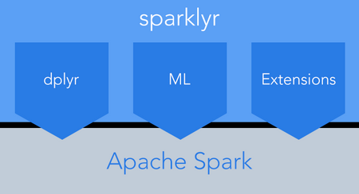

* 通过Apache Spark社区发布的SparkR进行集成

  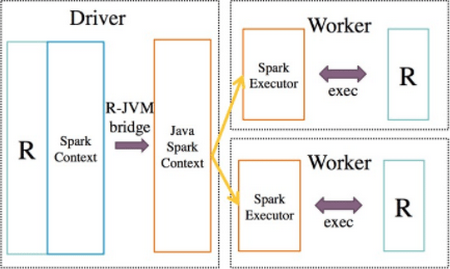

本文档包含了两种方式对接的步骤, 相关对接步骤如下：

- [安装R](#安装r)
- [安装RStudio Server](#安装rstudio-server)
- [安装FusionInsight客户端](#安装fusioninsight客户端)
- [使用SparkR与RStudio集成进行分析](#使用sparkr与rstudio集成进行分析)
  - [在RStudio中使用SparkR进行数据分析](#在rstudio中使用sparkr进行数据分析)
- [使用RStudio Sparklyr和Spark集成进行分析](#使用rstudio-sparklyr和spark集成进行分析)
  - [使用sparklyr结合spark进行数据分析babynames数据集](#使用sparklyr结合spark进行数据分析babynames数据集)
  - [使用sparklyr结合spark进行数据分析航空公司飞行数据(必须配套Spark2x)](#使用sparklyr结合spark进行数据分析航空公司飞行数据必须配套spark2x)

## 安装R
由于Spark的Executor上也需要执行R，所以除了在RStudio的节点上安装R以外，所有FusionInsight集群节点上也要安装同版本的R，安装步骤如下：

> 本文使用的RStudio节点为Redhat7.1，FusionInsight集群节点为Redhat6.6

* 配置redhat的yum源，国内可以配置[aliyun的源](#配置aliyun的源)或者[163的源](#配置163的源)
* [配置EPEL的源](#配置epel的源)
* [安装R-3.4.1](#安装r-341)

### 配置aliyun的源

* 配置好Redhat7.1的yum源

  ```
  cd ~
  rpm -qa|grep yum|xargs rpm -e --nodeps
  rpm -qa|grep python-urlgrabber|xargs rpm -e --nodeps
  wget https://mirrors.aliyun.com/centos/7/os/x86_64/Packages/yum-metadata-parser-1.1.4-10.el7.x86_64.rpm
  wget https://mirrors.aliyun.com/centos/7/os/x86_64/Packages/yum-3.4.3-150.el7.centos.noarch.rpm
  wget https://mirrors.aliyun.com/centos/7/os/x86_64/Packages/yum-rhn-plugin-2.0.1-6.el7.noarch.rpm
  wget https://mirrors.aliyun.com/centos/7/os/x86_64/Packages/yum-plugin-fastestmirror-1.1.31-40.el7.noarch.rpm
  wget https://mirrors.aliyun.com/centos/7/os/x86_64/Packages/python-urlgrabber-3.10-8.el7.noarch.rpm
  rpm -ivh *.rpm
  cd /etc/yum.repos.d/
  wget https://mirrors.aliyun.com/repo/Centos-7.repo
  sed -i 's/$releasever/7/g' /etc/yum.repos.d/Centos-7.repo
  yum clean
  yum makecache
  ```

### 配置163的源

* 配置好Redhat6.6的yum源

  ```
  cd ~
  rpm -aq | grep yum | xargs rpm -e --nodeps
  wget http://mirrors.163.com/centos/6/os/x86_64/Packages/python-iniparse-0.3.1-2.1.el6.noarch.rpm
  wget http://mirrors.163.com/centos/6/os/x86_64/Packages/yum-metadata-parser-1.1.2-16.el6.x86_64.rpm
  wget http://mirrors.163.com/centos/6/os/x86_64/Packages/yum-3.2.29-81.el6.centos.noarch.rpm
  wget http://mirrors.163.com/centos/6/os/x86_64/Packages/yum-plugin-fastestmirror-1.1.30-40.el6.noarch.rpm
  wget http://mirrors.163.com/centos/6/os/x86_64/Packages/python-urlgrabber-3.9.1-11.el6.noarch.rpm
  rpm -ivh python-iniparse-0.3.1-2.1.el6.noarch.rpm
  rpm -ivh yum-metadata-parser-1.1.2-16.el6.x86_64.rpm
  rpm -U python-urlgrabber-3.9.1-11.el6.noarch.rpm
  rpm -ivh yum-3.2.29-81.el6.centos.noarch.rpm yum-plugin-fastestmirror-1.1.30-40.el6.noarch.rpm
  cd /etc/yum.repos.d/
  wget http://mirrors.163.com/.help/CentOS6-Base-163.repo
  sed -i 's/$releasever/6/g' /etc/yum.repos.d/CentOS6-Base-163.repo
  yum clean all
  yum makecache
  ```

### 配置EPEL的源

* 安装EPEL源

  Redhat 6.x 使用下面命令安装
  ```
  rpm -Uvh https://mirrors.tuna.tsinghua.edu.cn/epel//6/x86_64/epel-release-6-8.noarch.rpm
  ```

  Redhat 7.x 使用下面命令安装
  ```
  rpm -Uvh https://mirrors.tuna.tsinghua.edu.cn/epel//7/x86_64/e/epel-release-7-10.noarch.rpm
  ```

* 更新cache
  ```
  yum clean all
  yum makecache
  ```

### 安装R-3.4.1

* 执行`yum install R` 安装R的相关的包

* 执行`R`，检查R是否可用

  正常启动如下图所示

  

## 安装RStudio Server

* 下载并安装RStudio Server
  ```
  wget https://download2.rstudio.org/rstudio-server-rhel-1.0.153-x86_64.rpm
  yum install --nogpgcheck rstudio-server-rhel-1.0.153-x86_64.rpm
  ```

* 使用 `vi /etc/rstudio/rserver.conf` 修改RStudio的配置文件，指定RStudio Server使用的R的路径
  ```
  rsession-which-r=/usr/bin/R
  ```

  

* 重启rstudio-server后，查看服务是否正常
  ```
  sudo systemctl restart rstudio-server
  sudo systemctl status rstudio-server
  ```

* 服务正常启动如下

  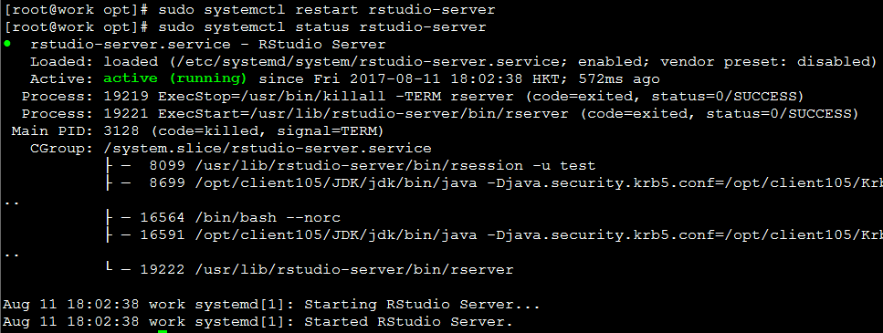

* 由于RStudio Server不允许使用root用户登陆，需要新建一个普通用户用于Web界面的登陆
  ```
  useradd -d /home/test -m test
  passwd test
  ```

* 用户新建完成后，关闭防火墙，然后使用本机ip:8787端口访问RStudio Server，使用新建的test用户登陆即可进入RStudio的Web开发界面
  ```
  sudo systemctl stop firewalld
  ```

  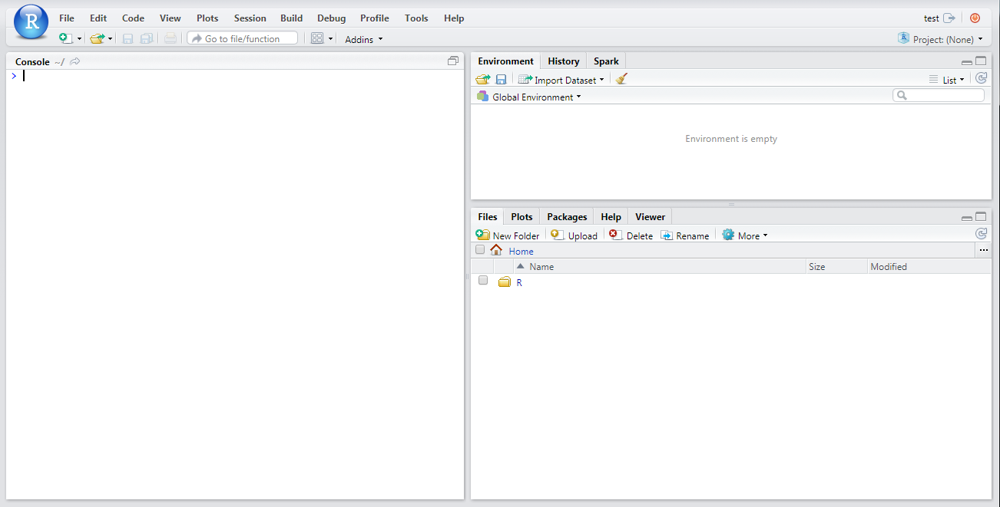

## 安装FusionInsight客户端

* 登录FusionInsight Manager系统，单击 **服务管理** ，在菜单栏中单击 **下载客户端**, 客户端类型勾选 **完整客户端**, 是否在集群的节点中生成客户端文件选择 **否**
* 使用WinSCP工具将下载下来的软件包上传到Linux服务器的目录，例如 `/tmp/client`
* 切换到新建的test用户
  ```
  su test
  ```

* 解压软件包。进入安装包所在目录，例如 `/tmp/client` 。执行如下命令解压安装包到本地目录
  ```
  cd /tmp/client
  tar -xvf FusionInsight_V100R002C60U20_Services_Client.tar
  tar -xvf FusionInsight_V100R002C60U20_Services_ClientConfig.tar
  ```

* 进入安装包所在目录，执行如下命令安装客户端到指定目录（绝对路径），例如安装到 `/home/test/hadoopclient` 目录
  ```
  cd /opt/tmp/FusionInsight_V100R002C60U20_Services_ClientConfig
  ./install.sh /home/test/hadoopclient
  ```

* 客户端将被安装到 `/home/test/hadoopclient` 目录中

* 检查客户端节点与FusionInsight集群时间同步（差距不能超过5分钟）

* 检查SparkR是否可用

  使用sparkuser进行Kerberos认证(sparkuser为FusionInsight中创建的拥有Spark访问权限的人机用户)
  ```
  cd /home/test/hadoopclient
  source bigdata_env
  kinit sparkuser
  ```

  执行`sparkR`启动SparkR, 正常启动出现以下界面

  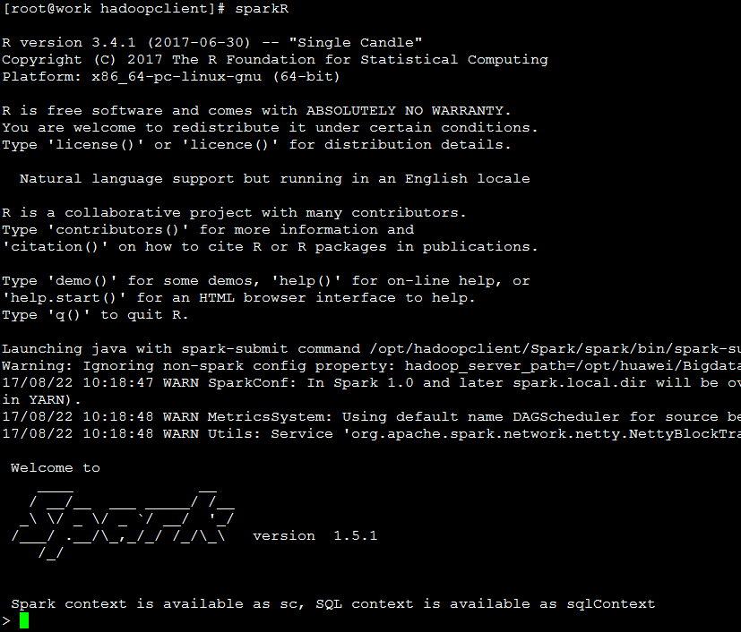

## 使用SparkR与RStudio集成进行分析

* 使用新建的用户登陆即可进入RStudio的Web开发界面
* 选择 **Tools** 菜单下的 **Shell** 进入登陆用户的shell进行kerberos认证
  ```
  cd /home/test/hadoopclient
  source bigdata_env
  kinit sparkuser
  ```

* 在RStudio界面中配置环境变量，初始化SparkR
  ```
  Sys.setenv("SPARKR_SUBMIT_ARGS"="--master yarn-client --num-executors 1 sparkr-shell")
  Sys.setenv(SPARK_HOME="/home/test/hadoopclient/Spark/spark")
  Sys.setenv(JAVA_HOME="/home/test/hadoopclient/JDK/jdk")
  .libPaths(c(file.path(Sys.getenv("SPARK_HOME"), "R","lib"), .libPaths()))
  library(SparkR)
  sc <- sparkR.init(master = "yarn-client", sparkPackages = "com.databricks:spark-csv_2.10:1.2.0")
  sqlContext <- sparkRSQL.init(sc)
  ```

* 初始化成功后如下图

  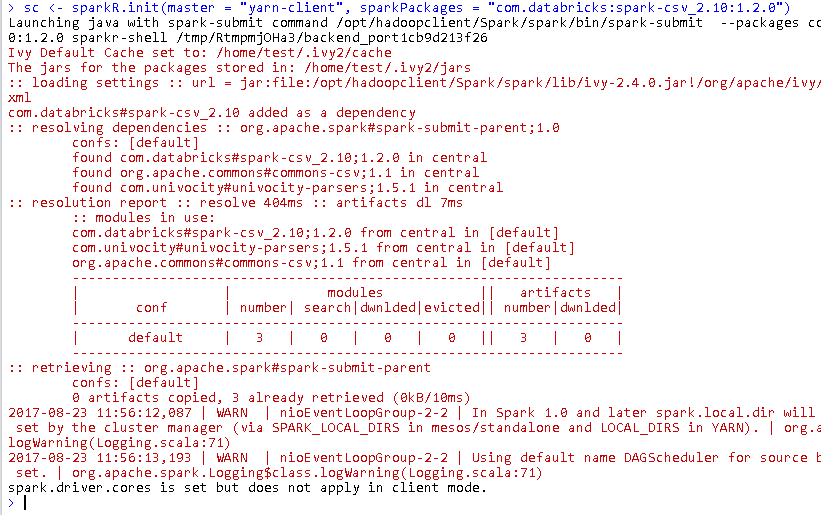

  在Yarn的ResourceManager界面可以看到sparkuser在集群启动了一个SparkR的应用

  

### 在RStudio中使用SparkR进行数据分析

* R DataFrame 转化为SparkR DataFrame
  ```
  df <- createDataFrame(sqlContext, faithful)
  head(df)
  ```

  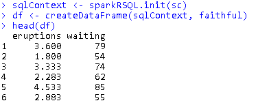

* 通过JSON文件加载数据进行分析处理

  将测试数据put到HDFS中
  ```
  wget https://raw.githubusercontent.com/eBay/Spark/master/examples/src/main/resources/people.json
  hdfs dfs -put people.json /user/sparkuser/
  ```

  执行文件加载分析
  ```
  people <- read.df(sqlContext, "/user/sparkuser/people.json", "json")
  head(people)
  printSchema(people)
  ```

  

* 从Hive表中加载数据进行分析
  ```
  hiveContext <- sparkRHive.init(sc)
  results <- sql(hiveContext, "SELECT * FROM employees")
  head(results)
  ```

  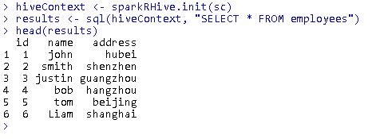

* DataFrame Operations
  * Selecting rows, columns
    ```
    df <- createDataFrame(sqlContext, faithful)
    df
    head(select(df, df$eruptions))
    head(select(df, "eruptions"))
    head(filter(df, df$waiting < 50))
    ```

    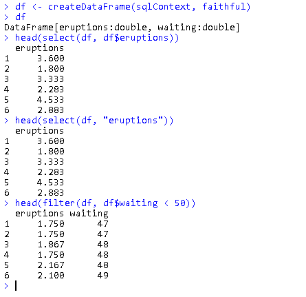

  * Grouping, Aggregation
    ```
    head(summarize(groupBy(df, df$waiting), count = n(df$waiting)))
    waiting_counts <- summarize(groupBy(df, df$waiting), count = n(df$waiting))
    head(arrange(waiting_counts, desc(waiting_counts$count)))
    ```

    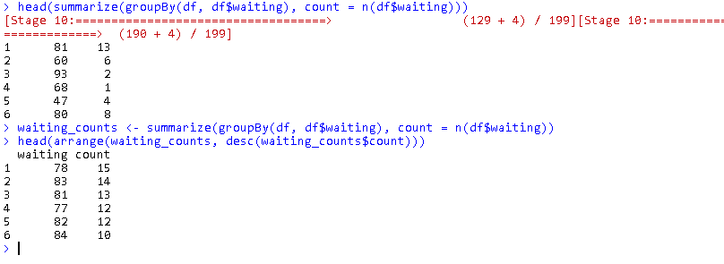

  * Operating on Columns
    ```
    df$waiting_secs <- df$waiting * 60
    head(df)
    ```
    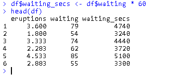

* Running SQL Queries from SparkR
  ```
  people <- read.df(sqlContext, "/user/sparkuser/people.json", "json")
  registerTempTable(people, "people")
  teenagers <- sql(sqlContext, "SELECT name FROM people WHERE age >= 13 AND age <= 19")
  head(teenagers)
  ```

  

* Machine Learning
  ```
  df <- createDataFrame(sqlContext, iris)
  model <- glm(Sepal_Length ~ Sepal_Width + Species, data = df, family = "gaussian")
  summary(model)
  predictions <- predict(model, newData = df)
  head(select(predictions, "Sepal_Length", "prediction"))
  ```
  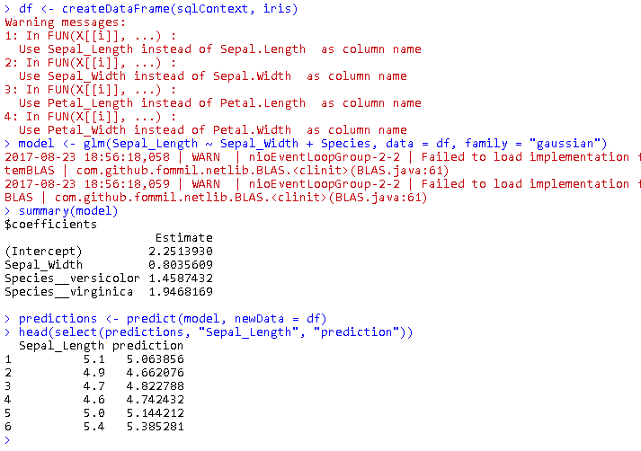

## 使用RStudio Sparklyr和Spark集成进行分析

* 选择 **Tools** 菜单下的 **Shell** 进入登陆用户的shell进行kerberos认证
  ```
  cd /home/test/hadoopclient
  source bigdata_env
  kinit sparkuser
  ```

* 在RStudio中执行下面的命令，安装所需的library
  ```
  install.packages("sparklyr")
  install.packages("dplyr")
  install.packages("ggplot2")
  install.packages("babynames")
  install.packages("dygraphs")
  install.packages("rbokeh")
  ```

* 通过spark_connect连接spark集群
  ```
  library(sparklyr)
  library(dplyr)
  library(ggplot2)
  options(bitmapType = 'cairo')
  Sys.setenv(JAVA_HOME="/home/test/hadoopclient/JDK/jdk")
  Sys.setenv(SPARK_HOME="/home/test/hadoopclient/Spark2x/spark")
  Sys.setenv(SPARK_HOME_VERSION="2.1.0")
  sc <- spark_connect(master =  "yarn-client", version = "2.1.0", spark_home = "/home/test/hadoopclient/Spark2x/spark")
  ```

  > 这里如果SPARK_HOME指向/home/test/hadoopclient/Spark/spark，同时设置version为1.6.1，则会对接上1.5.1的Spark
  >
  > sparklyr官方支持是1.6.1以上的Spark，这里强制指定version为1.6.1，主要功能均正常，部分Spark1.6.1支持而1.5.1不支持的特性执行会失败

  启动成功后，在FusionInsgiht的Yarn的ResourceManager页面可以看到sparklyr的任务已经启动

  

  在RStudio的Spark面板刷新一下，可以看到所有hive的表

  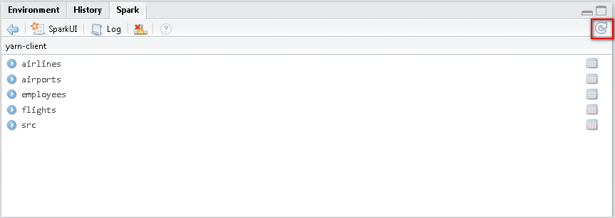

  选择hive表右边的数据图表可以预览表中的数据

  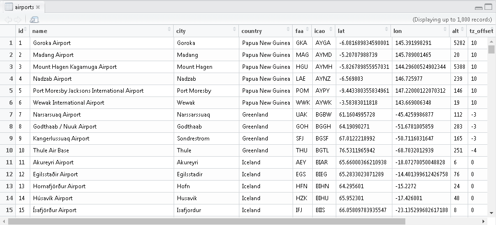

### 使用sparklyr结合spark进行数据分析babynames数据集

Use dplyr syntax to write Apache Spark SQL queries. Use select, where, group by, joins, and window functions in Aparche Spark SQL.

**Setup**

```
library(sparklyr)
library(dplyr)
library(babynames)
library(ggplot2)
library(dygraphs)
library(rbokeh)
knitr::opts_chunk$set(message = FALSE, warning = FALSE)
```

**Connect to Spark**

```
options(bitmapType = 'cairo')
Sys.setenv(JAVA_HOME="/home/test/hadoopclient/JDK/jdk")
Sys.setenv(SPARK_HOME="/home/test/hadoopclient/Spark/spark")
Sys.setenv(SPARK_HOME_VERSION="1.6.1")
sc <- spark_connect(master =  "yarn-client", version = "1.6.1", spark_home = "/home/test/hadoopclient/Spark/spark")
```

**Total US births**

Plot total US births recorded from the Social Security Administration.

```
birthsYearly <- applicants_tbl %>%
  mutate(male = ifelse(sex == "M", n_all, 0), female = ifelse(sex == "F", n_all, 0)) %>%
  group_by(year) %>%
  summarize(Male = sum(male) / 1000000, Female = sum(female) / 1000000) %>%
  arrange(year) %>%
  collect
birthsYearly %>%
  dygraph(main = "Total US Births (SSN)", ylab = "Millions") %>%
  dySeries("Female") %>%
  dySeries("Male") %>%
  dyOptions(stackedGraph = TRUE) %>%
  dyRangeSelector(height = 20)
```

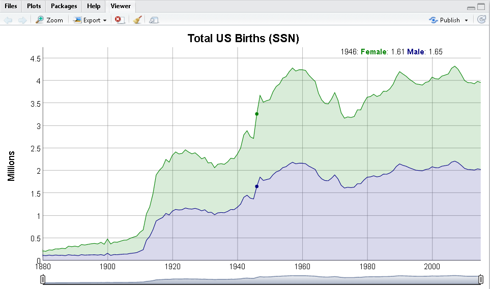

**Aggregate data by name**

Use Spark SQL to create a look up table. Register and cache the look up table in Spark for future queries.

```
topNames_tbl <- babynames_tbl %>%
  filter(year >= 1986) %>%  
  group_by(name, sex) %>%
  summarize(count = as.numeric(sum(n))) %>%
  filter(count > 1000) %>%
  select(name, sex)
filteredNames_tbl <- babynames_tbl %>%
  filter(year >= 1986) %>%
  inner_join(topNames_tbl)
yearlyNames_tbl <- filteredNames_tbl %>%
  group_by(year, name, sex) %>%
  summarize(count = as.numeric(sum(n)))
sdf_register(yearlyNames_tbl, "yearlyNames")
```

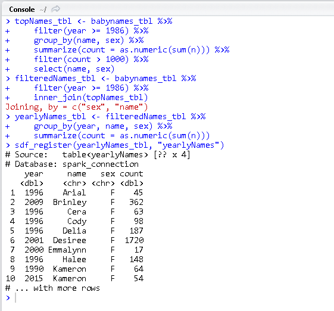

```
tbl_cache(sc, "yearlyNames")
```

**Most popular names (1986)**

Identify the top 5 male and female names from 1986. Visualize the popularity trend over time.

```
topNames1986_tbl <- yearlyNames_tbl %>%
  filter(year == 1986) %>%
  group_by(name, sex) %>%
  summarize(count = sum(count)) %>%
  group_by(sex) %>%
  mutate(rank = min_rank(desc(count))) %>%
  filter(rank < 5) %>%
  arrange(sex, rank) %>%
  select(name, sex, rank) %>%
  sdf_register("topNames1986")
tbl_cache(sc, "topNames1986")
topNames1986Yearly <- yearlyNames_tbl %>%
  inner_join(select(topNames1986_tbl, sex, name)) %>%
  collect
ggplot(topNames1986Yearly, aes(year, count, color=name)) +
  facet_grid(~sex) +
  geom_line() +
  ggtitle("Most Popular Names of 1986")
```

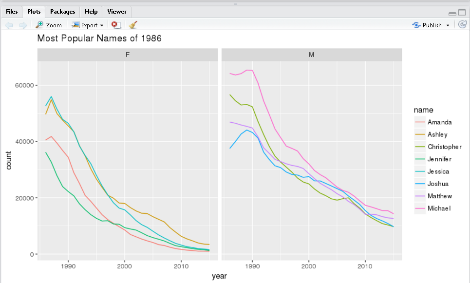

**Most popular names (2014)**

Identify the top 5 male and female names from 2014. Visualize the popularity trend over time.

```
topNames2014_tbl <- yearlyNames_tbl %>%
  filter(year == 2014) %>%
  group_by(name, sex) %>%
  summarize(count = sum(count)) %>%
  group_by(sex) %>%
  mutate(rank = min_rank(desc(count))) %>%
  filter(rank < 5) %>%
  arrange(sex, rank) %>%
  select(name, sex, rank) %>%
  sdf_register("topNames2014")
tbl_cache(sc, "topNames2014")
topNames2014Yearly <- yearlyNames_tbl %>%
  inner_join(select(topNames2014_tbl, sex, name)) %>%
  collect
ggplot(topNames2014Yearly, aes(year, count, color=name)) +
  facet_grid(~sex) +
  geom_line() +
  ggtitle("Most Popular Names of 2014")
```

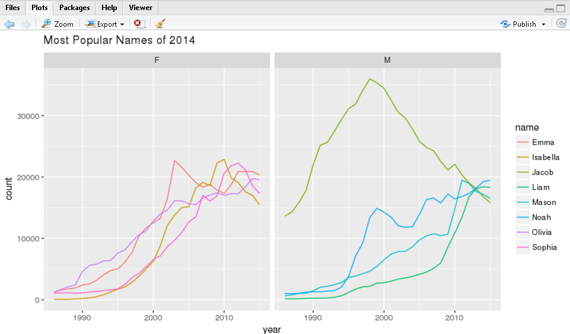

**Shared names**

Visualize the most popular names that are shared by both males and females.

```
sharedName <- babynames_tbl %>%
  mutate(male = ifelse(sex == "M", n, 0), female = ifelse(sex == "F", n, 0)) %>%
  group_by(name) %>%
  summarize(Male = as.numeric(sum(male)),
            Female = as.numeric(sum(female)),
            count = as.numeric(sum(n)),
            AvgYear = round(as.numeric(sum(year * n) / sum(n)),0)) %>%
  filter(Male > 30000 & Female > 30000) %>%
  collect
figure(width = NULL, height = NULL,
       xlab = "Log10 Number of Males",
       ylab = "Log10 Number of Females",
       title = "Top shared names (1880 - 2014)") %>%
  ly_points(log10(Male), log10(Female), data = sharedName,
            color = AvgYear, size = scale(sqrt(count)),
            hover = list(name, Male, Female, AvgYear), legend = FALSE)
```

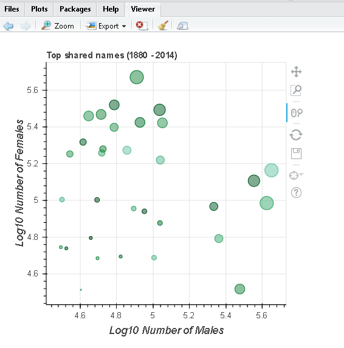

### 使用sparklyr结合spark进行数据分析航空公司飞行数据(必须配套Spark2x)

> **Train a linear model** step will failed in Spark 1.5.1, because Spark 1.5.1 does not support the coefficients method for linear model output

Is there evidence to suggest that some airline carriers make up time in flight? This analysis predicts time gained in flight by airline carrier.

**Connect to spark2x**
```
library(sparklyr)
library(dplyr)
library(ggplot2)
options(bitmapType = 'cairo')
Sys.setenv(JAVA_HOME="/home/test/hadoopclient/JDK/jdk")
Sys.setenv(SPARK_HOME="/home/test/hadoopclient/Spark2x/spark")
Sys.setenv(SPARK_HOME_VERSION="2.1.0")
sc <- spark_connect(master =  "yarn-client", version = "2.1.0", spark_home = "/home/test/hadoopclient/Spark2x/spark")
```

**Cache the tables into memory**

Use `tbl_cache` to load the flights table into memory. Caching tables will make analysis much faster. Create a dplyr reference to the Spark DataFrame.
```
# Cache flights Hive table into Spark
tbl_cache(sc, 'flights')
flights_tbl <- tbl(sc, 'flights')

# Cache airlines Hive table into Spark
tbl_cache(sc, 'airlines')
airlines_tbl <- tbl(sc, 'airlines')

# Cache airports Hive table into Spark
tbl_cache(sc, 'airports')
airports_tbl <- tbl(sc, 'airports')
```

**Create a model data set**

Filter the data to contain only the records to be used in the fitted model. Join carrier descriptions for reference. Create a new variable called gain which represents the amount of time gained (or lost) in flight.

```
# Filter records and create target variable 'gain'
model_data <- flights_tbl %>%
filter(!is.na(arrdelay) & !is.na(depdelay) & !is.na(distance)) %>%
filter(depdelay > 15 & depdelay < 240) %>%
filter(arrdelay > -60 & arrdelay < 360) %>%
filter(year >= 2003 & year <= 2007) %>%
left_join(airlines_tbl, by = c("uniquecarrier" = "code")) %>%
mutate(gain = depdelay - arrdelay) %>%
select(year, month, arrdelay, depdelay, distance, uniquecarrier, description, gain)

# Summarize data by carrier
model_data %>%
group_by(uniquecarrier) %>%
summarize(description = min(description), gain=mean(gain),
          distance=mean(distance), depdelay=mean(depdelay)) %>%
select(description, gain, distance, depdelay) %>%
arrange(gain)
```

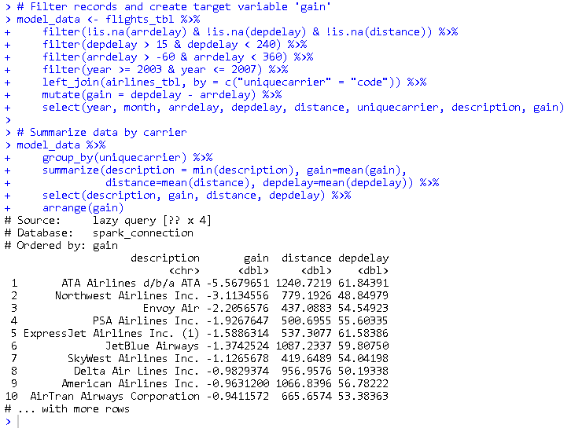

**Train a linear model**

Predict time gained or lost in flight as a function of distance, departure delay, and airline carrier.

```
# Partition the data into training and validation sets
model_partition <- model_data %>%
sdf_partition(train = 0.8, valid = 0.2, seed = 5555)

# Fit a linear model
ml1 <- model_partition$train %>%
ml_linear_regression(gain ~ distance + depdelay + uniquecarrier)

# Summarize the linear model
summary(ml1)
```

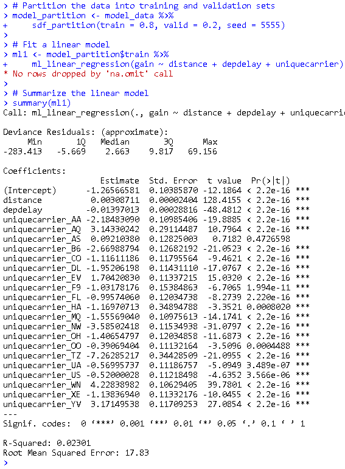

**  Assess model performance**

Compare the model performance using the validation data.
```
# Calculate average gains by predicted decile
model_deciles <- lapply(model_partition, function(x) {
  sdf_predict(ml1, x) %>%
    mutate(decile = ntile(desc(prediction), 10)) %>%
    group_by(decile) %>%
    summarize(gain = mean(gain)) %>%
    select(decile, gain) %>%
    collect()
})

# Create a summary dataset for plotting
deciles <- rbind(
  data.frame(data = 'train', model_deciles$train),
  data.frame(data = 'valid', model_deciles$valid),
  make.row.names = FALSE
)

# Plot average gains by predicted decile
deciles %>%
  ggplot(aes(factor(decile), gain, fill = data)) +
  geom_bar(stat = 'identity', position = 'dodge') +
  labs(title = 'Average gain by predicted decile', x = 'Decile', y = 'Minutes')
```

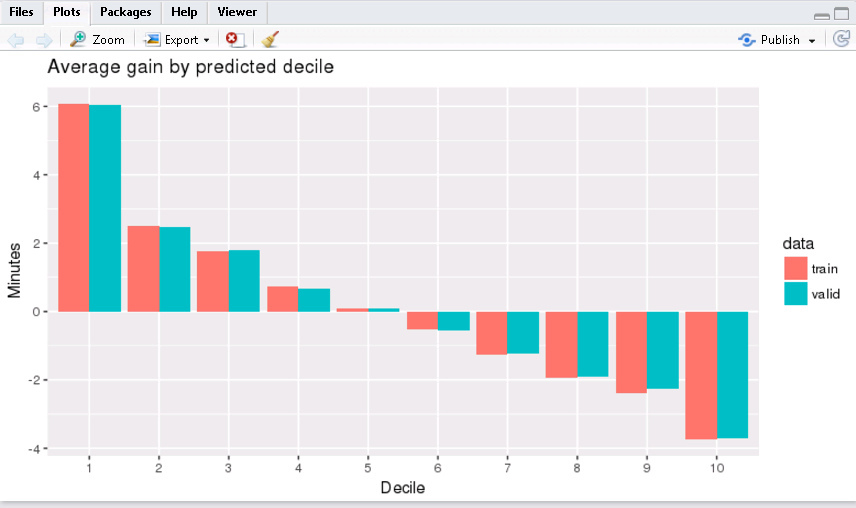

**Visualize predictions**

Compare actual gains to predicted gains for an out of time sample.
```
# Select data from an out of time sample
data_2008 <- flights_tbl %>%
  filter(!is.na(arrdelay) & !is.na(depdelay) & !is.na(distance)) %>%
  filter(depdelay > 15 & depdelay < 240) %>%
  filter(arrdelay > -60 & arrdelay < 360) %>%
  filter(year == 2008) %>%
  left_join(airlines_tbl, by = c("uniquecarrier" = "code")) %>%
  mutate(gain = depdelay - arrdelay) %>%
  select(year, month, arrdelay, depdelay, distance, uniquecarrier, description, gain, origin,dest)

# Summarize data by carrier
carrier <- sdf_predict(ml1, data_2008) %>%
  group_by(description) %>%
  summarize(gain = mean(gain), prediction = mean(prediction), freq = n()) %>%
  filter(freq > 10000) %>%
  collect

# Plot actual gains and predicted gains by airline carrier
ggplot(carrier, aes(gain, prediction)) +
  geom_point(alpha = 0.75, color = 'red', shape = 3) +
  geom_abline(intercept = 0, slope = 1, alpha = 0.15, color = 'blue') +
  geom_text(aes(label = substr(description, 1, 20)), size = 3, alpha = 0.75, vjust = -1) +
  labs(title='Average Gains Forecast', x = 'Actual', y = 'Predicted')
```

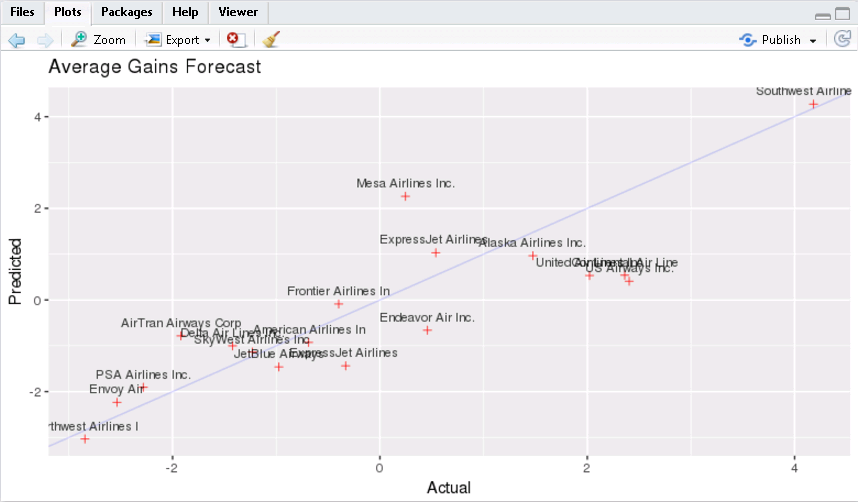

Some carriers make up more time than others in flight, but the differences are relatively small. The average time gains between the best and worst airlines is only six minutes. The best predictor of time gained is not carrier but flight distance. The biggest gains were associated with the longest flights.

## FAQ

### FusionInsight集群不允许访问网络，如何安装R

* 在集群外同版本的Redhat版本下按照[配置EPEL的源安装R](#配置epel的源安装r)进行操作，最后一步不要执行`yum install R`
* 执行`yum install yum-utils`安装yumdownloader
* 执行`yumdownloader R --resolve --destdir=/tmp/packages`把所有的rpm安装包下载到`/tmp/packages`中
* 将`/tmp/packages`中的所有rpm包复制到集群每个节点的`/tmp/packages`中
* 切换到集群每个节点的`/tmp/packages`中，执行`yum localinstall *.rpm`完成安装

### 安装sparklyr报错configuration failed for package ‘openssl’

- 操作系统需要执行`yum install openssl-devel`安装openssl-devel

### 如何获取本文中使用sparklyr分析的源数据

* 执行以下shell脚本获取待分析的数据
  ```shell
  # Make download directory
  mkdir /tmp/flights

  # Download flight data by year
  for i in {2006..2008}
    do
      echo "$(date) $i Download"
      fnam=$i.csv.bz2
      wget -O /tmp/flights/$fnam http://stat-computing.org/dataexpo/2009/$fnam
      echo "$(date) $i Unzip"
      bunzip2 /tmp/flights/$fnam
    done

  # Download airline carrier data
  wget --no-check-certificate -O /tmp/airlines.csv http://www.transtats.bts.gov/Download_Lookup.asp?Lookup=L_UNIQUE_CARRIERS

  # Download airports data
  wget --no-check-certificate -O /tmp/airports.csv https://raw.githubusercontent.com/jpatokal/openflights/master/data/airports.dat
  ```

* 将下载下来的/tmp/flights目录以及/tmp/airlines.csv，/tmp/airports.csv文件上传到HDFS的/user/sparkuser目录中，然后在Hive中创建三张表，将数据加载到对应的表中

  ```
  hdfs dfs -mkdir /user/sparkuser/flights
  hdfs dfs -put flights/* /user/sparkuser/flights/
  hdfs dfs -put airlines.csv /user/sparkuser/
  hdfs dfs -put airports.csv /user/sparkuser/
  ```

  ```sql
  CREATE EXTERNAL TABLE IF NOT EXISTS flights
  (
    year int,
    month int,
    dayofmonth int,
    dayofweek int,
    deptime int,
    crsdeptime int,
    arrtime int,
    crsarrtime int,
    uniquecarrier string,
    flightnum int,
    tailnum string,
    actualelapsedtime int,
    crselapsedtime int,
    airtime string,
    arrdelay int,
    depdelay int,
    origin string,
    dest string,
    distance int,
    taxiin string,
    taxiout string,
    cancelled int,
    cancellationcode string,
    diverted int,
    carrierdelay string,
    weatherdelay string,
    nasdelay string,
    securitydelay string,
    lateaircraftdelay string
  )
  ROW FORMAT DELIMITED
  FIELDS TERMINATED BY ','
  LINES TERMINATED BY '\n'
  STORED AS TEXTFILE
  TBLPROPERTIES("skip.header.line.count"="1");
  ```

  ```sql
  LOAD DATA INPATH '/user/sparkuser/flights/2006.csv' INTO TABLE flights;
  LOAD DATA INPATH '/user/sparkuser/flights/2007.csv' INTO TABLE flights;
  LOAD DATA INPATH '/user/sparkuser/flights/2008.csv' INTO TABLE flights;
  ```

  ```sql
  CREATE EXTERNAL TABLE IF NOT EXISTS airlines
  (
  Code string,
  Description string
  )
  ROW FORMAT SERDE 'org.apache.hadoop.hive.serde2.OpenCSVSerde'
  WITH SERDEPROPERTIES
  (
  "separatorChar" = '\,',
  "quoteChar"     = '\"'
  )
  STORED AS TEXTFILE
  tblproperties("skip.header.line.count"="1");
  ```

  ```sql
  LOAD DATA INPATH '/user/sparkuser/airlines.csv' INTO TABLE airlines;
  ```

  ```sql
  CREATE EXTERNAL TABLE IF NOT EXISTS airports
  (
  id string,
  name string,
  city string,
  country string,
  faa string,
  icao string,
  lat double,
  lon double,
  alt int,
  tz_offset double,
  dst string,
  tz_name string
  )
  ROW FORMAT SERDE 'org.apache.hadoop.hive.serde2.OpenCSVSerde'
  WITH SERDEPROPERTIES
  (
  "separatorChar" = '\,',
  "quoteChar"     = '\"'
  )
  STORED AS TEXTFILE;
  ```

  ```sql
  LOAD DATA INPATH '/user/sparkuser/airports.csv' INTO TABLE airports;
  ```
