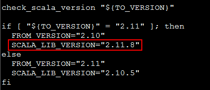
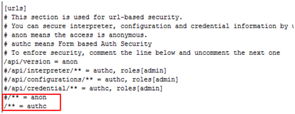
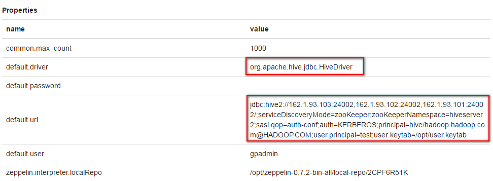
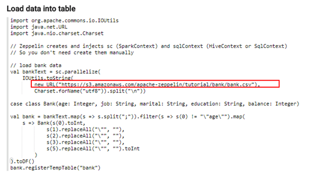
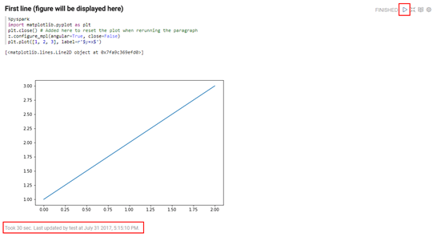
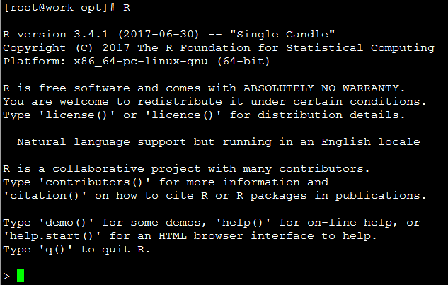
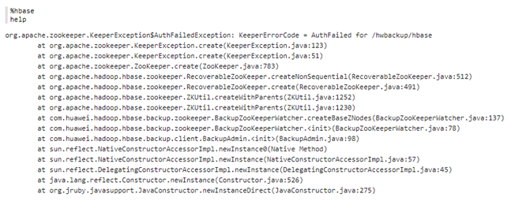

# Zeppelin对接FusionInsight HD

## 适用场景

> Zeppelin 0.7.3  <--> FusionInsight HD V100R002C70SPC100 (Spark2.x)

## 编译Zepplin

* 安装maven：
  ```
  wget http://apache.osuosl.org/maven/maven-3/3.3.9/binaries/apache-maven-3.3.9-bin.tar.gz
  tar -xzvf apache-maven-3.3.9-bin.tar.gz -C /opt/
  ```

  修改profile文件`vi /etc/profile`,增加以下配置
  ```
  export PATH=$PATH:/opt/apache-maven-3.3.9/bin
  ```

  导入环境变量
  ```
  source /etc/profile
  ```

  执行`mvn -v`

* 安装git

  ```
  yum install -y git
  ```

* 安装nodejs：

  ```
  wget https://nodejs.org/dist/v6.10.0/node-v6.10.0-linux-x64.tar.xz --no-check-certificate
  tar -xvf node-v6.10.0-linux-x64.tar.xz -C /opt/
  ```

  修改profile文件`vi /etc/profile`,增加以下配置
  ```
  export PATH=$PATH:/opt/apache-maven-3.3.9/bin:/opt/node-v6.10.0-linux-x64/bin
  ```

  导入环境变量
  ```
  source /etc/profile
  ```

  执行`npm -v`

* 安装bower
  ```
  npm install -g bower
  ```

  配置bower允许root用户执行
  ```
  echo '{ "allow_root": true }' > /root/.bowerrc
  ```

  执行`bower -v`

* 获取Zepplin0.7.3的版本
  ```
  git clone https://github.com/apache/zeppelin.git
  cd zeppelin
  git checkout v0.7.3
  ```

* 修改scala版本，适配FusionInsight_HD_V100R002C70SPC100的Hadoop版本

  在zeppelin代码根目录执行`vi ./dev/change_scala_version.sh`，修改下图的SCALA_LIB_VERSION为2.11.8

  

  执行命令完成scala版本的修改
  ```
  ./dev/change_scala_version.sh 2.11
  ```

* 执行`vi pom.xml`文件的修改<libthrift.version>为0.9.3

  

* 执行`vi hbase/pom.xml`修改hbase版本和hadoop版本

  

* 编译Zepplin
  ```
  mvn clean package -Pbuild-distr -Pspark-2.1 -Dspark.version=2.1.0 -Dhadoop.version=2.7.2 -Phadoop-2.7 -Pscala-2.11 -Psparkr -DskipTests
  ```

* 编译完成后在`zeppelin-distribution/target`目录下生成`zeppelin-0.7.3.tar.gz`文件

## 安装Zepplin

### 操作场景

安装Zepplin0.7.3

### 前提条件

- 已完成FusionInsight HD客户端的安装。

### 操作步骤

- 将编译好的zeppelin-0.7.3.tar.gz上传放到/opt目录下，解压生成zeppelin-0.7.3目录。
  ```
  cp zeppelin-distribution/target/zeppelin-0.7.3.tar.gz /opt
  cd /opt
  tar -zxvf zeppelin-0.7.3.tar.gz
  ```

- 配置Zeppelin环境变量，在profile文件中加入如下变量
  ```
  vi /etc/profile
  export ZEPPELIN_HOME=/opt/zeppelin-0.7.3
  export PATH=$ZEPPELIN_HOME/bin:$PATH
  ```

- 编辑zeppelin-env.sh文件，位置/opt/zeppelin-0.7.3/conf
  ```
  cd /opt/zeppelin-0.7.3/conf/
  cp zeppelin-env.sh.template zeppelin-env.sh
  vi zeppelin-env.sh
  ```

  加入如下内容：
  ```
  export JAVA_HOME=/opt/hadoopclient/JDK/jdk
  ```

  编辑zeppelin-site.xml文件，位置/opt/zeppelin-0.7.3/conf/
  ```
  cp zeppelin-site.xml.template zeppelin-site.xml
  ```

  将zeppelin-site.xml中端口8080替换成18081（可自定义，也可以不改）
  ```
  sed -i 's/8080/18081/' zeppelin-site.xml
  ```
  

- 运行zeppelin
  ```
  cd /opt/zeppelin-0.7.3/
  ./bin/zeppelin-daemon.sh start
  ```

- 在浏览器中输入地址zeppelin_ip:18081登陆，zeppelin_ip为安装zeppelin的虚拟机IP。

  

- 根据产品文档创建用户test，并赋予足够权限，下载用户test的keytab文件user.keytab，上传至/opt/目录下。

- 编辑zeppelin-site.xml文件，将zeppelin.anonymous.allowed参数的true修改为false。

  

- 编辑shiro.ini文件，位置/opt/zeppelin-0.7.3/conf/shiro.ini
  ```
  cp shiro.ini.template shiro.ini
  vi shiro.ini
  ```

  [urls]authc表示对任何url访问都需要验证

  

  [users]下增加用户test，密码Huawei@123

  

- 重启zeppelin。
  ```
  cd /opt/zeppelin-0.7.3/
  ./bin/zeppelin-daemon.sh restart
  ```
- 使用test用户登陆Zeppelin

## Zeppelin连接Hive

### 操作场景

Zepplin中配置JDBC解析器，对接Hive的JDBC接口。

### 前提条件

- 已经完成Zeppelin 0.7.3的安装；

- 已完成FusionInsight HD客户端的安装，包含Hive组件。

### 操作步骤

- 将`/opt/hadoopclient/Hive/Beeline/lib/`下的jar包拷贝至`/opt/zeppelin-0.7.3/interpreter/jdbc/`目录下。

- 将从新拷贝过来的jar包的属主和权限修改为和/opt/zeppelin-0.7.3/ interpreter/jdbc/下原有的jar包相同
  ```
  chown 501:wheel *.jar
  chmod 644 *.jar
  ```

- 编辑zeppelin-env.sh文件，位置/opt/zeppelin-0.7.3/conf，加入以下三个配置内容
  ```
  export JAVA_HOME=/opt/hadoopclient/JDK/jdk
  export ZEPPELIN_INTP_JAVA_OPTS="-Djava.security.krb5.conf=/etc/krb5.conf -Djava.security.auth.login.config=/opt/zeppelin-0.7.3/conf/jaas.conf -Dzookeeper.server.principal=zookeeper/hadoop.hadoop.com -Dzookeeper.request.timeout=120000"
  export HADOOP_CONF_DIR=/opt/hadoopclient/HDFS/hadoop/etc/hadoop
  ```

- 从FusionInsight客户端下载用户test的user.keytab和krb5.conf文件，将krb5.conf文件放在/etc/下
- 使用`vi /opt/zeppelin-0.7.3/conf/`新建hbase的认证文件jaas.conf，内容如下:
  ```
  Client {
  com.sun.security.auth.module.Krb5LoginModule required
  useKeyTab=true
  keyTab="/opt/user.keytab"
  principal="test"
  useTicketCache=false
  storeKey=true
  debug=true;
  };
  ```
  > 其中用户为在FusionInsight Manager中创建的test用户，将test的keytab文件user.key放在/opt/目录下

- 登陆Zepplin，选择右上角菜单中的 Interpreter

    

- 选择JDBC，点击 **edit** 编辑，修改default.driver和default.url参数，点击 **save** 保存
  ```
  default.driver：org.apache.hive.jdbc.HiveDriver
  default.url：jdbc:hive2://162.1.93.103:24002,162.1.93.102:24002,162.1.93.101:24002/;serviceDiscoveryMode=zooKeeper;zooKeeperNamespace=hiveserver2;sasl.qop=auth-conf;auth=KERBEROS;principal=hive/hadoop.hadoop.com@HADOOP.COM;user.principal=test;user.keytab=/opt/user.keytab
  ```
  

- 重启zeppelin。
  ```
  source /opt/hadoopclient/bigdata_env
  kinit –kt /opt/user.keytab test
  cd /opt/zeppelin-0.7.3/bin
  ./zeppelin-daemon.sh restart
  ```

- 页面选择Notebook -> Create new note

  

- 自定义note名称，例如hive

  

- 编辑note，点击右侧“执行”按钮。
  ```
  %jdbc
  Show tables;
  Select * from workers_info;
  ```

- 查看结果

  


## Zeppelin连接HBase

### 操作场景

Zeppelin中配置Hbase解析器，对接Hbase

### 前提条件

- 已经完成Zeppelin 0.7.3的安装；

- 已完成FusionInsight HD客户端的安装，包含HBase组件。

### 操作步骤

- 将`/opt/zeppelin-0.7.3/interpreter/hbase/`目录下旧的jar包移走
  ```
  cd /opt/zeppelin-0.7.3/interpreter/hbase
  mkdir hbase_jar
  mv hbase*.jar hbase_jar
  mv hadoop*.jar hbase_jar
  mv zookeeper-3.4.6.jar hbase_jar
  ```


- 将`/opt/hadoopclient/HBase/hbase/lib/`以下的jar包拷贝至`/opt/zeppelin-0.7.3/interpreter/hbase/`目录下
  ```
  cp /opt/hadoopclient/HBase/hbase/lib/hbase-*.jar /opt/zeppelin-0.7.3/interpreter/hbase
  cp /opt/hadoopclient/HBase/hbase/lib/hadoop-*.jar /opt/zeppelin-0.7.3/interpreter/hbase
  cp /opt/hadoopclient/HBase/hbase/lib/zookeeper-*.jar /opt/zeppelin-0.7.3/interpreter/hbase
  cp /opt/hadoopclient/HBase/hbase/lib/dynalogger-V100R002C30.jar /opt/zeppelin-0.7.3/interpreter/hbase
  ```

- 编辑zeppelin-env.sh文件，位置/opt/zeppelin-0.7.3/conf，加入以下三个配置内容
  ```
  export JAVA_HOME=/opt/hadoopclient/JDK/jdk
  export ZEPPELIN_INTP_JAVA_OPTS="-Djava.security.krb5.conf=/etc/krb5.conf -Djava.security.auth.login.config=/opt/zeppelin-0.7.3/conf/jaas.conf -Dzookeeper.server.principal=zookeeper/hadoop.hadoop.com -Dzookeeper.request.timeout=120000"
  export HBASE_HOME=/opt/hadoopclient/HBase/hbase
  ```

- 从FusionInsight客户端下载用户test的user.keytab和krb5.conf文件，将krb5.conf文件放在/etc/下
- 使用`vi /opt/zeppelin-0.7.3/conf/`新建hbase的认证文件jaas.conf，内容如下:
  ```
  Client {
  com.sun.security.auth.module.Krb5LoginModule required
  useKeyTab=true
  keyTab="/opt/user.keytab"
  principal="test"
  useTicketCache=false
  storeKey=true
  debug=true;
  };
  ```
  > 其中用户为在FusionInsight Manager中创建的test用户，将test的keytab文件user.key放在/opt/目录下

- 登陆Zepplin，选择右上角菜单中的 Interpreter

    

- 选择hbase，点击 **edit** 编辑，修改hbase.home参数，点击 **save** 保存
  ```
  hbase.home：/opt/hadoopclient/HBase/hbase
  ```
  

- 重启zeppelin
  ```
  source /opt/hadoopclient/bigdata_env
  kinit –kt /opt/user.keytab test
  cd /opt/zeppelin-0.7.3/bin
  ./zeppelin-daemon.sh restart
  ```

- 页面选择Notebook -> Create new note

  

- 自定义note名称，例如hbase

  


- 编辑note，点击右侧 **执行** 按钮
  ```
  %hbase
  create 'test2', 'cf'
  put 'test2', 'row1', 'cf:a', 'value1'
  ```

  

- 在FusionInsight的客户端下可以看到创建的hbase表test2和数据

  


## Zeppelin连接Spark

### 操作场景

Zepplin中配置Spark解析器

### 前提条件

- 完成Zeppelin0.7.3的安装；
- 已完成FusionInsight HD V100R002C70SPC100和客户端的安装，包含Spark2x组件。
- 参考[http://zeppelin.apache.org/docs/latest/interpreter/spark.html](http://zeppelin.apache.org/docs/latest/interpreter/spark.html)

### 操作步骤

- 编辑zeppelin-env.sh文件，位置`/opt/zeppelin-0.7.3/conf`，加入以下内容
  ```
  export MASTER=yarn-client
  export SPARK_HOME=/opt/hadoopclient/Spark2x/spark
  export HADOOP_CONF_DIR=/opt/hadoopclient/HDFS/hadoop/etc/hadoop
  ```

- 登陆Zepplin，选择右上角菜单中的 Interpreter

  

- 选择Spark，点击 **edit** 编辑，将 Master 参数改为 yarn-client，点击 **save** 保存

  

- 重启zeppelin
  ```
  source /opt/hadoopclient/bigdata_env
  kinit –kt /opt/user.keytab test
  cd /opt/zeppelin-0.7.3/bin
  ./zeppelin-daemon.sh restart
  ```

- 执行zeppelin的sparkSQL语句

  

- 执行zeppelin的spark样例代码zeppelin Tutorial -> Basic Features(Spark)
  > 样例代码需要访问Internet上的资源，所以保证zeppelin所在的节点可以联网，检测是否能打开以下链接

  

  

- 执行zeppelin的spark样例代码Zeppelin Tutorial -> Matplotlib (Python • PySpark)

  安装python-matplotlib
  ```
  yum install python-matplotlib
  ```
  安装Anaconda2-4.4
  ```
  wget https://repo.continuum.io/archive/Anaconda2-4.4.0-Linux-x86_64.sh
  sh Anaconda2-4.4.0-Linux-x86_64.sh
  ```
  配置环境变量PATH，将python换成安装Anaconda安装目录中的python
  ```
  export PATH=/root/anaconda2/bin/:$PATH
  ```
  在zeppelin的界面中，选择右上角的 Interpreter

  选择Spark，点击 **edit** 编辑，将 zeppelin.pyspark.python 参数改为Anaconda安装目录中的python，点击 **save** 保存

  

  执行zeppelin的pyspark样例代码Zeppelin Tutorial -> Matplotlib

  

## Zeppelin连接SparkR

### 操作场景

Zepplin中配置Spark解析器，连接SparkR

### 前提条件

- 完成Zeppelin0.7.3的安装；
- 已完成FusionInsight HD V100R002C70SPC100和客户端的安装，包含Spark组件。
- 参考[http://zeppelin.apache.org/docs/latest/interpreter/spark.html](http://zeppelin.apache.org/docs/latest/interpreter/spark.html)

### 操作步骤

- 由于Spark的Executor上也需要执行R，所以除了在Zeppelin的节点上安装R以外，所有FusionInsight集群节点上也要安装同版本的R，安装步骤如下：

  > 不同OS配置yum源时下载的文件路径有所不同，下面以Redhat6.6安装R为例

  > 如果安装R的节点无法访问互联网，参考FAQ进行R的安装

* 配置Redhat6.6的yum源

  ```
  cd ~
  rpm -aq | grep yum | xargs rpm -e --nodeps
  wget http://mirrors.163.com/centos/6/os/x86_64/Packages/python-iniparse-0.3.1-2.1.el6.noarch.rpm
  wget http://mirrors.163.com/centos/6/os/x86_64/Packages/yum-metadata-parser-1.1.2-16.el6.x86_64.rpm
  wget http://mirrors.163.com/centos/6/os/x86_64/Packages/yum-3.2.29-81.el6.centos.noarch.rpm
  wget http://mirrors.163.com/centos/6/os/x86_64/Packages/yum-plugin-fastestmirror-1.1.30-40.el6.noarch.rpm
  wget http://mirrors.163.com/centos/6/os/x86_64/Packages/python-urlgrabber-3.9.1-11.el6.noarch.rpm
  rpm -ivh python-iniparse-0.3.1-2.1.el6.noarch.rpm
  rpm -ivh yum-metadata-parser-1.1.2-16.el6.x86_64.rpm
  rpm -U python-urlgrabber-3.9.1-11.el6.noarch.rpm
  rpm -ivh yum-3.2.29-81.el6.centos.noarch.rpm yum-plugin-fastestmirror-1.1.30-40.el6.noarch.rpm
  cd /etc/yum.repos.d/
  wget http://mirrors.163.com/.help/CentOS6-Base-163.repo
  sed -i 's/$releasever/6/g' /etc/yum.repos.d/CentOS6-Base-163.repo
  yum clean all
  yum makecache
  ```

- 配置EPEL的源

  Redhat 6.x 使用下面命令安装
  ```
  rpm -Uvh https://mirrors.tuna.tsinghua.edu.cn/epel//6/x86_64/epel-release-6-8.noarch.rpm
  ```

* 更新cache
  ```
  yum clean all
  yum makecache
  ```

- 执行`yum install R` 安装R的相关的包

- 执行`R`，检查R是否可用

  正常启动如下图所示

  

- FusionInsight客户端下测试是否可以使用sparkR
  ```
  source /opt/hadoopclient/bigdata_env
  kinit test
  sparkR
  ```
- 正常启动如下图所示

  

- 参考[http://zeppelin.apache.org/docs/0.7.3/interpreter/r.html#using-the-r-interpreter ](http://zeppelin.apache.org/docs/0.7.3/interpreter/r.html#using-the-r-interpreter )在R的命令行中安装sparkR样例需要的R的libraries

  ```
  install.packages('devtools')
  install.packages('knitr')
  install.packages('ggplot2')
  install.packages(c('devtools','mplot','googleVis'))
  install.packages('data.table')
  install.packages('sqldf')
  install.packages('glmnet')
  install.packages('pROC')
  install.packages('caret')
  install.packages('sqldf')
  install.packages('wordcloud')
  ```
- 在zeppelin的界面中，选择右上角的 Interpreter
- 选择Spark，点击 **edit** 编辑，将 zeppelin.R.cmd 参数改为R的启动文件，点击 **save** 保存

  

- 重启zeppelin
  ```
  cd /opt/zeppelin-0.7.3/bin/
  ./zeppelin-daemon.sh restart
  ```

- 在Zeppelin中执行Zeppelin Tutorial -> R (SparkR)样例

  

## FAQ

- **FusionInsight集群不允许访问网络，如何安装R**

  在集群外同版本的Redhat版本下按照本文中yum源的方式进行安装R的操作，最后一步不要执行`yum install R`

  执行`yum install yum-utils`安装yumdownloader

  执行`yumdownloader R --resolve --destdir=/tmp/packages`把所有的rpm安装包下载到`/tmp/packages`中

  将`/tmp/packages`中的所有rpm包复制到集群每个节点的`/tmp/packages`中

  切换到集群每个节点的`/tmp/packages`中，执行`yum localinstall *.rpm`完成安装

- **连接hbase出现AuthFialed for /hwbackup/hbase**

  

  原因：zeppelin的原理hbase的jar包与从FusionInsight客户端下拷贝过来的jar冲突。

  解决：将zeppelin中原有的重名jar包移走或删除，全部用FusionInsight客户端下的相关jar包。

- **Zeppelin连接spark是报如下NoSuchMethodError**

  

  原因：jar包冲突

  解决：删除`/opt/zeppelin-0.7.3/lib/`下原有jar包scala-reflect-2.11.7.jar，替换为FusionInsight客户端下的jar包，重启zeppelin

- **Zeppelin执行Spark样例代码时报GC overhead limit exceeded**

  

  原因：内存不够

  解决：安装Zeppelin的节点的内存需要16G以上

- **执行zeppelin的样例代码Zeppelin Tutorial/Matplotlib (Python PySpark)报如下错误**

  

  原因：python版本问题

  解决：安装Anaconda2-4.4
