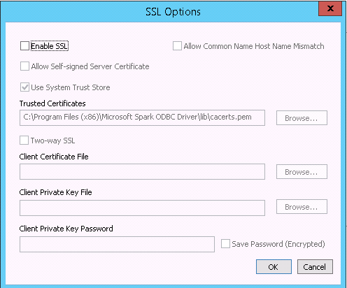
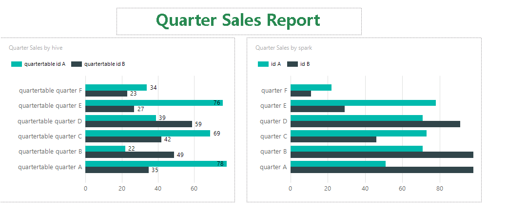
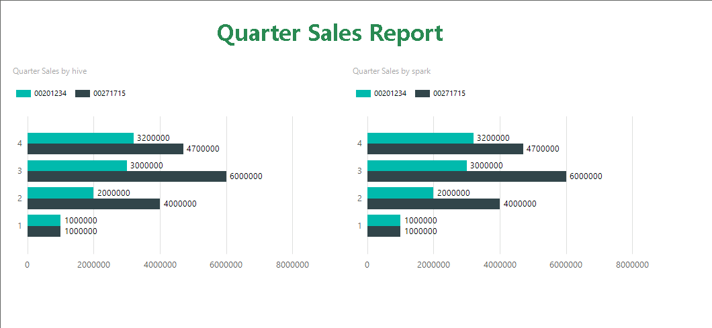
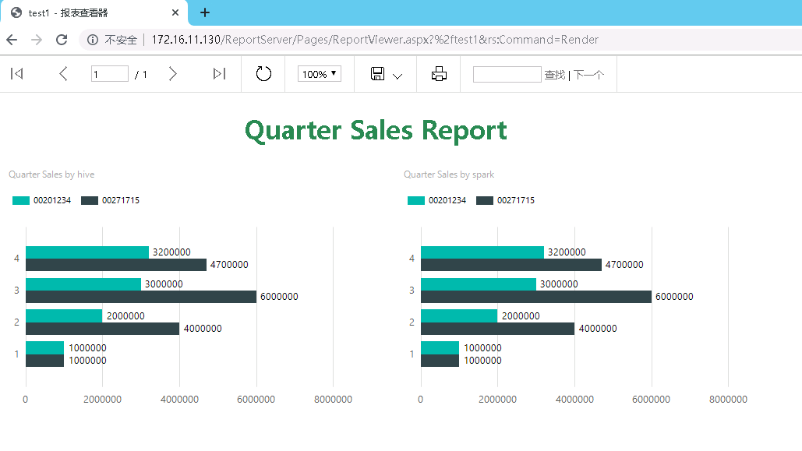

# SSRS对接FusionInsight

## 适用场景

> SSRS 2017 <--> FusionInsight HD 6.5 (Hive/SparkSQL)


## 安装配置

### 下载安装

  * Microsoft SQL Server 2017 Reporting Services 下载: [点击下载](https://www.microsoft.com/en-us/download/details.aspx?id=55252)

  * 安装过程：[点击查看安装指导](https://docs.microsoft.com/en-us/sql/reporting-services/install-windows/install-reporting-services?view=sql-server-2017)

### 软件配置

  * 安装完成后打开Report Server Configuration Manager，选择 **Web Service URL**, 设置服务端口、虚拟目录 等，点击 **应用** 完成设置。

## 准备工作

### 数据驱动及认证工具安装

* 下载和安装32bit 和64 bit的Microsoft ODBC驱动:

  * Microsoft Hive ODBC  Driver下载：
  [点击下载](https://www.microsoft.com/en-us/download/details.aspx?id=40886)

  * Microsoft Spark ODBC  Driver下载地址：
  [点击下载](https://www.microsoft.com/en-us/download/details.aspx?id=49883)

* 下载和安装MIT Kerberos认证客户端: [点击下载](http://web.mit.edu/ker)

### 配置Kerberos认证

  1. 下载并安装MIT Kerberos。请记住安装路径，例如：**C:\Program Files\MIT\Kerberos**。

  2. 	参考FusionInsight HD 6.5 文档，**应用开发指南**-> **安全模式** ->**安全认证** 创建对接账号及配置相关权限。

  3. 	使用对接账号登录FusionInsight管理界面，鼠标停留在右上角显示用户处，在下拉显示框中选择 **下载用户凭据** ，选择集群并确认下载，下载解压后包括 **krb5.conf** 和 **user.keytab** 两个文件。

  4.	重命名krb5.conf文件为 **krb5.ini** ，并拷贝到 **C:\ProgramData\MIT\Kerberos5** 目录下。“C:\ProgramData”目录一般是隐藏的，需要设置显示隐藏文件。

  5.	设置Kerberos票据的缓存文件。创建存放票据的目录，例如“C:\temp”。

  6.	设置Windows的系统环境变量，变量名为 **KRB5CCNAME** ，变量值为 **C:\temp\krb5cache** 。设置Windows的系统环境变量，变量名为 **KRB5_CONFIG**，变量值为 **C:\ProgramData\MIT\Kerberos5\krb5.ini** 。

  7. 重启服务器。

  8. 在Windows上进行认证。打开MIT Kerberos，单击 **get Ticket**，在弹出的“MIT Kerberos: Get Ticket”窗口中，**Pricipal** 输入用户名，**Password** 输入密码，单击 **OK**完成认证。

## 配置Spark和Hive ODBC DSN

###  配置Spark ODBC　DSN

  * 打开Windows ODBC配置工具，在 **System DSN** 中，分别配置 **Sample Microsoft Hive DSN** 和 **Sample Microsoft Spark DSN** ，相关配置参考下图，根据实际环境替换HOST地址。

    ```
      Data Source Name: Sample Microsoft Spark DSN
      Spark Serve Type: SparkThriftServer(Spark1.1 and later)
      Host(s): 172.16.11.22，Spark2x的JDBCServer2x主节点
      Port：22550
      Database: default
      Mechanism：Kerberos
      Host FQDN：hadoop.hadoop.com
      Service Name：spark2x
      Realm：留空
      Thrift Transport: SASL
    ```
    参考配置：

    

    在 **SSL OPTIONS** 中取消勾选SSL校验，设置如下图：

    

### 配置HIVE ODBC DSN

  * HIVE DSN 配置参考选项如下，根据实际环境替换HOST地址

    ```
      Data Source Name: Sample Microsoft Hive DSN
      Host(s): 172.16.11.21，Hive Service主节点
      Port：21066，Hive Service端口
      Database: default
      Mechanism：Kerberos
      Host FQDN：hadoop.hadoop.com
      Service Name：hive
      Realm：留空
      Thrift Transport: SASL
      SSL Options: 取消勾选“Enable SSL”

    ```
    参考配置如下图：

    

## 功能验证

### 准备测试数据

   * 通过beeline创建数据库和数据表，并插入部分测试数据。本测试场景中，创建销售测试表，包括员工ID，姓名 name，季度 quarter，销售额 sales等列，插入了部分测试数据，通过SSRS报表来显示员工每个季度的销售额以及对比直方图。

      ```
      create database sales;
      create table quarterTable(id string,name string, quarter int, sales bigint);
      insert into quarterTable values('00271715','tiekui',1,1000000);
      insert into quarterTable values('00271715','tiekui',2,4000000);
      insert into quarterTable values('00271715','tiekui',3,6000000);
      insert into quarterTable values('00271715','tiekui',4,4700000);
      insert into quarterTable values('00201234','zhangsan',1,1000000);
      insert into quarterTable values('00201234','zhangsan',2,2000000);
      insert into quarterTable values('00201234','zhangsan',3,3000000);
      insert into quarterTable values('00201234','zhangsan',4,3200000);
      ```

### 创建Hive数据源

   * 打开Report Builder软件，右键 **Data Sources**，点击 **add data source** ,设置 **Data Source Name**，选择 **use a connection embedded in my report** ，**select connection type** 下拉条中选择 **ODBC** ，点击 **build**，在弹出框中，**Data Source Specification** 中选择 **use connection string** ，点击 **build** 按钮，弹出框中选择 **Machine Data Source**，选择 **Sample Microsoft Hive DSN**，点击 **OK** 完成配置.

### 创建Spark2X 数据源

  * 打开Report Builder软件，右键 **Data Sources**，点击 **add data source** ,设置 **Data Source Name**，选择 **use a connection embedded in my report** ，**select connection type** 下拉条中选择 **ODBC** ，点击 **build**，在弹出框中，**Data Source Specification** 中选择 **use connection string** ，点击 **build** 按钮，弹出框中选择 **Machine Data Source**，选择 **Sample Microsoft Spark DSN**，点击 **OK** 完成配置.

### 创建数据集

  * 在Report Builder左侧视图中，右键 **Data Sets** ,选择 **add dataset"**，设置数据集名称，选择 **use a dataset embedded in my report**，选择data sources为之前配置的Hive或者Spark Data Sources。在Query Designer中输入SQL语句筛选数据列，例如 `select * from sales.quarterTable`,点击 **OK** ,完成配置。完成该操作以后，将在左侧出现数据集的列，用于后续的数据分析。

### 设计报表

  * 根据需求设计报表，本测试设计的图标如下，分别基于Hive和Spark设计了两个数据表格，创建过程如下：

    选择 **Report Builder** -> **insert** -> **chart wizard** ，选择Hive数据源，选择 **Bar**，catergories 使用 **quarter** 列，series 使用 **id** 列，value选择 **sum(quaterTable_sales)**

    点击 **Next** 和 **Finish**，完成配置。使用相同的方式，使用spark数据源创建一个表格。

    创建后的效果如下图：


    

    点击Report Builder 工具左上解 **RUN** 按钮测试，将获取数据并生成报表，测试结果如下：

    

### 发布到SSRS

   * 测试完成后，选择左上角 **File** -> **Publish Report Parts** -> **publish all report parts with defalt settings** ，Report Server地址为 **http://{reportserver_ip}/ReportServer**,上传完成后，打开Report Server网站 **http://{ip}/ReportServer**, 选择对应的文件，查看报表结果如下，可在浏览器中查看到报表数据。

      

  * 验证完成，SSRS报表通过Hive ODBC和Spark ODBC获取数据并正确呈现。
