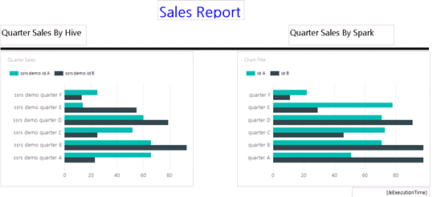
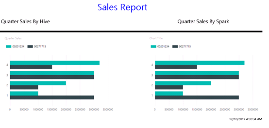

# Connect SSRS to FusionInsight

## Applicable Scene

> SSRS 2017 <-> FusionInsight HD 6.5 (Hive/SparkSQL)

## SSRS Connection Guide

  * Download and install Microsoft ODBC driver with 32bit and 64 bit

    * Microsoft Hive ODBC Driver download:
  [Click to download](https://www.microsoft.com/en-us/download/details.aspx?id=40886)

    * Microsoft Spark ODBC Driver download address:
  [Click to download](https://www.microsoft.com/en-us/download/details.aspx?id=49883)

    * Download and install the MIT Kerberos authentication client: [Click to download](http://web.mit.edu/ker)

* Configure Kerberos authentication

  1. Download and install MIT Kerberos. Remember the installation path, for example: "C:\program Files\MIT\Kerberos".

  2. Refer to the FusionInsight HD 6.5 document, "Application Development Guide-> Security Mode-> Security Authentication" to configure the connection account and related permissions.

  3. Use the connection account to log in to the FusionInsight management interface, hover the mouse over the upper right corner to display the user, select "Download user credentials" in the drop-down display box, select the cluster and confirm the download. After downloading and decompressing, there are two krb5.conf and user.keytab files.

  4. Rename the krb5.conf file to krb5.ini and copy it to the "C:\ProgramData\MIT\Kerberos5" directory. The "C:\ProgramData" directory is usually hidden, and you need to set to show hidden files.

  5. Set the cache file for Kerberos tickets. Create a directory for your tickets, such as "C:\temp".

  6. Set the system environment variable for Windows. The variable name is "KRB5CCNAME" and the variable value is "C:\temp\krb5cache". Set the Windows system environment variable. The variable name is "KRB5_CONFIG" and the variable value is "C:\ProgramData\MIT\Kerberos5\krb5.ini".Restart the server.

  7. Authenticate on Windows. Open MIT Kerberos, click "Get Ticket", and in the pop-up "MIT Kerberos: Get Ticket" window, enter the username in "Privileg", enter the password in "Password", and click "OK".

* Configure Spark and Hive ODBC DSN

    * Configure Spark ODBC DSN

      Open the Windows ODBC configuration tool, and configure "Sample Microsoft Hive DSN" and "Sample Microsoft Spark DSN" in the System DSN. For the related configuration, refer to the following figure and replace the HOST address according to the actual environment.

      

      Disable SSL verification in "SSL OPTIONS", the settings are as follows:

      

    * Configure HIVE ODBC DSN

      HIVE DSN configuration refer to the following figure, replace the HOST address according to the actual environment

      

* Functional Verification

  * Prepare test data

    Create a database and data table through beeline, and insert some test data. In this test scenario, a sales test table is created, including employee ID, name, quarter, sales, etc. Part of the test data is inserted, and the SSRS report is used to display the sales of each quarter of the employee and a comparison histogram.

  * Create Hive data source

    Open Report Builder, right-click "Data Sources", set the Data Source Name, select "use a connection embedded in my report", select Connection Type as ODBC, click "build", in the pop-up box, select "Data Source Specification" use connection string ", click the" build "button, select" Machine Data Source "in the pop-up box, select" Sample Microsoft Hive DSN ", and click" OK "to complete the configuration.

  * Create a Spark data source

    Open Report Builder, right-click "Data Sources", set the Data Source Name, select "use a connection embedded in my report", select Connection Type as ODBC, click "build", in the pop-up box, select "Data Source Specification" use connection string ", click the" build "button, select" Machine Data Source "in the pop-up box, select" Sample Microsoft Spark DSN ", and click" OK "to complete the configuration.

  * Create dataset

    In the left view of Report Builder, right-click "Data Sets" to add a dataset, set the dataset name, select "use a dataset embedded in my report", and select data sources as the previously configured Hive or Spark Data Sources. Enter the SQL statement in the Query to filter the data columns, such as "select * from database.table", click "OK" to complete the configuration. After completing this operation, the columns of the data set will appear on the left for subsequent data analysis.

  * Design report

    The report is designed according to the requirements. The report designed for this test are as follows. Two data tables are designed based on Hive and Spark, as shown below:

    

    Click the "RUN" button on the upper left to test. The test results are as follows:

    

  * Post to SSRS

      After the test is completed, select "File-> Publish to Report Server" in the upper left corner. The report server address is http://{ip}/ReportServer. After uploading, open the report server website http://{ip}/ ReportServer, and select the corresponding path. View the report results as follows, you can view the report data in the browser.

      

  * The verification is completed. The SSRS report obtains the data through Hive and Spark ODBC and displays it correctly.
