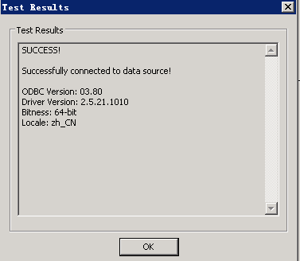
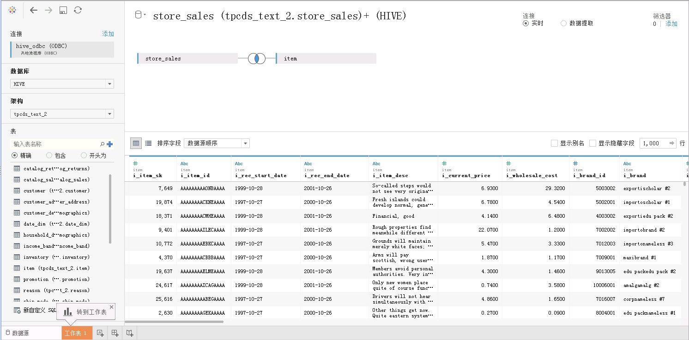
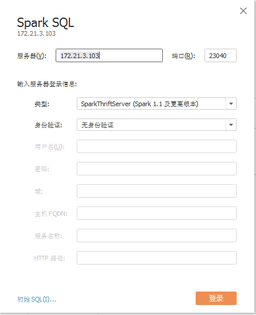
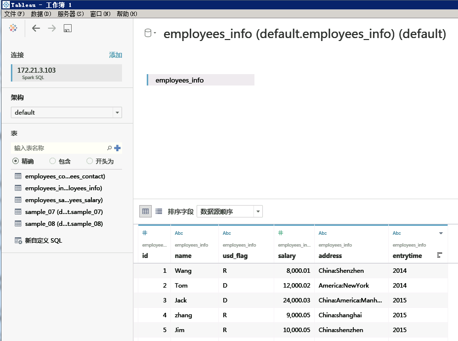
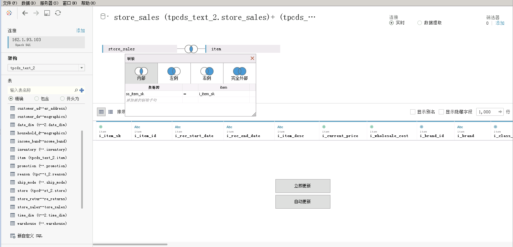

# Tableau对接FusionInsight

## 适用场景

> Tableau 10.0.0 <--> FusionInsight HD V100R002C30 (Hive/SparkSQL)
>
> Tableau 10.0.0 <--> FusionInsight HD V100R002C50 (Hive/SparkSQL)
>
> Tableau 10.1.4 <--> FusionInsight HD V100R002C60U20 (Hive/SparkSQL)
>
> Tableau 10.3.2 <--> FusionInsight HD V100R002C70SPC200 (Hive/SparkSQL)
>
> Tableau 10.5.0 <--> FusionInsight HD V100R002C80SPC100 (Hive/SparkSQL)
>
> Tableau 10.5.0 <--> FusionInsight HD 6.5 (Hive/SparkSQL)

## 配置Windows的kerberos认证

* 下载并安装MIT Kerberos

  下载网址：<http://web.mit.edu/kerberos/dist/#kfw-4.0>

  版本与操作系统位数保持一致，本文版本kfw-4.1-amd64.msi。

* 确认客户端机器的时间与FusionInsight HD集群的时间一致，时间差要小于5分钟

* 设置Kerberos的配置文件

  在FusionInsight Manager创建一个角色与“人机”用户，具体请参见《FusionInsight HD 管理员指南》的创建用户章节。角色需要根据业务需要授予Hive的访问权限，并将用户加入角色。例如，创建用户“tableau”并下载对应的keytab文件user.keytab以及krb5.conf文件，把krb5.conf文件重命名为krb5.ini，并放到`C:\ProgramData\MIT\Kerberos5`目录中。

* 设置Kerberos票据的缓存文件

  * 创建存放票据的目录，例如“C:\temp”。
  * 设置Windows的系统环境变量，变量名为“KRB5CCNAME”，变量值为“C:\temp\krb5cache”。

    

* 重启机器。

* 在Windows上进行认证

  * 使用上述创建的用户名密码登录，用户名的格式为：用户名@Kerberos域名。

  * 打开MIT Kerberos，单击“get Ticket”，在弹出的“MIT Kerberos: Get Ticket”窗口中，“Pricipal”输入用户名，“Password”输入密码，单击“OK”。

    

## 配置Hive数据源

Tableau中配置Hive数据源，对接Hive的ODBC接口。

* 下载并安装ODBC驱动：[下载地址](http://www.cloudera.com/content/cloudera/en/downloads/connectors/hive/odbc/hive-odbc-v2-5-15.html)

  根据操作系统类型选择对应的ODBC版本，下载并安装。

* 配置ODBC驱动

  * 创建DSN(Data Source Name)：选择 **开始** -> **Simba Spark ODBC Driver** -> **ODBC Administrator**。
  * 选择 **User DSN** -> **Add** -> **Cloudera ODBC Driver for Apache Hive** -> **Finish**

    按实际配置相应的变量，

    * Host(s): Hive Service主节点
    * Port：Hive Service端口21066
    * Mechanism：Kerberos
    * Host FQDN：hadoop.hadoop.com
    * Service Name：hive
    * Realm：留空

    如下图

    

    > Advanced Options不需要进行配置默认的参数即可连接成功。

  * 点击中的Test进行测试连接，如果出现下图，则表示ODBC连接Hive成功。

    

* Tableau使用数据源

  * Tableau启动后会进入连接选择界面，点击“更多服务器”，再点击“其他数据库（ODBC）”；

  * DSN选择hive_odbc（上一步中设置ODBC的名称），点击连接，如下图所示，点击“连接”，然后登陆。

    

  * 查询百万级数据表数据

    

  * 查询多表数据

    

## 配置Spark数据源

* 下载并安装spark的ODBC驱动
  ODBC驱动下载地址：<http://www.tableau.com/support/drivers>

  

* 创建DSN（Data Source Name）

* 打开`C:\Program Files\Simba Spark ODBC Driver\lib\DriverConfiguration64.exe`

* 按实际配置相应的变量
  * Mechanism：Kerberos
  * Host FQDN：hadoop.hadoop.com
  * Service Name：spark
  * Realm：留空

  如下图：

  

* 点击“Advanced Options”，勾选如下选项：

  

* 点击OK，保存配置。

* Tableau使用Spark数据源

  * Tableau启动后会进入连接选择界面，点击“更多服务器”，再点击“Spark SQL”，作如下配置：

    

  * 其中服务器为JDBCServer(主)的业务IP。

    

  * 端口为FusionInsight中Spark服务配置，导出服务配置文件，其中<name>hive.server2.thrift.port</name>对应值。

  

  * 点击“登录”，进入tableau页面，选择架构和表，结果如下。

    

  * 用Tableau做实时连接，打开工作簿，对该表进行图形化分析。

    

  * 性能测试

    * 查询包含百万条数据的表web_sales

      

    * 多表关联查询：store_sales和item表做关联查询

      

      

      增加customer_address表

      

      查询结果：

      

## FAQ

* 找不到C:\ProgramData\MIT\Kerberos5文件夹

  C:\ProgramData一般属于隐藏文件夹，设置文件夹隐藏可见或者使用搜索功能即可解决问题。

* 连接成功无数据库权限

  连接所使用的用户需要有数据库的权限，否则将导致ODBC连接成功却无法读取数据库内容。

* ODBC连接失败

  常见情况是Host(s)、Port、Host FQDN等的输入数据有误，请根据实际情况进行输入
