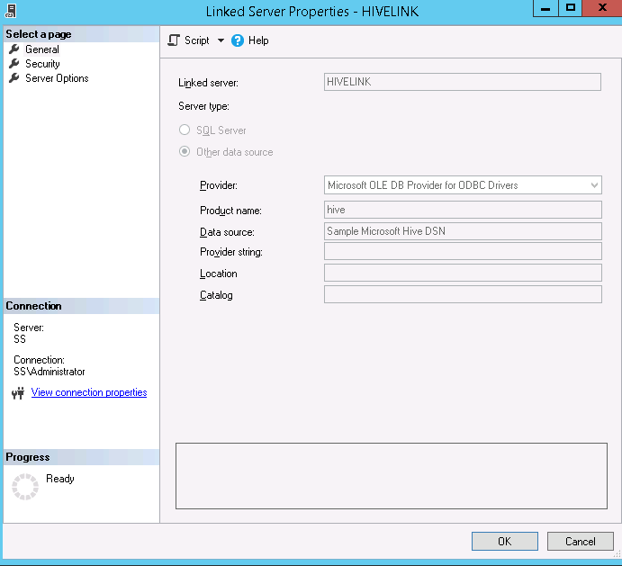
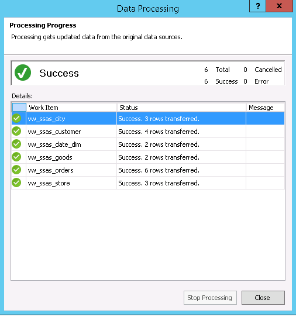
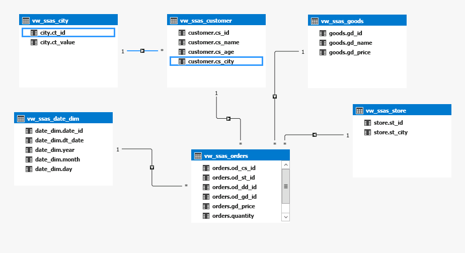
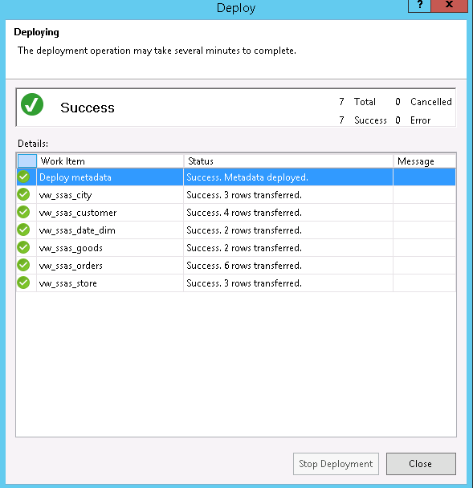
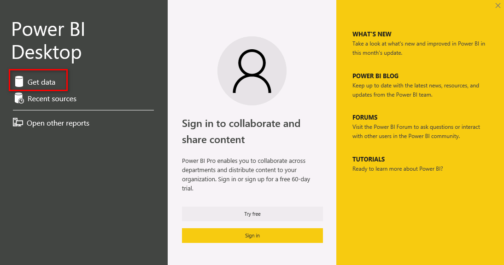
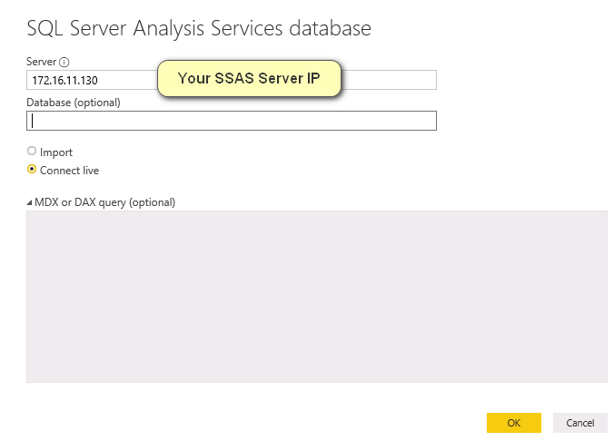
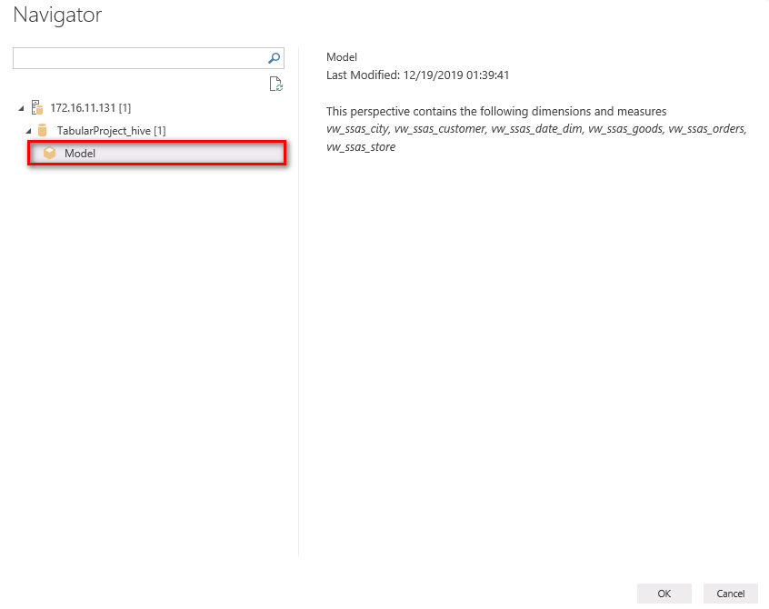
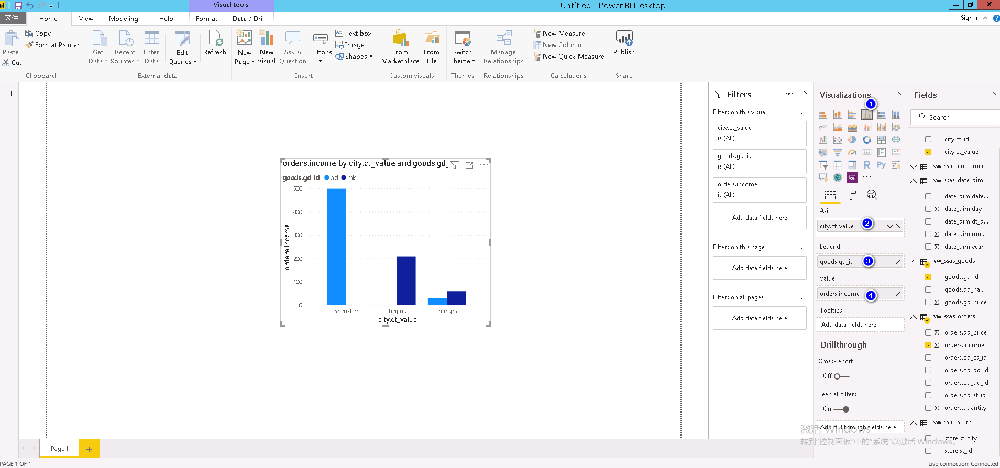
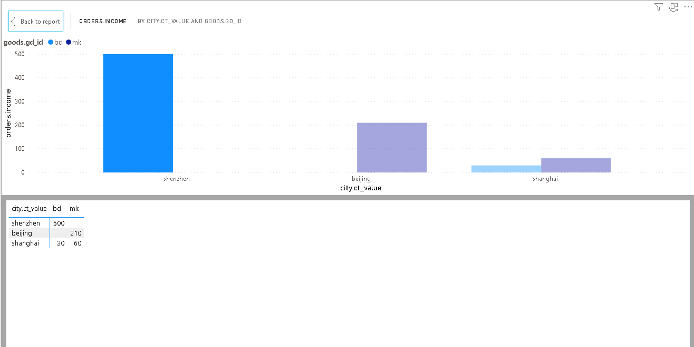

# SQL Server Analysis Services 对接 FusionInsight HD

## 适用场景

> SSAS 2017 <--> FusionInsight HD 6.5 (Hive/Spark)


## 准备工作

### 软件安装

  * 提前安装以下软件用于SSAS测试验证：

  1. visual studio 2019，需要安装 Microsoft Analysis Services Projects 扩展包以及data storage and processing 工具包。

  2. Power BI Desktop，用于调用SSAS数据源，进行数据展现。

  3. SQL Server 2017，用于创建Linked Server For Hive/Spark 。

  4. SSMS, 用于SQL Server和SSAS数据库管理。

  5. SSAS 2017, 安装过程参考官方指导，Server Mode 选择 Tabular Mode。

### 数据源驱动准备

  * 下载和安装32bit 和64 bit的Microsoft ODBC驱动:

    * Microsoft Hive ODBC  Driver下载：
    [点击下载](https://www.microsoft.com/en-us/download/details.aspx?id=40886)

    * 下载和安装MIT Kerberos认证客户端: [点击下载](http://web.mit.edu/ker)

### 配置Kerberos认证

    * 配置Kerberos认证过程：

    1. 下载并安装MIT Kerberos。请记住安装路径，例如：“C:\Program Files\MIT\Kerberos”。

    2. 参考FusionInsight HD 6.5 文档，“应用开发指南->安全模式->安全认证”配置对接账号及相关权限。

    3. 使用对接账号登录FusionInsight管理界面，鼠标停留在右上角显示用户处，在下拉显示框中选择“下载用户凭据”，选择集群并确认下载，下载解压后包括krb5.conf和user.keytab两个文件。

    4. 重命名krb5.conf文件为krb5.ini，并拷贝到“C:\ProgramData\MIT\Kerberos5”目录下。“C:\ProgramData”目录一般是隐藏的，需要设置显示隐藏文件。

    5. 设置Kerberos票据的缓存文件。创建存放票据的目录，例如“C:\temp”。

    6. 设置Windows的系统环境变量，变量名为“KRB5CCNAME”，变量值为“C:\temp\krb5cache”。设置Windows的系统环境变量，变量名为“KRB5_CONFIG”，变量值为“C:\ProgramData\MIT\Kerberos5\krb5.ini”,重启服务器。

    7. 在Windows上进行认证。打开MIT Kerberos，单击“get Ticket”，在弹出的“MIT Kerberos: Get Ticket”窗口中，“Pricipal”输入用户名，“Password”输入密码，单击“OK”。


###  配置Spark ODBC　DSN

  * 打开Windows ODBC配置工具，在 **System DSN** 中，分别配置 **Sample Microsoft Hive DSN** 和 **Sample Microsoft Spark DSN** ，相关配置参考下图，根据实际环境替换HOST地址。

      ```
        Data Source Name: Sample Microsoft Spark DSN
        Spark Serve Type: SparkThriftServer(Spark1.1 and later)
        Host(s): 172.16.11.22，Spark2x的JDBCServer2x主节点
        Port：22550
        Database: default
        Mechanism：Kerberos
        Host FQDN：hadoop.hadoop.com
        Service Name：spark2x
        Realm：留空
        Thrift Transport: SASL
      ```
      参考配置：

      

      在 **SSL OPTIONS** 中取消勾选SSL校验，设置如下图：

      

### 配置HIVE ODBC DSN

  * HIVE DSN 配置参考选项如下，根据实际环境替换HOST地址

      ```
        Data Source Name: Sample Microsoft Hive DSN
        Host(s): 172.16.11.21，Hive Service主节点
        Port：21066，Hive Service端口
        Database: default
        Mechanism：Kerberos
        Host FQDN：hadoop.hadoop.com
        Service Name：hive
        Realm：留空
        Thrift Transport: SASL
        SSL Options: 取消勾选“Enable SSL”

      ```
      参考配置如下图：

      


## 功能验证

  验证使用Hive数据源创建一个SSAS表格模型。

### 准备测试数据。
  * 在beeline模式下执行以下命令，创建测试表及相关数据。

    ```
    create database ssas;
    create table city(ct_id string,ct_value string);
    insert into city values('sz', 'shenzhen');
    insert into city values('bj', 'beijing');
    insert into city values('sh', 'shanghai');

    create table customer(cs_id string, cs_name string, cs_age int, cs_city string);
    insert into customer values('1','tk', 32, 'sz');
    insert into customer values('2','ht', 18, 'bj');
    insert into customer values('3','zhh', 21, 'sh');
    insert into customer values('4','hhx', 22, 'sz');

    create table store(st_id string, st_city string);
    insert into store values('store1',  'sz');
    insert into store values('store2',  'bj');
    insert into store values('store3',  'sh');


    create table goods(gd_id string, gd_name string, gd_price int);
    insert into goods values('bd','bread',10);
    insert into goods values('mk','milk',6);

    create table date_dim(date_id string,dt_date date,year int,month int,day int);
    insert into date_dim values('2010','20101001',2010,10,1);
    insert into date_dim values('2011','20110501',2011,5,1);

    create table orders(od_cs_id string,od_st_id string, od_dd_id string,od_gd_id string, gd_price int,quantity int, income int);
    insert into orders values('1','store1','2010','bd',10,30,300);
    insert into orders values('2','store2','2011','mk',6,5,30);
    insert into orders values('3','store3','2010','mk',6,10,60);
    insert into orders values('3','store3','2011','bd',10,3,30);
    insert into orders values('2','store2','2010','mk',6,30,180);
    insert into orders values('1','store1','2011','bd',10,20,200);

    ```

### 创建 linked server

  * 在SQL SERVER 数据库中链接数据库

    * 打开SQL Server Management Studio, 选择 **file**->**object Explorer**，选择 **database engine**,连接本机已经安装完成的SQL Server。

    * 左侧资源栏中，右键 **server objects**->**Linked Servers**，选择 **New Linked Server**，输入链接服务器的连接信息，点击 **OK** 完成配置。

      ```
      Linked Server: HIVELINK ,可自定义
      Provider: Microsoft OLEDB Provider for ODBC Driver
      Data Source: Sample Microsoft Hive DSN  #如果是Spark,则此处替换为Spark的DSN,如Sample Microsoft Spark DSN
      其它可留空

      ```

      配置参考如下图：

      

### 创建视图

  * 在SSMS中，打开一个SQL查询窗口，分别执行以下每条语句，创建Hive表对应的视图：

    ```
    create view vw_ssas_city AS
    SELECT * FROM OPENQUERY(HIVELINK,'SELECT * FROM ssas.city;')

    create view vw_ssas_customer AS
    SELECT * FROM OPENQUERY(HIVELINK,'SELECT * FROM ssas.customer;')

    create view vw_ssas_date_dim AS
    SELECT * FROM OPENQUERY(HIVELINK,'SELECT * FROM ssas.date_dim;')


    create view vw_ssas_goods AS
    SELECT * FROM OPENQUERY(HIVELINK,'SELECT * FROM ssas.goods;')

    create view vw_ssas_orders AS
    SELECT * FROM OPENQUERY(HIVELINK,'SELECT * FROM ssas.orders;')

    create view vw_ssas_store AS
    SELECT * FROM OPENQUERY(HIVELINK,'SELECT * FROM ssas.store;')

    create view vw_ssas_store AS
    SELECT * FROM OPENQUERY(HIVELINK,'SELECT * FROM ssas.store;')

    ```


### 创建Project

  * 打开visual studio 工具，**File**->**new**-> **Project**-> **Analysis services tabular project**，点击 **next** ,设置项目名称，选择框架为 **.NET Framework 4.7.2**，点击 **create**, 选择 **Integrated workspace"**，兼容模式设置为 **SQL Server 2017/ Azure Analysis Services(1400)**, 点击 **OK** 完成项目创建。

### 添加数据

  * 在右侧Tabular Model Explorer 中，右键 **DATA SOURCE** -> **New DataSource** -> **SQL Server** ->  点击 **Connect**.

  * 新的弹出窗口中，输入连接数据库信息，**server** 栏中输入SQL Server的IP地址，**database** 中输入 **master**，点击 **OK**

  * 选择 **windows** -> **impersonation mode** 为 **impersonate account**，输入数据库用户名和密码，选择 **OK** 。

### 导入表格

  * 右键 SQL数据源，选择 **import new tables**，勾选创建的所有视图，点击 **load** 加载数据，执行成功后如下图：

    

### 创建模型

  * 创建模型的实体关联关系，如下图：

    

    点击工具栏 **启动**，完成模型创建和部署，模型创建完成后如下图：

    

### 报表分析

  * 使用Power BI Desktop 加载ssas模型并进行报表展示

    * 打开Power BI Desktop软件，选择 **Get Data**，选择 **SQL Server Analysis Service Database**，点击 **Connect**,

      

      输入 SSAS database server信息，Database可以不填，连接方式使用 **Connect Live** 方式，点击 **OK** 进入下一步。

      

      选择对应的模型，并点击 **OK** 进入下一步，模型将被导入，模型中的表及字段信息将在右侧Fields模块中显示。

      

    * 设计报表，本案例中设计一个直方图，展示各城市面包和牛奶的销售情况：

      

      右键图表，选择 **show data**，可以查看详细数据，如下图：

      

    * Power BI Desktop 能够正确读取SSAS模型数据并报表呈现，验证完成。    
