# Splunk对接FusionInsight HD

## 适用场景

> Splunk 7.2.4 <--> FusionInsight HD V100R002C80SPC200 (HDFS/Hive)
>
> Splunk 7.2.4 <--> FusionInsight HD 6.5 (HDFS)

## 安装与启动Splunk,获取配置文件

 - 关闭主机防火墙
  ```
  systemctl stop firewalld
  ```
- 安装Splunk 7.2.4,在网址<https://www.splunk.com/en_us/download/splunk-enterprise.html>下载Linux平台安装包，使用WinSCP导入主机并用`tar -zxvf splunk-7.2.4-8a94541dcfac-Linux-x86_64.tgz`解压出splunk目录。
 > Splunk 对接Hadoop集群需要使用Splunk Analytics for Hadoop 组件，该组件不支持Windows版本的Splunk Enterprise，需下载Linux版本Splunk

- 启动和停止splunk,进入splunk目录执行
  ```
  ./bin/splunk start
  ./bin/splunk stop
  ```
  第一次启动会显示Licence Agreement页面，输入`y`,然后输入用户名和密码
  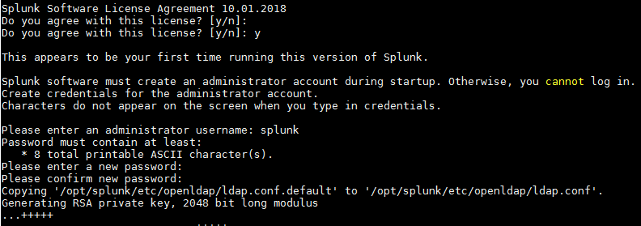

  启动成功后显示如下
  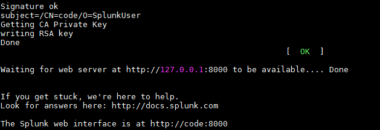

- 在浏览器输入`http://ip:8080`，输入用户名密码即可进入splunk页面。

  
- 在集群服务端，获取mapred用户的keytab文件以及集群的krb5.conf文,上传至splunk主机中,例如`/opt/splunk/`目录下

## 新建提供程序
- 进入splunk主界面，点击右上角设置，选择虚拟索引
- 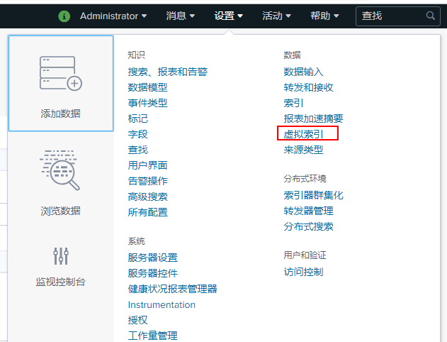

- 新建提供程序，填写相关信息
  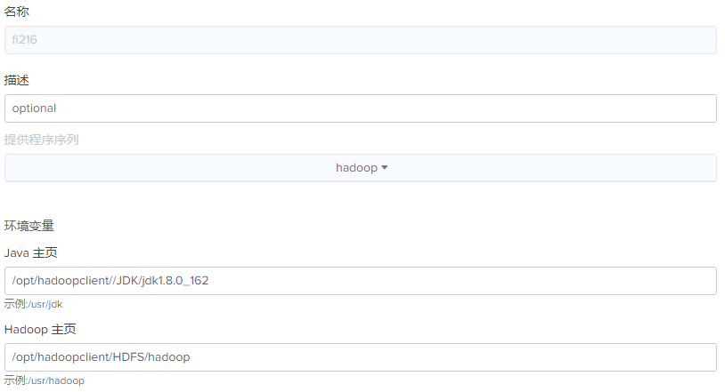
  * 名称：自定义
  * 提供程序序列：hadoop
  * Java主页：集群中环境变量JAVA_HOME的值
  * Hadoop主页：集群中环境变量HADOOP_HOME的值

- 填写Hadoop集群信息
  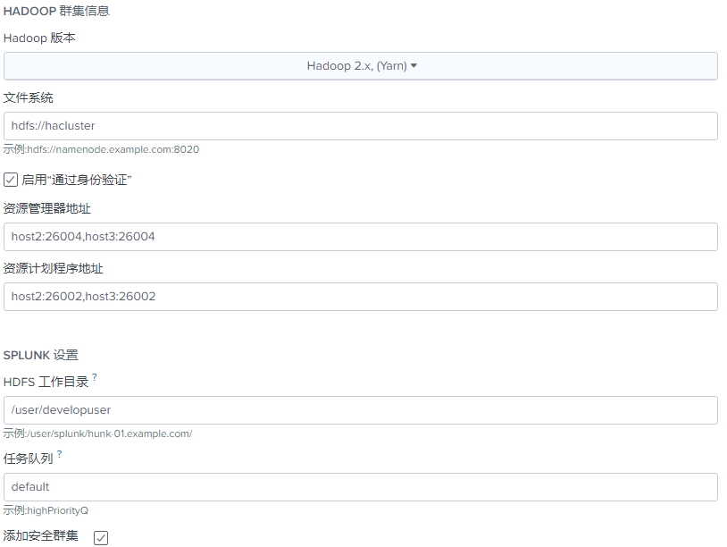  
  * Hadoop版本：Hadoop2.x(Yarn)
  * 文件系统：hdfs://hacluster
  * 勾选启用通过身份验证
  * 资源管理器地址:resourcemanager服务所在节点ip或主机名,端口为26004,在集群manager界面,选择服务管理->yarn->resourcemanager可查看resourcemanager服务所在节点ip,在服务配置中，可查看resourcemanager服务端口
  * 资源计划程序地址:节点同resourcemanager,端口可在服务配置中查看
  * HDFS工作目录：自行制定
    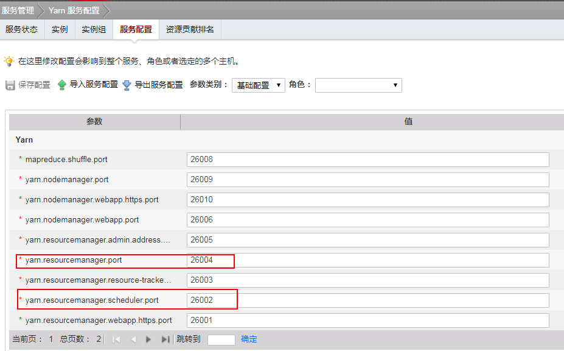

- 填写安全设置信息
    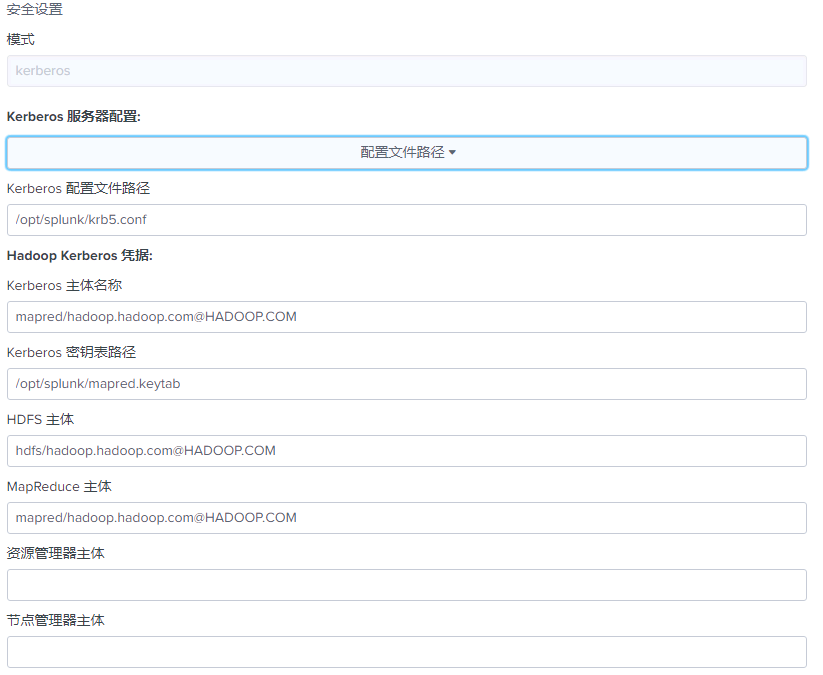
  * 勾选添加安全集群，安全模式选择kerberos
  * Kerberos服务器配置选择配置文件路径,填写路径
  * kerberos主体名称:mapred/hadoop.hadoop.com@HADOOP.com
  * kerberos密钥即为keytab文件
  * HDFS主体:hdfa/hadoop.hadoop.com@HADOOP.com
  * MapreReduce主体为:mapred/hadoop.hadoop.com@HADOOP.com
  * 资源管理器主体与节点管理器主体可不填

- 其他保持默认，点击“保存”。

## 新建虚拟索引
- 在新建索引界面，自定义索引名称，提供程序选择刚才新建的提供程序，HDFS 中数据的路径根据需要搜索的路径进行填写，勾选递归处理目录，点击保存。
  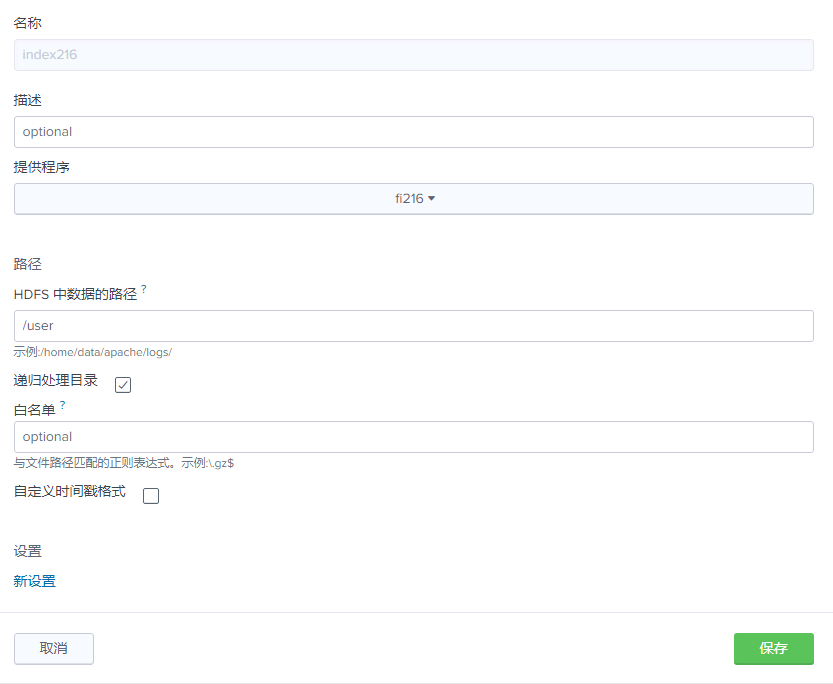

## 使用搜索程序
  - 在splunk主页面，点击浏览数据
  

  - 选择已创建的提供程序和虚拟索引
    

  - 点击下一步，选择要搜索的文件
    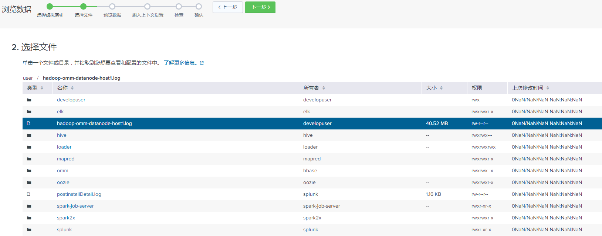

  - 在数据预览中，选择数据来源类型，根据数据类型进行选择
    

  - 在上下文配置中选择应用程序的上下文，点击下一步
    
  - 点击完成
    

  - 点击搜索可以进入对此文件的搜索页面
    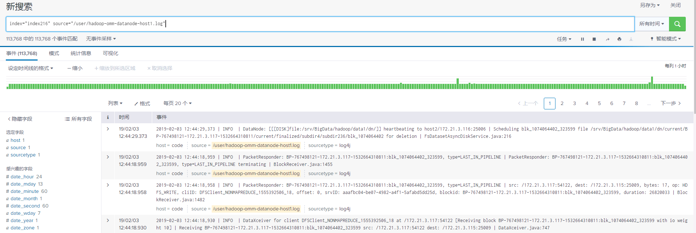

  - 可以根据查询需要进行一些可视化展示  
    

## 读取Hive表
  通过Splunk读取Hive表，需要在提供程序中添加以下两个配置：
  ```
  vix.splunk.search.splitter = HiveSplitGenerator
vix.splunk.search.splitter.hive.serde = org.apache.hadoop.hive.serde2.columnar.LazyBinaryColumnarSerDe
  ```
  

  在虚拟索引中配置要搜索的表的信息，包括数据库名称，表名，表头，字段类型，文件类型，分隔符，换行符
  >目前仅能正确读取rcfile格式的文件

  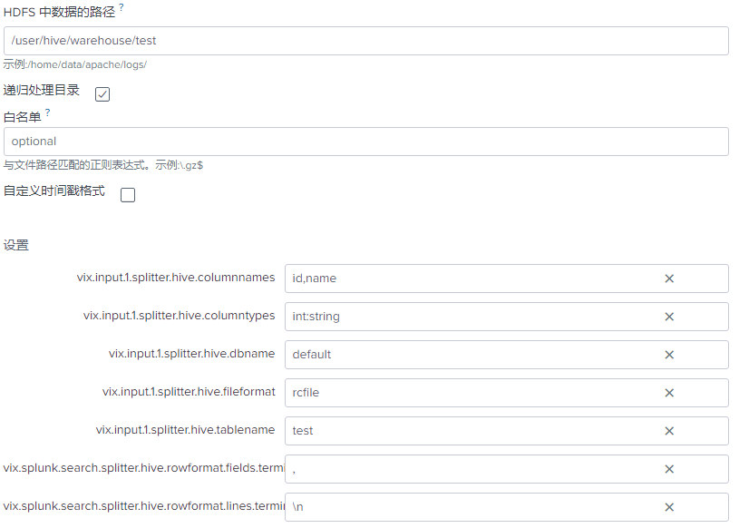

  然后在虚拟索引处点击`搜索`，进入搜索页面，并在搜索框前选择`所有时间`，即可看到表中数据
  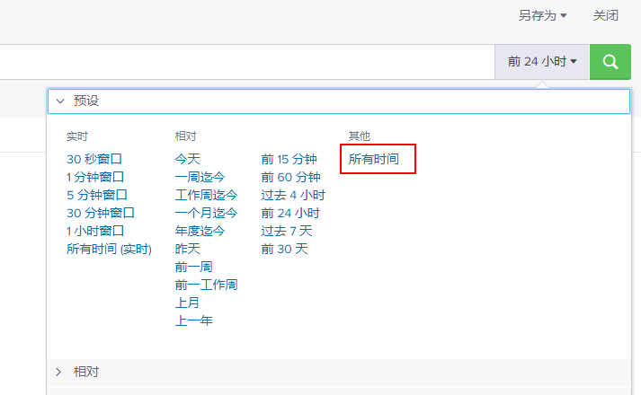

  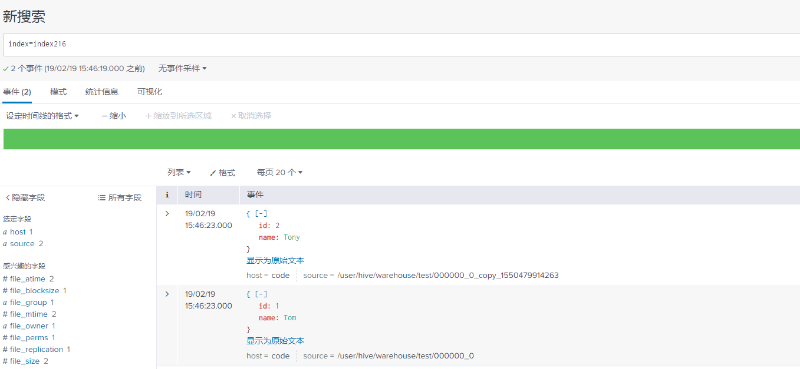
