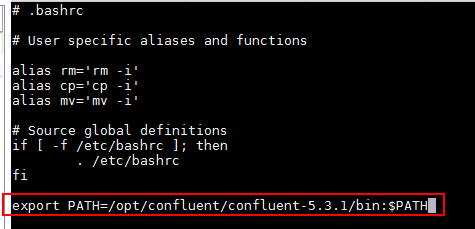
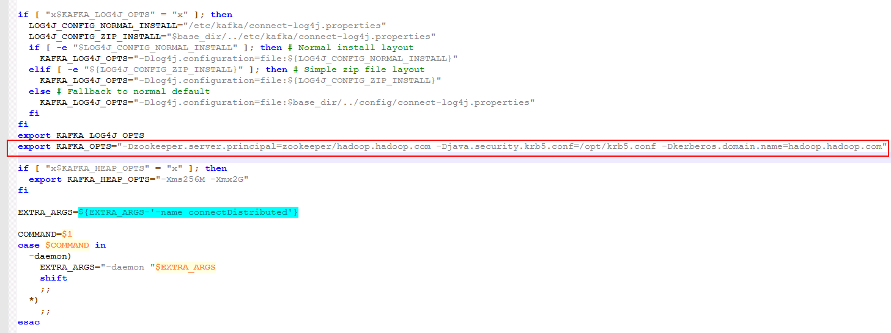
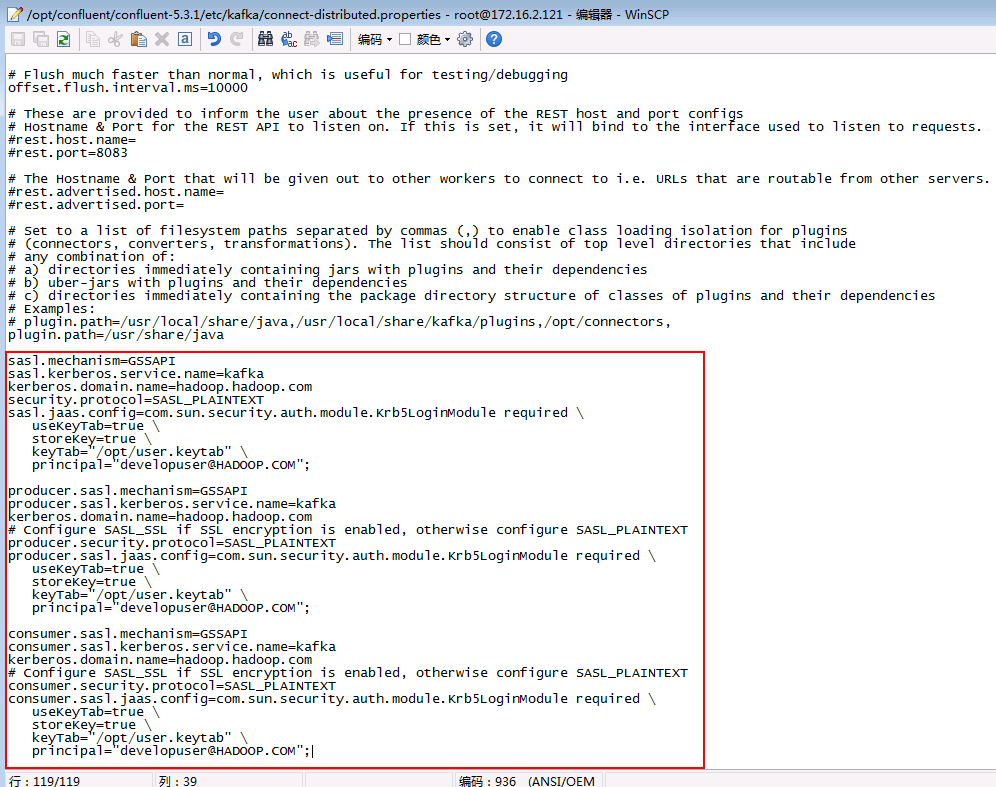
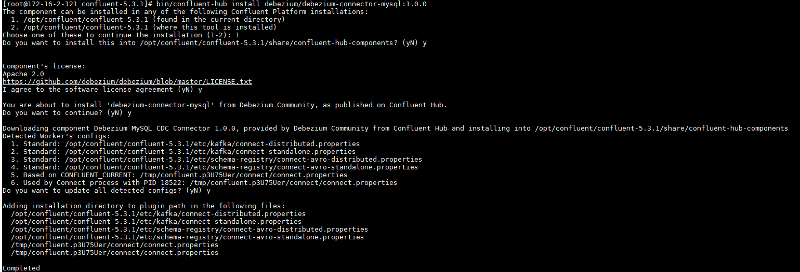

# debezium connector对接FusionInsight


## 适用场景

> debezium 1.0.0 <--> FusionInsight HD 6.5 (Kafka)


测试环境说明：

FI HD: 6.5.1 (kafka安全模式)

confluent: 5.3.1
debezium: 1.0.0

场景说明：confluent最新版本5.3.1能够直接下载debezium 1.0.0最新版本的 database connector，这里以mysql为例作为源端，同步后的数据传入huawei kafka中（安全模式）


### 安装confluent

### 操作步骤

- 登录Confluent官方网站下载页面：https://www.confluent.io/previous-versions/?_ga=2.102961223.611794173.1561088831-1783953529.1561088831

  下载最新版本5.3.1

- 将下载的开源压缩包使用WinSCP工具上传至linux主机，使用`tar -xvf confluent-5.3.1-2.12.tar.gz`解压

- 增加confluent环境变量

  使用命令`vi ~/.bashrc`，增加confluent bin目录到PATH环境变量中，完成后使用`source ~/.bashrc`使之生效

  

## 配置Confluent

说明：Confluent启动时会起自己的zookeeper和kafka服务，这里不做修改。需要更改的是connect， schema-registry服务配置，使得这些服务直接对接FusionInsight HD安全模式的zookeeper和kafka服务

### 操作步骤

- 在`confluent安装目录\share\java`下新建路径，名为huawei

  

- 到FusionInsight 6.5.1的kafka客户端下所有kafka相关jar包拷贝到huawei路径下

  `cp /opt/125_651hdclient/hadoopclient/Kafka/kafka/libs/*.jar /opt/confluent/confluent-5.3.1/share/java/huawei/`

- 在路径`/opt/confluent/confluent-5.3.1/bin`下找到connect-distributed文件，进行如下编辑：

  1.  在适当位置添加KAFKA_OPTS的启动JVM参数

    

    具体内容为：

    `export KAFKA_OPTS="-Dzookeeper.server.principal=zookeeper/hadoop.hadoop.com -Djava.security.krb5.conf=/opt/krb5.conf -Dkerberos.domain.name=hadoop.hadoop.com"`

    其中-Djava.security.krb5.conf=/opt/krb5.conf为对接集群认证的krb5.conf文件，可在集群Manager页面上获取

    另外还可以添加 -Dsun.security.krb5.debug=true 打开kerberos认证日志开关，进行错误定位、排查

  2.  在前面位置将huawei路径引进去

    

- 修改`/opt/confluent/confluent-5.3.1/etc/kafka/connect-distributed.properties`配置文件

  1.  修改bootstrap.servers为对接FI HD集群kafka地址

    

  2.  在配置文件最后增加内容如下,配置Kerberos认证相关参数：

  ```
  sasl.mechanism=GSSAPI
  sasl.kerberos.service.name=kafka
  kerberos.domain.name=hadoop.hadoop.com
  security.protocol=SASL_PLAINTEXT
  sasl.jaas.config=com.sun.security.auth.module.Krb5LoginModule required \
     useKeyTab=true \
     storeKey=true \
     keyTab="/opt/user.keytab" \
     principal="developuser@HADOOP.COM";

  producer.sasl.mechanism=GSSAPI
  producer.sasl.kerberos.service.name=kafka
  kerberos.domain.name=hadoop.hadoop.com
  # Configure SASL_SSL if SSL encryption is enabled, otherwise configure SASL_PLAINTEXT
  producer.security.protocol=SASL_PLAINTEXT
  producer.sasl.jaas.config=com.sun.security.auth.module.Krb5LoginModule required \
     useKeyTab=true \
     storeKey=true \
     keyTab="/opt/user.keytab" \
     principal="developuser@HADOOP.COM";

  consumer.sasl.mechanism=GSSAPI
  consumer.sasl.kerberos.service.name=kafka
  kerberos.domain.name=hadoop.hadoop.com
  # Configure SASL_SSL if SSL encryption is enabled, otherwise configure SASL_PLAINTEXT
  consumer.security.protocol=SASL_PLAINTEXT
  consumer.sasl.jaas.config=com.sun.security.auth.module.Krb5LoginModule required \
     useKeyTab=true \
     storeKey=true \
     keyTab="/opt/user.keytab" \
     principal="developuser@HADOOP.COM";
  ```

  

- 修改`/opt/confluent/confluent-5.3.1/etc/schema-registry/connect-avro-distributed.properties`配置文件，与上一步类似：

  1.  修改bootstrap.servers为对接FI HD集群kafka地址

    

  2.  在配置文件最后增加内容如下,配置Kerberos认证相关参数：

  ```
  sasl.mechanism=GSSAPI
  sasl.kerberos.service.name=kafka
  kerberos.domain.name=hadoop.hadoop.com
  security.protocol=SASL_PLAINTEXT
  sasl.jaas.config=com.sun.security.auth.module.Krb5LoginModule required \
     useKeyTab=true \
     storeKey=true \
     keyTab="/opt/user.keytab" \
     principal="developuser@HADOOP.COM";

  producer.sasl.mechanism=GSSAPI
  producer.sasl.kerberos.service.name=kafka
  kerberos.domain.name=hadoop.hadoop.com
  # Configure SASL_SSL if SSL encryption is enabled, otherwise configure SASL_PLAINTEXT
  producer.security.protocol=SASL_PLAINTEXT
  producer.sasl.jaas.config=com.sun.security.auth.module.Krb5LoginModule required \
     useKeyTab=true \
     storeKey=true \
     keyTab="/opt/user.keytab" \
     principal="developuser@HADOOP.COM";

  consumer.sasl.mechanism=GSSAPI
  consumer.sasl.kerberos.service.name=kafka
  kerberos.domain.name=hadoop.hadoop.com
  # Configure SASL_SSL if SSL encryption is enabled, otherwise configure SASL_PLAINTEXT
  consumer.security.protocol=SASL_PLAINTEXT
  consumer.sasl.jaas.config=com.sun.security.auth.module.Krb5LoginModule required \
     useKeyTab=true \
     storeKey=true \
     keyTab="/opt/user.keytab" \
     principal="developuser@HADOOP.COM";

  producer.interceptor.classes=io.confluent.monitoring.clients.interceptor.MonitoringProducerInterceptor
  producer.confluent.monitoring.interceptor.sasl.mechanism=GSSAPI
  producer.confluent.monitoring.interceptor.security.protocol=SASL_PLAINTEXT
  producer.confluent.monitoring.interceptor.jaas.config=org.apache.kafka.common.security.plain.PlainLoginModule required \
     useKeyTab=true \
     storeKey=true \
     keyTab="/opt/user.keytab" \
     principal="developuser@HADOOP.COM";

  consumer.interceptor.classes=io.confluent.monitoring.clients.interceptor.MonitoringConsumerInterceptor
  consumer.confluent.monitoring.interceptor.sasl.mechanism=GSSAPI
  consumer.confluent.monitoring.interceptor.security.protocol=SASL_PLAINTEXT
  consumer.confluent.monitoring.interceptor.jaas.config=org.apache.kafka.common.security.plain.PlainLoginModule required \
     useKeyTab=true \
     storeKey=true \
     keyTab="/opt/user.keytab" \
     principal="developuser@HADOOP.COM";

  ```

  

- 参考confluent官方文档：https://docs.confluent.io/current/quickstart/ce-quickstart.html#ce-quickstart

  

  使用如下命令在confluent的bin目录下引入confluent执行文件

  `curl -L https://cnfl.io/cli | sh -s -- -b /opt/confluent/confluent-5.3.1/bin`

  


- 使用命令`bin/confluent local start`start命令启动confluent

  注意：同之前的confluent 4.1.0版本相比 之前的`confluent start`命令改为了`conflueng local start`

  


## 场景1. 源端mysql数据实时同步到Kafka

### 配置源端mysql

具体安装过程参考mysql官方文档

说明：做实时数据库同步的时候需要mysql打开bin日志（binary log）

- 参考confluent官方文档：https://docs.confluent.io/current/connect/debezium-connect-mysql/index.html

  核心配置如下，在Mysql主机的/etc/my.cnf的mysqld下添加如下配置,打开mysql bin日志

  ```
  [mysqld]
  server-id         = 223344
  log_bin           = mysql-bin
  binlog_format     = row
  binlog_row_image  = full
  expire_logs_days  = 10
  ```

  然后，重启一下Mysql以使得binlog生效。

  `systemctl start mysqld.service`

- 使用命令`mysql -u root -p`登陆mysql，需要输入登陆密码

- 使用如下命令创建database名字叫做`test`

  `CREATE DATABASE test;`

- 使用如下建表语句，创建表tb_dept

  ```
  create table tb_dept(
       Id int primary key,
       Name varchar(18)

   );
  ```


### 配置debezium mysql connector

同样参考confluent官方文档：https://docs.confluent.io/current/connect/debezium-connect-mysql/index.html

- 安装最新版本的debezium mysql connector:

  使用如下命令：`bin/confluent-hub install debezium/debezium-connector-mysql:1.0.0`

  

  重启confluent使用命令查看debezium mysql connector是否安装成功：

  `curl -sS localhost:8083/connector-plugins | grep mysql`

  

- confluent 5.3.1版本加载新的connector都是以curl命令通过rest的方式进行的，首先现在confluent本机的/opt路径下创建debezium mysql connector的配置json文件，名字叫register-mysql-huawei2.json：

内容如下：
```
{
 "name": "inventory-connector2",
 "config": {
     "connector.class": "io.debezium.connector.mysql.MySqlConnector",
     "tasks.max": "1",
     "key.converter.schema.registry.url": "http://172-16-2-124:8081",
     "value.converter.schema.registry.url": "http://172-16-2-124:8081",
     "database.hostname": "172-16-2-124",
     "database.port": "3306",
     "database.user": "root",
     "database.password": "Huawei@123",
     "database.server.id": "223344",
     "database.server.name": "dbserver1",
     "database.whitelist": "test",
     "table.whitlelist" : "tb_dept",
     "database.history.producer.security.protocol": "SASL_PLAINTEXT",
     "database.history.consumer.security.protocol":"SASL_PLAINTEXT",
     "database.history.kafka.bootstrap.servers": "172.16.4.121:21007,172.16.4.122:21007,172.16.4.123:21007",
     "database.history.kafka.topic": "schema-changes.test",
     "key.converter": "org.apache.kafka.connect.json.JsonConverter",
     "value.converter": "org.apache.kafka.connect.json.JsonConverter",
     "value.converter.schemas.enable": "true",
     "transforms": "unwrap",
     "transforms.unwrap.type": "io.debezium.transforms.UnwrapFromEnvelope",
     "transforms": "route",
     "transforms.route.type": "org.apache.kafka.connect.transforms.RegexRouter",
     "transforms.route.regex": "([^.]+)\\.([^.]+)\\.([^.]+)",
     "transforms.route.replacement": "$3"

     }
}
```

- 使用如下命令将上述配置的debezium mysql connector装载到confluent 上去

  `curl -i -X POST -H "Accept:application/json" -H  "Content-Type:application/json" http://localhost:8083/connectors/ -d @/opt/register-mysql-huawei2.json`

  登陆confluent /tmp目录下，在对应的confluent日志路径下查看connect.stout日志检查是否装载成功：

  

- 在mysql源端使用`insert into tb_dept values(1,'aaa');`插入一条数据，登陆对接集群kafka客户端，消费对应同步topic名字叫做tb_dept:

  

- 在mysql源端使用`UPDATE test.tb_dept SET Name='Anne Marie' WHERE id=1;`对第一条数据做update操作，登陆对接集群kafka客户端，消费对应同步topic名字叫做tb_dept:

  

- 在mysql源端使用`delete from tb_dept where Id=1;`对第一条数据做delete操作，登陆对接集群kafka客户端，消费对应同步topic名字叫做tb_dept:

  

证明使用debezium mysql connector可以将Mysql源端数据库增、删、改操作记录下来并发到对应的FI hd的kafka中

- 使用命令`bin/confluent local status connectors` 查看装载成功的connector状态

- 使用命令`bin/confluent local unload inventory-connector2`将暂时不需要的connector移除
