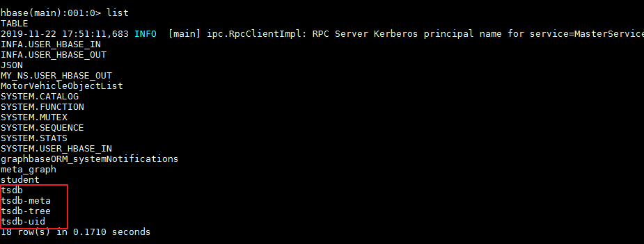
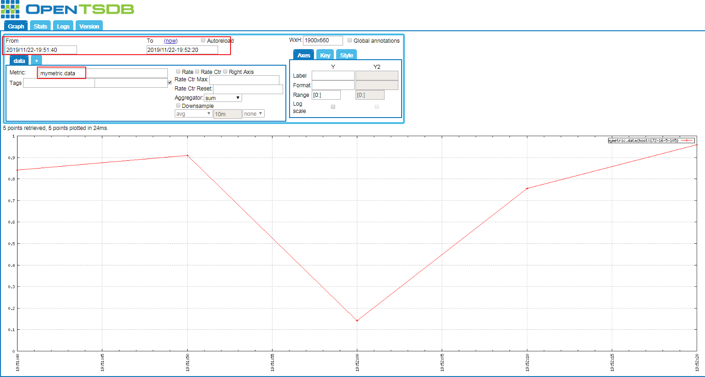
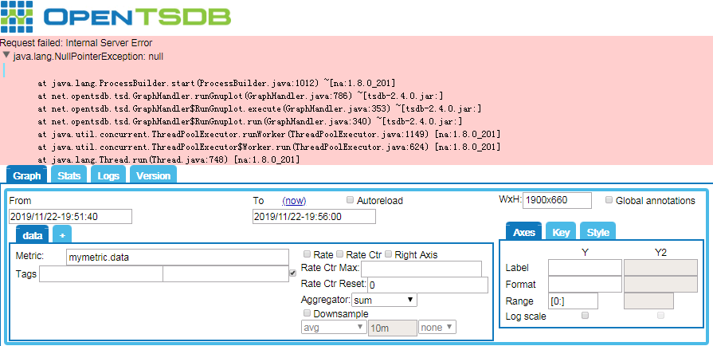

# GeoMesa对接FusionInsight

## 适用场景

> OpenTSDB 2.4.0  <--> FusionInsight HD 6.5 (HBase)

## 简介

OpenTSDB用HBase存储所有的时序（无须采样）来构建一个分布式、可伸缩的时间序列数据库。它支持秒级数据采集所有metrics，支持永久存储，可以做容量规划。OpenTSDB可以从大规模的集群（包括集群中的网络设备、操作系统、应用程序）中获取相应的metrics并进行存储、索引以及服务，从而使得这些数据更容易让人理解，如web化、图形化等。

本文档主要描述在Linux操作系统，OpenTSDB使用FusionInsight HD的HBase组件存储数据。

## 准备工作

* 登录FusionInsight Manager创建一个“人机”用户，例如：developuser，具体请参见FusionInsight HD产品文档的`管理员指南->系统设置->权限设置->用户管理->创建用户`章节。给developuser用户授予所有访问权限，包含但不限于HBase。

* 已完成FusionInsight HD客户端安装，具体请参见FusionInsight HD产品文档的`应用开发指南->安全模式->安全认证->配置客户端文件`章节。本文使用的安装目录为`/opt/hadoopclient`。

* 客户端机器的时间与FusionInsight HD集群的时间要保持一致，时间差小于5分钟。

* 登录FusionInsight Manager的`系统->用户->更多（developuser）->下载认证凭证`，下载developuser对应的认证凭证。将用户的 **krb5.conf** 和 **user.keytab** 文件拷贝到`/opt`目录下。

## 安装部署OpenTSDB

### 操作场景

在已安装FusionInsight HD客户端的节点安装部署OpenTSDB。

### 前提条件

* 已完成准备工作。

### 操作步骤

* 从<https://github.com/OpenTSDB/opentsdb/releases>下载最新版本的OpenTSDB，本文档使用的是OpenTSDB 2.4.0。将下载的opentsdb-2.4.0.tar.gz上传至FusionInsight HD客户端的安装节点的`/opt`目录并解压。

  ```
  cd /opt
  tar -zxvf opentsdb-2.4.0.tar.gz
  ```

* 编译源代码。

  ```
  source /opt/hadoopclient/bigdata_env
  cd /opt/opentsdb-2.4.0
  mkdir build
  cp -r third_party/ ./build
  ./build.sh
  ```

  

* 安装OpenTSDB

  ```
  cd /opt/opentsdb-2.4.0/build
  make install
  ```

  

  >说明：默认安装目录为/usr/local/share/opentsdb/。

* 配置OpenTSDB

  * 创建配置文件夹`/etc/opentsdb`。

    ```
     ln -s /usr/local/share/opentsdb/etc/opentsdb /etc/opentsdb
    ```

  * 复制用户凭证到配置文件夹。

    ```
    cp /opt/user.keytab /etc/opentsdb/
    cp /opt/krb5.conf /etc/opentsdb/
    ```

  * 在`/etc/opentsdb`目录下新建 **jaas.conf** 文件，示例如下：
    ```
    Client {
      com.sun.security.auth.module.Krb5LoginModule required
      useKeyTab=true
      keyTab="/etc/opentsdb/user.keytab"
      principal="developuser"
      useTicketCache=false
      storeKey=true
      debug=true;
    };
    ```

  * 修改opentsdb的配置文件。

    ```
    vi /etc/opentsdb/opentsdb.conf
    ```

    **opentsdb.conf配置如下：**
    ```
    # --------- NETWORK ----------
    tsd.network.port = 4242
    tsd.network.bind = 0.0.0.0
    #tsd.network.tcp_no_delay = true
    #tsd.network.keep_alive = true
    #tsd.network.reuse_address = true
    #tsd.network.worker_threads = 8
    #tsd.network.async_io = true

    # ----------- HTTP -----------
    tsd.http.staticroot = /usr/local/share/opentsdb/static/
    tsd.http.cachedir = /tmp/opentsdb

    # --------- CORE ----------
    tsd.core.auto_create_metrics = true
    tsd.query.skip_unresolved_tagvs = true
    tsd.core.meta.enable_realtime_ts = true
    tsd.core.meta.enable_realtime_uid = true
    tsd.core.meta.enable_tsuid_incrementing = true
    tsd.core.meta.enable_tsuid_tracking = true
    tsd.core.tag.allow_specialchars=@( )
    tsd.core.plugin_path = /usr/local/share/opentsdb/plugins

    # --------- STORAGE ----------
    #tsd.storage.enable_compaction = true
    # tsd.storage.flush_interval = 1000
    #tsd.storage.hbase.data_table = tsdb
    #tsd.storage.hbase.uid_table = tsdb-uid
    tsd.storage.hbase.zk_basedir = /hbase
    tsd.storage.fix_duplicates=true
    tsd.http.request.enable_chunked=true
    tsd.http.request.max_chunk=1073741824
    tsd.http.query.allow_delete=true

    # hbase zookeeper集群地址，请修改为集群的zk地址
    tsd.storage.hbase.zk_quorum = 172.16.4.21:24002,172.16.4.22:24002,172.16.4.23:24002

    # hbase kerberos认证信息
    hbase.security.auth.enable=true
    hbase.security.authentication=Kerberos

    # hadoop.com@HADOOP.COM需要根据当前集群 krbServer 的 realm 进行修改
    hbase.kerberos.regionserver.principal=hbase/hadoop.hadoop.com@HADOOP.COM
    hbase.sasl.clientconfig=Client
    ```

  * 修改opentsdb的tsdb脚本增加认证配置。

    将`/usr/local/share/opentsdb/bin/tsdb`脚本倒数第二行（else后面）增加蓝色部分安全相关的环境变量：

    exec $JAVA $JVMARGS -classpath "$CLASSPATH" **<span style="color:blue;">-Djava.security.krb5.conf=/etc/opentsdb/krb5.conf -Djava.security.auth.login.config=/etc/opentsdb/jaas.conf -Dzookeeper.server.principal=zookeeper/hadoop.hadoop.com</span>** net.opentsdb.tools.$MAINCLASS "$@"

    ```
    vi /usr/local/share/opentsdb/bin/tsdb
    ```

    

  * 创建缺失的目录

    ```
    mkdir /usr/local/share/opentsdb/plugins
    ```

  * 更新为使用FusionInsight HD的Zookeeper jar包。

    ```
    cp /opt/hadoopclient/HBase/hbase/lib/zookeeper-3.5.1.jar /usr/local/share/opentsdb/lib/
    rm -rf /usr/local/share/opentsdb/lib/zookeeper-3.4.6.jar
    ```

  * 拷贝集群配置文件 **hdfs-site.xml** 、**core-site.xml** 、**hbase-site.xml** 到`/etc/opentsdb`目录。

    ```
    cp /opt/hadoopclient/HDFS/hadoop/etc/hadoop/hdfs-site.xml /etc/opentsdb/
    cp /opt/hadoopclient/HDFS/hadoop/etc/hadoop/core-site.xml /etc/opentsdb/
    cp /opt/hadoopclient/HBase/hbase/conf/hbase-site.xml /etc/opentsdb/
    ```

    

* 创建Opentsdb相关的hbase表结构

  * **删除create_table.sh** 脚本的第53行的” , TTL => '$TSDB_TTL'”。

    ```
    cp /opt/opentsdb-2.4.0/src/create_table.sh /usr/local/share/opentsdb/bin/
    vi /usr/local/share/opentsdb/bin/create_table.sh

    ```

    

  * 增加 **create_table.sh** 脚本的执行权限。

    ```
    chmod +x /usr/local/share/opentsdb/bin/create_table.sh
    ```

  * 运行创建Hbase表脚本。

    ```
    source /opt/hadoopclient/bigdata_env
    kdestroy
    kinit -kt /etc/opentsdb/user.keytab developuser
    env COMPRESSION=snappy /usr/local/share/opentsdb/bin/create_table.sh
    ```

    

  * 使用hbase shell查询Opentsdb相关表

    ```
    hbase shell
    list
    ```

    

    >说明：Opentsdb表一共有4张表
    >
    >tsdb：存储所有数据
    >
    >tsdb-meta：存储额外信息
    >
    >tsdb-tree：树状结构，类似于文件系统
    >
    >tsdb-uid：存储UID映射

* 安装gnuplot

  ```
  yum install gnuplot
  ```

* 启动OpenTSDB

  ```
  source /opt/hadoopclient/bigdata_env
  /usr/local/share/opentsdb/bin/tsdb tsd
  ```

  

  使用浏览器打开<http://172.16.5.105:4242/>。

  

  >说明：
  >
  >172.16.5.105为启动OpenTSDB节点的IP。
  >
  >必须确保确定的防火墙是关闭状态，浏览器才能访问。执行`systemctl stop firewalld`可关闭防火墙。
  >
  >

## 使用OpenTSDB

### 操作场景

使用OpenTSDB创建数据存入HBase并查看。

### 前提条件

* 已完成安装部署OpenTSDB。

### 操作步骤

* 准备数据

  * 创建metric

    ```
    source /opt/hadoopclient/bigdata_env
    /usr/local/share/opentsdb/bin/tsdb mkmetric mymetric.data
    ```
    

  * 准备导入数据

    ```
    vi /opt/opentsdb_mymetric.txt
    ```

    **opentsdb_mymetrix.txt内容如下：**

    ```
    mymetric.data 1574423500 0.841470984808 host=172-16-5-105
    mymetric.data 1574423510 0.909297426826 host=172-16-5-105
    mymetric.data 1574423520 0.14112000806 host=172-16-5-105
    mymetric.data 1574423530 0.756802495308 host=172-16-5-105
    mymetric.data 1574423540 0.958924274663 host=172-16-5-105
    ```

  * 向metric导入数据

    ```
    /usr/local/share/opentsdb/bin/tsdb import /opt/opentsdb_mymetric.txt
    ```

    

* 启动OpenTSDB并用浏览器访问，例如<http://172.16.5.105:4242/>。

  ```
  /usr/local/share/opentsdb/bin/tsdb tsd
  ```

  

  


* 输入以下查询条件：

  ```
  From: UNIX timestamp=1574423500
  To: UNIX timestamp=1574423540
  Metrix: mymetric_data
  ```

  

## FAQ

* **查询数据时返回java.lang.NullPointerException: null**

    **【问题描述】**

    在界面输入查询条件查询数据时，返回以下错误。

    ```
    Request failed: Internal Server Error
    java.lang.NullPointerException: null
    at java.lang.ProcessBuilder.start(ProcessBuilder.java:1012) ~[na:1.8.0_201]
  	at net.opentsdb.tsd.GraphHandler.runGnuplot(GraphHandler.java:786) ~[tsdb-2.4.0.jar:]
  	at net.opentsdb.tsd.GraphHandler$RunGnuplot.execute(GraphHandler.java:353) ~[tsdb-2.4.0.jar:]
  	at net.opentsdb.tsd.GraphHandler$RunGnuplot.run(GraphHandler.java:340) ~[tsdb-2.4.0.jar:]
  	at java.util.concurrent.ThreadPoolExecutor.runWorker(ThreadPoolExecutor.java:1149) [na:1.8.0_201]
  	at java.util.concurrent.ThreadPoolExecutor$Worker.run(ThreadPoolExecutor.java:624) [na:1.8.0_201]
  	at java.lang.Thread.run(Thread.java:748) [na:1.8.0_201]
    ```

    

    **【解决方法】**

    检查是否已安装插件。如果未安装，执行以下命令安装后再重新启动OpenTSDB。

    ```
    yum install gnuplot
    /usr/local/share/opentsdb/bin/tsdb tsd
    ```
