# DbVisualizer对接FusionInsight

## 适用场景

> DbVisualizer 10.0.21 <-> FusionInsight HD 6.5.0
>
> DbVisualizer 10.0.21 <-> FusionInsight HD 6.5.1

## 简介

SQL开发工具，如DbVisualizer、DBeaver、Squirrel是数据库开发的常用选择，虽然这些工具大多不提供原生Hive、SparkSQL、Phoenix的支持，但是通过它们支持的自定义JDBC的能力，我们可以与FusionInsignt提供的Fiber组件的JDBC接口进行对接，实现这Hive、SparkSQL、Phoenix组件的统一SQL查询。

* Fiber架构图

  

本文档主要描述在Window操作系统，DbVisualizer通过Fiber方式对接FusionInsight HD的Hive、Spark2x、Phoenix组件。

## 准备工作

* 登录FusionInsight Manager创建一个“人机”用户，例如：developuser，具体请参见FusionInsight HD产品文档的`管理员指南->系统设置->权限设置->用户管理->创建用户`章节。给developuser用户授予所有访问权限，包含但不限于Spark2x、Hive、HBase。

* 已完成FusionInsight HD客户端安装，具体请参见FusionInsight HD产品文档的`应用开发指南->安全模式->安全认证->配置客户端文件`章节。

* 已将集群的节点主机名与IP的映射关系加入到windows的hosts文件中`C:\Windows\System32\drivers\etc\hosts`。

* 客户端机器的时间与FusionInsight HD集群的时间要保持一致，时间差小于5分钟。

* Windows上已经安装好jdk1.8或者以上版本，并完成jdk环境变量配置。

* Hive数据库已存在表student，数据类似于：

  

  **示例如下：**

  ```
  CREATE TABLE IF NOT EXISTS student(id INT, name STRING, class_id INT);
  INSERT INTO student VALUES (1,'Tom',1);
  INSERT INTO student VALUES (2,'Sandy',2);
  INSERT INTO student VALUES (3,'Benny',3);
  INSERT INTO student VALUES (4,'Tina',1);
  ```

## Fiber认证方式配置

### 操作场景

Fiber的安全认证有kinit和keytab两种方式。具体参数配置说明可参考FusionInsight HD产品文档的`业务操作指南->统一SQL(Fiber)->客户端配置`章节。

### 前提条件

* 已完成准备工作。

* 将FusionInsight HD客户端的Fiber、Hive、Spark2x、HBase客户端文件夹，拷贝至本地新建目录`C:\ecotesting`。假设FusionInsight HD客户端安装于`/opt/hadoopclient`目录，则：

  * 将`/opt/hadoopclient/Fiber`拷贝至本地`C:\ecotesting`目录。

  * 将`/opt/hadoopclient/Hive`拷贝至本地`C:\ecotesting\Fiber`目录。

  * 将`/opt/hadoopclient/Spark2x`拷贝至本地`C:\ecotesting\Fiber`目录。

  * 将`/opt/hadoopclient/HBase`拷贝至本地`C:\ecotesting\Fiber`目录。

  * 将`C:\ecotesting\Fiber\HBase\hbase\lib\phoenix-core-4.13.1-HBase-1.3.jar`拷贝至`C:\ecotesting\Fiber\lib`。

  

* 登录FusionInsight Manager的`系统->用户->更多（developuser）->下载认证凭证`，下载developuser对应的认证凭证。将用户的 **krb5.conf** 和 **user.keytab** 文件拷贝到`C:\ecotesting\Fiber\conf`目录下。

### 操作步骤

#### 使用kinit认证方式配置

- 从<http://web.mit.edu/kerberos/dist/#kfw-4.0>下载对应操作系统架构的MIT Kerberos并安装。

- 设置Kerberos的配置文件。将用户的krb5.conf文件重命名为 **krb5.ini** 放在`C:\ProgramData\MIT\Kerberos5`目录下。

- 设置Kerberos票据的缓存文件

  * 在本地创建存放票据的目录，例如`C:\temp`。

  * 设置Windows的系统环境变量，变量名为`KRB5CCNAME`，变量值为`C:\temp\krb5cache`。

    

- 在Windows上进行认证

  打开MIT Kerberos，单击 **get Ticket** ，在弹出的MIT Kerberos: Get Ticket窗口中，**Pricipal** 输入用户名`developuser@HADOOP.COM`，**Password** 输入密码，单击 **OK**。

  

- 在`C:\ecotesting\Fiber\conf`目录下新建 **jaas.conf** 文件，内容如下所示：

  ```
  Client {
    com.sun.security.auth.module.Krb5LoginModule required
    useKeyTab=false
    useTicketCache=true
    debug=true;
  };
  ```
- 修改配置文件`C:\ecotesting\Fiber\conf\fiber.xml`。

  **Hive的JDBC配置示例：**
  ```
  <jdbc>
    <identify>hive</identify>
    <describe>hive jdbc configuration</describe>
    <driverClass>org.apache.hive.jdbc.HiveDriver</driverClass>
    <securityClass>com.huawei.fiber.DefaultAuthenticationCallback</securityClass>     
    <classPath>C:\\ecotesting\\Fiber\\Hive\\config;C:\\ecotesting\\Fiber\\Hive\\Beeline\\lib;C:\\ecotesting\\Fiber\\Hive\\Beeline\\conf</classPath>
    <jdbcUrl>jdbc:hive2://172.16.4.21:24002,172.16.4.22:24002,172.16.4.23:24002/;serviceDiscoveryMode=zooKeeper;zooKeeperNamespace=hiveserver2;sasl.qop=auth-conf;auth=KERBEROS;principal=hive/hadoop.hadoop.com@HADOOP.COM</jdbcUrl>
    <properties>
      <property>
        <name>java.security.krb5.conf</name>
        <value>C:\\ecotesting\\Fiber\\conf\\krb5.conf</value>
      </property>
      <property>
        <name>java.security.auth.login.config</name>
        <value>C:\\ecotesting\\Fiber\\conf\\jaas.conf</value>
      </property>
      <property>
        <name>zookeeper.server.principal</name>
        <value>zookeeper/hadoop.hadoop.com</value>
      </property>
      <property>
        <name>zookeeper.kinit</name>
        <value>C:\\Program Files\\Java\\jdk1.8.0_202\\jre\\bin\\kinit.exe</value>
      </property>
    </properties>
  </jdbc>
  ```

  **Spark2x的JDBC配置示例：**
  ```
  <jdbc>
    <identify>Spark2x</identify>
    <describe>Spark2x jdbc configuration</describe>
    <driverClass>org.apache.hive.jdbc.HiveDriver</driverClass>
    <securityClass>com.huawei.fiber.DefaultAuthenticationCallback</securityClass>
    <classPath>C:\\ecotesting\\Fiber\\Spark2x\\spark\\conf;C:\\ecotesting\\Fiber\\Spark2x\\spark\\jars</classPath>
    <jdbcUrl>jdbc:hive2://172.16.4.21:24002,172.16.4.22:24002,172.16.4.23:24002/;serviceDiscoveryMode=zooKeeper;zooKeeperNamespace=sparkthriftserver2x;saslQop=auth-conf;auth=KERBEROS;principal=spark2x/hadoop.hadoop.com@HADOOP.COM</jdbcUrl>
    <properties>
  	<property>
  	  <name>java.security.krb5.conf</name>
  	  <value>C:\\ecotesting\\Fiber\\conf\\krb5.conf</value>
  	</property>
  	<property>
  	  <name>java.security.auth.login.config</name>
  	  <value>C:\\ecotesting\\Fiber\\conf\\jaas.conf</value>
  	</property>
  	<property>
  	  <name>zookeeper.server.principal</name>
  	  <value>zookeeper/hadoop.hadoop.com</value>
  	</property>
  	<property>
  	  <name>zookeeper.kinit</name>
  	  <value>C:\\Program Files\\Java\\jdk1.8.0_202\\jre\\bin\\kinit.exe</value>
  	</property>
    </properties>
  </jdbc>
  ```

  **Phoenix的JDBC配置示例：**
  ```
  <jdbc>
    <identify>phoenix</identify>
    <describe>phoenix jdbc configuration</describe>
    <driverClass>org.apache.phoenix.jdbc.PhoenixDriver</driverClass>
    <securityClass>com.huawei.fiber.DefaultAuthenticationCallback</securityClass>
    <classPath>C:\\ecotesting\\Fiber\\HBase\\hbase\\lib;C:\\ecotesting\\Fiber\\HBase\\hbase\\conf</classPath>
    <jdbcUrl>jdbc:phoenix</jdbcUrl>
    <properties>
      <property>
        <name>java.security.krb5.conf</name>
        <value>C:\\ecotesting\\Fiber\\conf\\krb5.conf</value>
      </property>
      <property>
        <name>java.security.auth.login.config</name>
        <value>C:\\ecotesting\\Fiber\\conf\\jaas.conf</value>
      </property>
      <property>
        <name>zookeeper.server.principal</name>
        <value>zookeeper/hadoop.hadoop.com</value>
      </property>
      <property>
        <name>zookeeper.kinit</name>
        <value>C:\\Program Files\\Java\\jdk1.8.0_202\\jre\\bin\\kinit.exe</value>
      </property>
    </properties>
  </jdbc>
  ```

#### 使用keytab认证方式配置

- 在`C:\ecotesting\Fiber\conf`目录下新建 **jaas.conf** 文件，示例如下：
  ```
  Client {
    com.sun.security.auth.module.Krb5LoginModule required
    useKeyTab=true
    keyTab="C:\\ecotesting\\Fiber\\conf\\user.keytab"
    principal="developuser"
    useTicketCache=false
    storeKey=true
    debug=true;
  };
  ```

- 修改配置文件`C:\ecotesting\Fiber\conf\fiber.xml`。

  **Hive的JDBC配置示例：**

  ```
  <jdbc>
    <identify>hive</identify>
    <describe>hive jdbc configuration</describe>
    <driverClass>org.apache.hive.jdbc.HiveDriver</driverClass>
    <securityClass>com.huawei.fiber.DefaultAuthenticationCallback</securityClass>     
    <classPath>C:\\ecotesting\\Fiber\\Hive\\config;C:\\ecotesting\\Fiber\\Hive\\Beeline\\lib;C:\\ecotesting\\Fiber\\Hive\\Beeline\\conf</classPath>
    <jdbcUrl>jdbc:hive2://172.16.4.21:24002,172.16.4.22:24002,172.16.4.23:24002/;serviceDiscoveryMode=zooKeeper;zooKeeperNamespace=hiveserver2;sasl.qop=auth-conf;auth=KERBEROS;principal=hive/hadoop.hadoop.com@HADOOP.COM;user.principal=developuser;user.keytab=C:/ecotesting/Fiber/conf/user.keytab</jdbcUrl>
     <properties>
      <property>
        <name>java.security.krb5.conf</name>
        <value>C:\\ecotesting\\Fiber\\conf\\krb5.conf</value>
      </property>
      <property>
        <name>java.security.auth.login.config</name>
        <value>C:\\ecotesting\\Fiber\\conf\\jaas.conf</value>
      </property>
      <property>
        <name>zookeeper.server.principal</name>
        <value>zookeeper/hadoop.hadoop.com</value>
      </property>
      <property>
        <name>zookeeper.kinit</name>
        <value>C:\\Program Files\\Java\\jdk1.8.0_202\\jre\\bin\\kinit.exe</value>
      </property>
    </properties>
  </jdbc>
  ```

  **Spark2x的JDBC配置示例：**
  ```
  <jdbc>
    <identify>Spark2x</identify>
    <describe>Spark2x jdbc configuration</describe>
    <driverClass>org.apache.hive.jdbc.HiveDriver</driverClass>
    <securityClass>com.huawei.fiber.DefaultAuthenticationCallback</securityClass>
    <classPath>C:\\ecotesting\\Fiber\\Spark2x\\spark\\conf;C:\\ecotesting\\Fiber\\Spark2x\\spark\\jars</classPath>
    <jdbcUrl>jdbc:hive2://172.16.4.21:24002,172.16.4.22:24002,172.16.4.23:24002/;serviceDiscoveryMode=zooKeeper;zooKeeperNamespace=sparkthriftserver2x;saslQop=auth-conf;auth=KERBEROS;principal=spark2x/hadoop.hadoop.com@HADOOP.COM;user.principal=developuser;user.keytab=C:/ecotesting/Fiber/conf/user.keytab</jdbcUrl>
    <properties>
  	<property>
  	  <name>java.security.krb5.conf</name>
  	  <value>C:\\ecotesting\\Fiber\\conf\\krb5.conf</value>
  	</property>
  	<property>
  	  <name>java.security.auth.login.config</name>
  	  <value>C:\\ecotesting\\Fiber\\conf\\jaas.conf</value>
  	</property>
  	<property>
  	  <name>zookeeper.server.principal</name>
  	  <value>zookeeper/hadoop.hadoop.com</value>
  	</property>
  	<property>
  	  <name>zookeeper.kinit</name>
  	  <value>C:\\Program Files\\Java\\jdk1.8.0_202\\jre\\bin\\kinit.exe</value>
  	</property>
    </properties>
  </jdbc>
  ```

  **Phoenix的JDBC配置示例：** 需要增加属性hbase.myclient.keytab.file和hbase.myclient.principal。
  ```
  <jdbc>
    <identify>phoenix</identify>
    <describe>phoenix jdbc configuration</describe>
    <driverClass>org.apache.phoenix.jdbc.PhoenixDriver</driverClass>
    <securityClass>com.huawei.fiber.DefaultAuthenticationCallback</securityClass>
    <classPath>C:\\ecotesting\\Fiber\\HBase\\hbase\\lib;C:\\ecotesting\\Fiber\\HBase\\hbase\\conf</classPath>
    <jdbcUrl>jdbc:phoenix:172.16.4.21,172.16.4.22,172.16.4.23:24002:/hbase</jdbcUrl>
    <properties>
      <property>
        <name>java.security.krb5.conf</name>
        <value>C:\\ecotesting\\Fiber\\conf\\krb5.conf</value>
      </property>
      <property>
        <name>java.security.auth.login.config</name>
        <value>C:\\ecotesting\\Fiber\\conf\\jaas.conf</value>
      </property>
      <property>
        <name>hbase.master.keytab.file</name>
        <value>C:\\ecotesting\\Fiber\\conf\\user.keytab</value>
      </property>
  	<property>
        <name>hbase.myclient.principal</name>
        <value>developuser</value>
      </property>
  	<property>
        <name>zookeeper.server.principal</name>
        <value>zookeeper/hadoop.hadoop.com</value>
      </property>
      <property>
        <name>zookeeper.kinit</name>
        <value>C:\\Program Files\\Java\\jdk1.8.0_202\\jre\\bin\\kinit.exe</value>
      </property>
    </properties>
  </jdbc>
  ```

## DbVisualizer对接Fiber

### 操作场景

DbVisualizer通过Fiber方式对接FusionInsight HD的Hive、Spark2x、Phoenix组件。

### 前提条件

* 从<http://www.dbvis.com/download/>下载与本地系统相对应的DbVisualizer软件，并完成安装。可按照默认选项完成安装。

  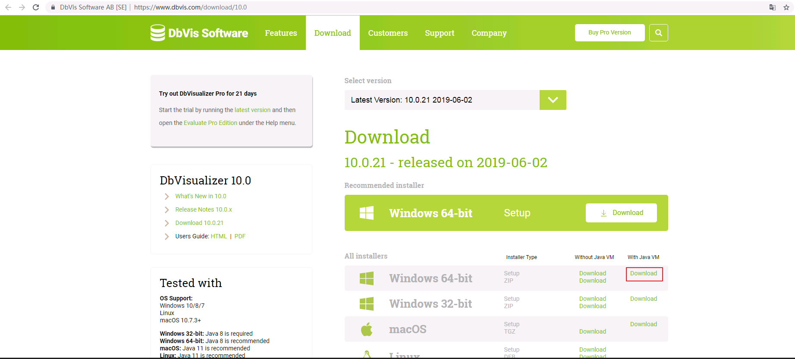

### 操作步骤

#### DbVisualizer通过Fiber对接Hive

* 打开DbVisualizer，点击 **Cancel**。

  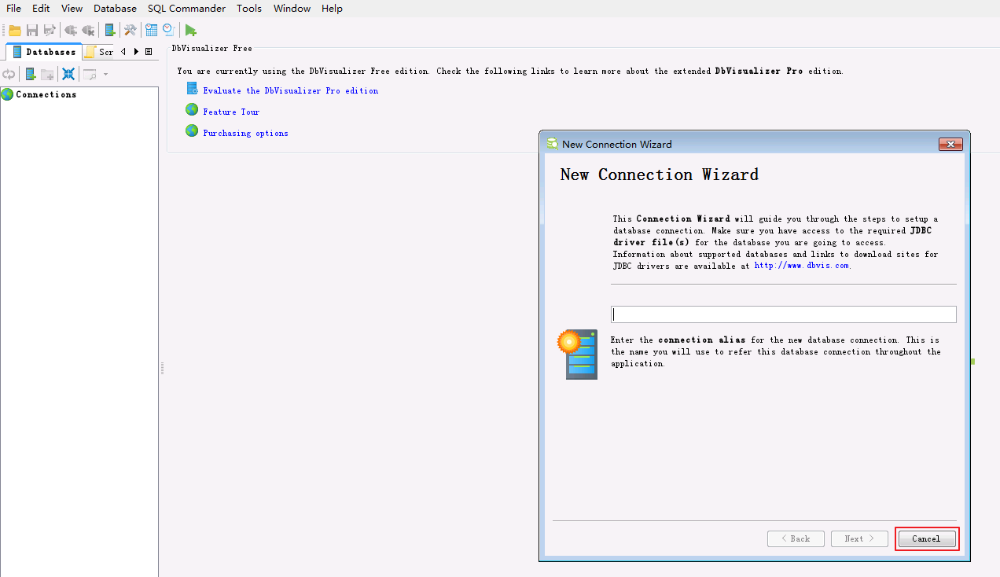

* 菜单栏选择`Tools->Driver Manager`。

  

* 点击新建driver。信息填写完毕后，关闭该窗口。

  **填写信息示例如下：**

  ```
  Name：Fiber（自定义）
  URL Format：jdbc:fiber://
  Dirver jar Files: 将C:\ecotesting\Fiber\lib目录下所有的jar包加入
  Class Name：com.huawei.fiber.FiberDriver（添加jar包后从下拉框中选择）

  ```

  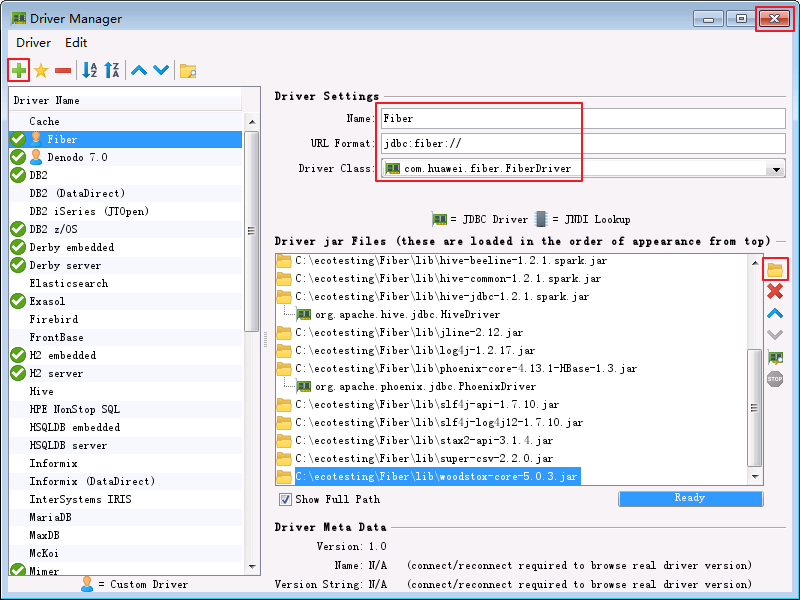

* 菜单栏选择`Database-> Create Database Connection`。

  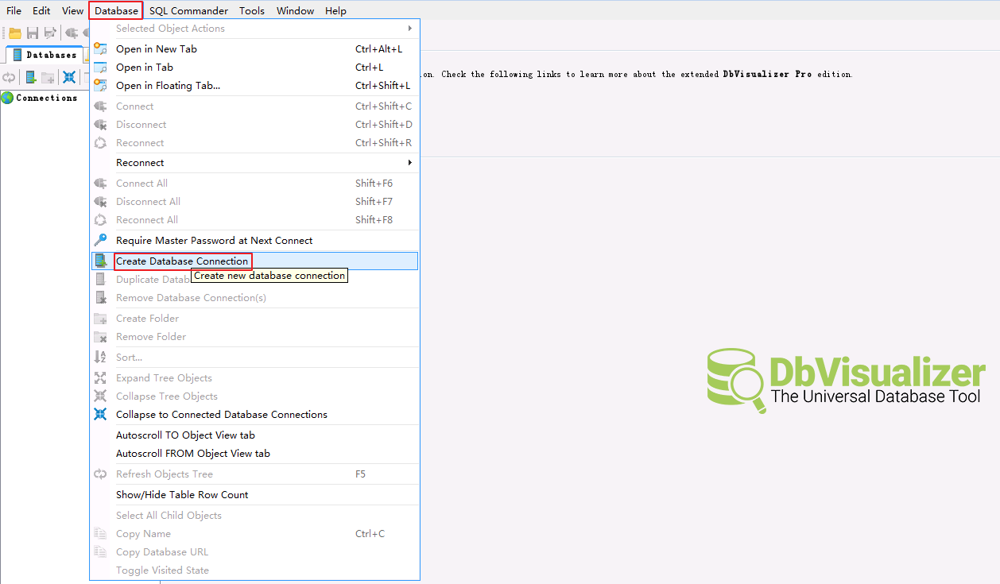

* 选择 **Use Wizard**。

  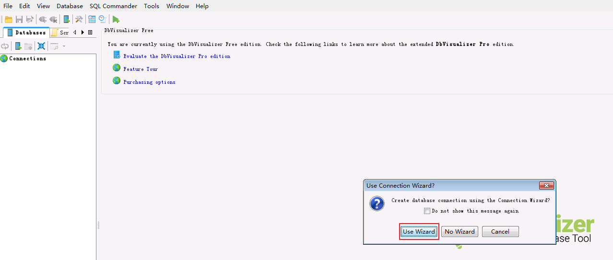

* 自定义连接名称，例如 **Fiber** ，点击 **Next** 。

  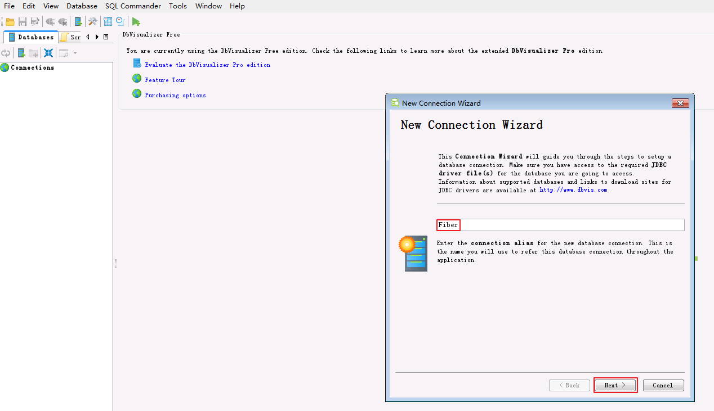

* 选择数据库Driver。在下拉框中选择 **Fiber** 。

  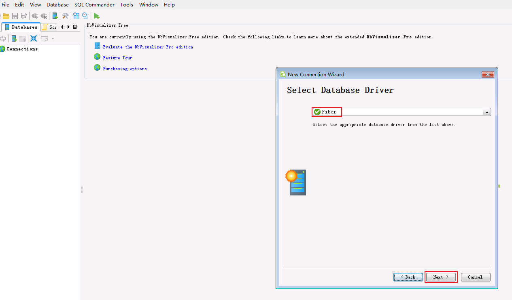

* 填写 **Database URL = jdbc:fiber://** ，其余的可不填写。点击 **Finish** 完成配置。

  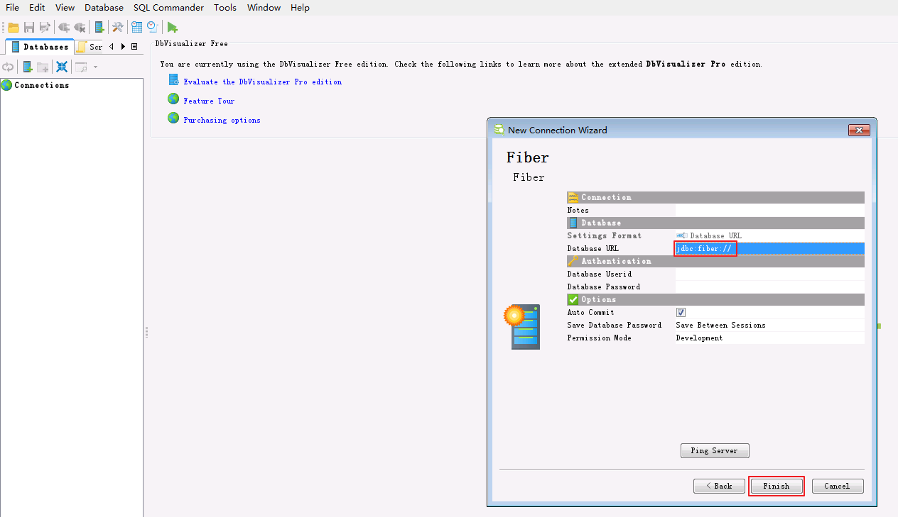

* 选择`Databases->Connections->Fiber`，选择 **Properties** 面板，填写 **defaultDriver = hive** 和 **fiberconfig = C:\\\ecotesting\\\Fiber\\\conf\\\fiber.xml** ，点击 **Apply** 。

  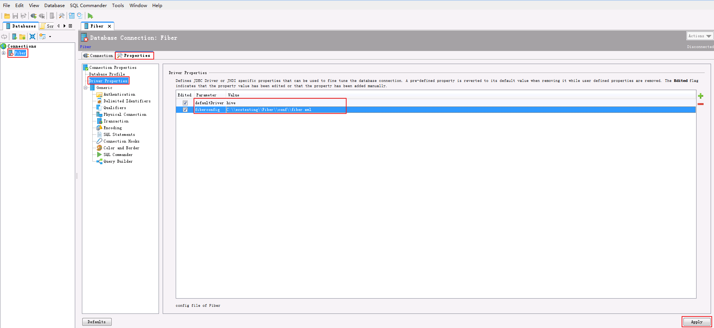

* 选择 **Connection** 面板，点击 **Connect** 按钮。

  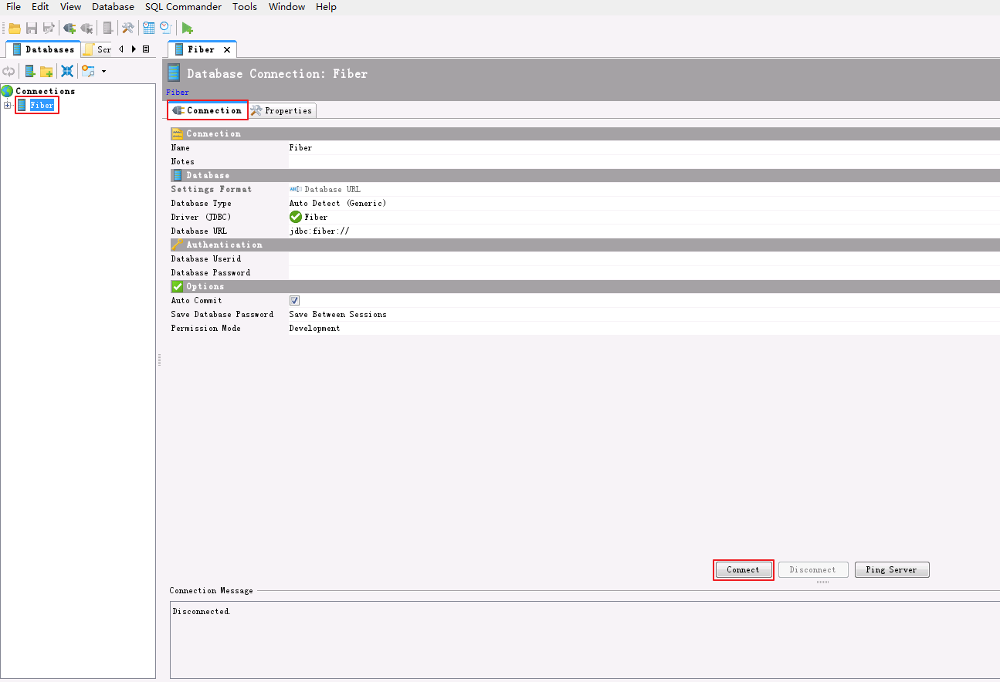

* Connection Message返回使用的Server和Driver版本信息，且返回默认数据库 **default** 则表示通过Fiber连接Hive成功。

  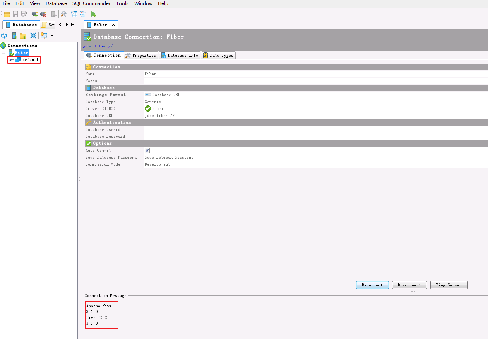

* 查看表数据。点击`default->TABLE->student->Data`查看student表数据。

  

* SQL查询表数据。菜单栏选择`File->New SQL Commander` ，编辑查询SQL，点击 **执行** 按钮，查看查询结果。

  `select * from student;`

  

#### DbVisualizer通过Fiber对接Spark2x

* 双击数据连接`Fiber`打开DataBase Connection配置面板。选择`Properties->Driver Properties`，将 “defaultDriver”修改为 **spark2x** ，点击 **Apply** 。

  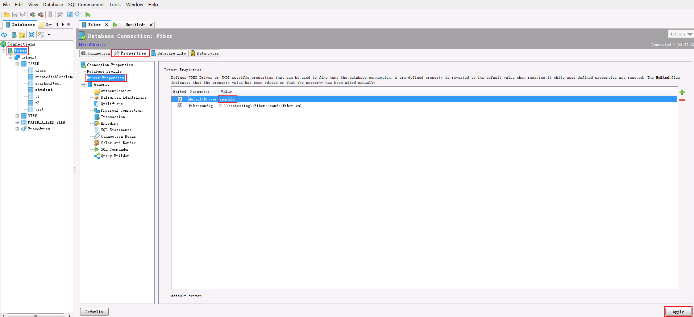

* 选择 **Connection** 面板，点击 **Reconnect** 按钮。Connection Message返回使用的Server和Driver版本信息，且返回默认数据库 **default** 则表示通过Fiber连接Spark2x成功。

  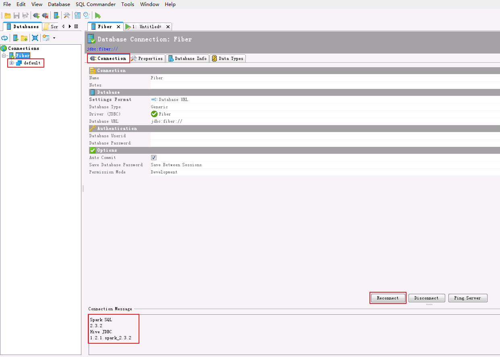

* 查看表数据。点击`default->TABLE->student->Data`查看student表数据。

  

* SQL查询表数据。菜单栏选择`File->New SQL Commander` ，编辑查询SQL，点击 **执行** 按钮，查看查询结果。

  `select * from student;`

  

#### DbVisualizer通过Fiber对接Phoenix

* 双击数据连接`Fiber`打开DataBase Connection配置面板。选择`Properties->Driver Properties`，将 “defaultDriver”修改为 **phoenix** ，点击 **Apply** 。

  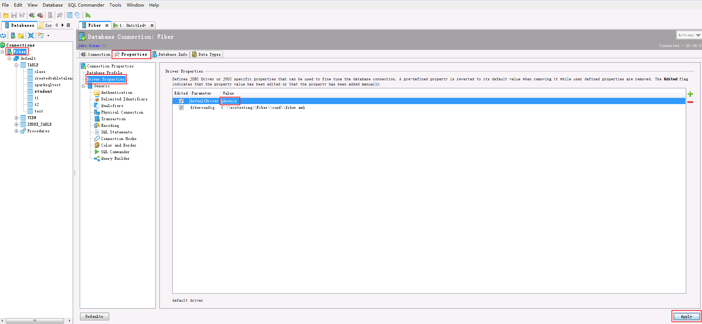

* 选择 **Connection** 面板，点击 **Reconnect** 按钮。Connection Message返回使用的Server和Driver版本信息，且返回默认数据库 **SYSTEM** 则表示通过Fiber连接Phoenix成功。

  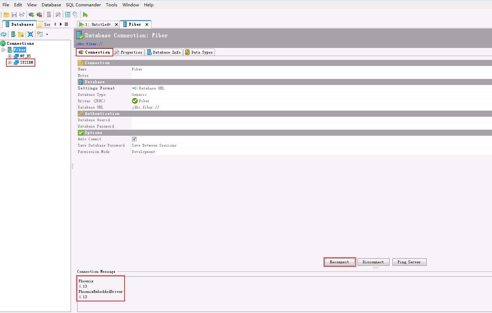

* SQL操作表数据。

  * 如果不存在自定义的命名空间空间“MY_NS”，则登录FusionInsight集群客户端，执行hbase shell的“create_namespace”命令创建新的命名空间 **MY_NS**。

    `create_namespace 'MY_NS'`

    

  * 创建表和数据。菜单栏选择`File->New SQL Commander` ，编辑SQL如下，点击 **执行** 按钮，查看查询结果。

    ```
    CREATE TABLE IF NOT EXISTS MY_NS.SQL_TEST (id integer not null primary key, name varchar);
    UPSERT INTO MY_NS.SQL_TEST VALUES(1,'John');
    UPSERT INTO MY_NS.SQL_TEST VALUES(2,'Tom');
    UPSERT INTO MY_NS.SQL_TEST VALUES(3,'Manson');
    UPSERT INTO MY_NS.SQL_TEST VALUES(4,'Aurora');
    ```

    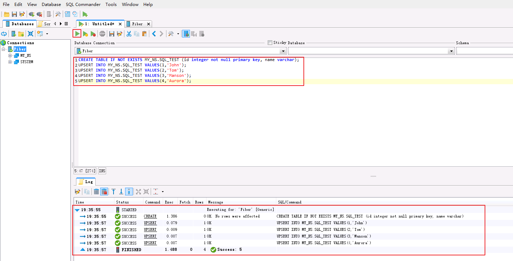

  * SQL查询表数据。编辑SQL如下，点击 **执行** 按钮。

    `select * from MY_NS.SQL_TEST;`

    

  * SQL修改表的数据。编辑SQL如下，点击 **执行** 按钮。

    `UPSERT INTO MY_NS.SQL_TEST VALUES(1,'Jessy');`

  * SQL删除表的数据。编辑SQL如下，点击 **执行** 按钮。

    `DELETE FROM MY_NS.SQL_TEST WHERE ID=4;`

  * 编辑SQL如下，点击 **执行** 按钮。“ID=1”的“NAME”已被修改为“Jessy”，“ID=4”的记录已被删除。

    `select * from MY_NS.SQL_TEST;`

    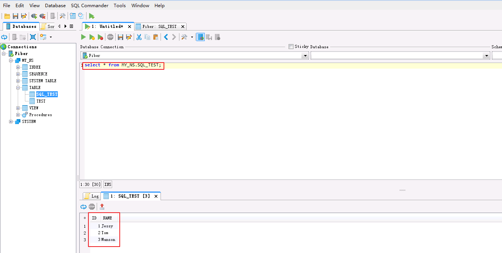

* 直接查看表数据。点击`MY_NS->TABLE->SQL_TEST->Data`查看student表数据。

  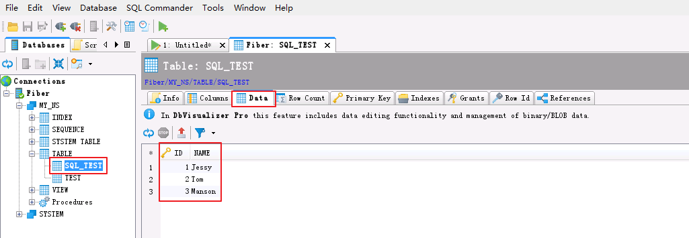

## FAQ

  * **界面查看表数据时，返回ParseException line 1:14 cannot recognize input near '"default"' '.' '"student"' in join source**

    **【问题描述】**

    连接上Hive后，点击`default->TABLE->student->Data`查看student表数据时，返回以下错误。

    An error occurred while performing the operation:
    Error while compiling statement: FAILED: ParseException line 1:14 cannot recognize input near '"default"' '.' '"student"' in join source

    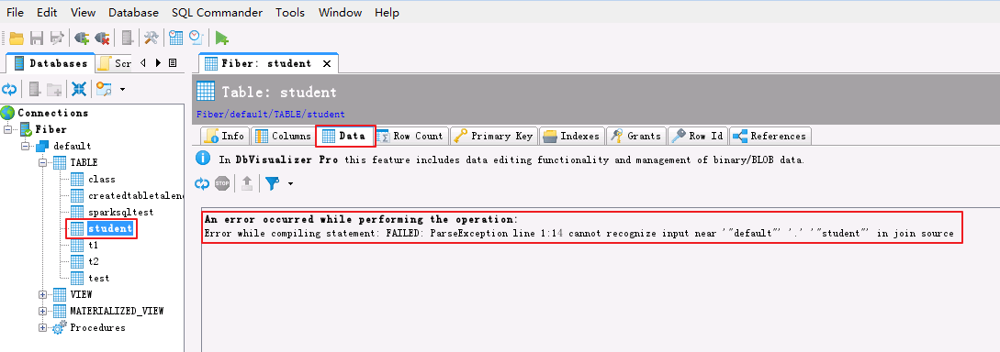

    **【解决方法】**

    双击数据连接`Fiber`打开DataBase Connection配置面板。选择`Properties->Generic->Delimited Identifiers`。将 **Begin Identifier** 和 **End Identifier** 的内容（例如双引号 **"**）清空后，点击 **Apply** 。

    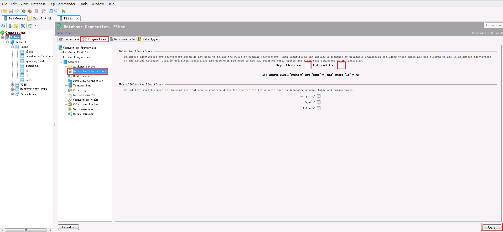
