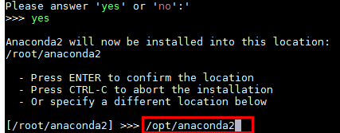
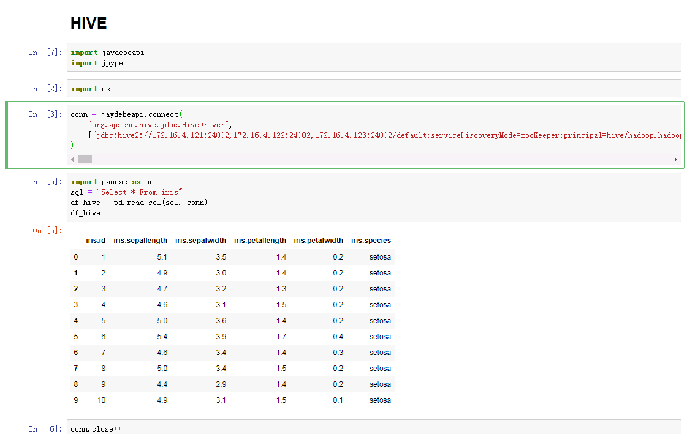
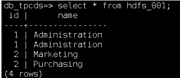
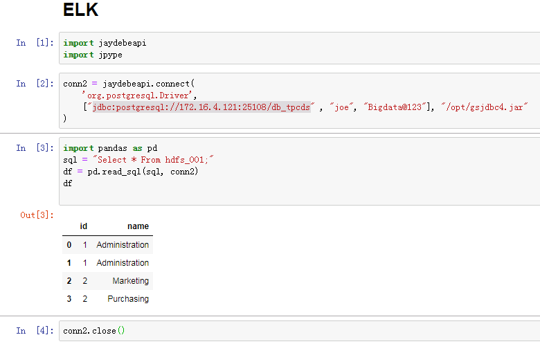

# Connection Instruction between Jupyter Notebook and FusionInsight

## Succeeded Case

> Jupyter Notebook 5.7.8 <--> FusionInsight HD V100R002C80SPC200 (Hive/Elk/Spark2x)

> Jupyter Notebook 5.7.8 <--> FusionInsight HD 6.5 (Hive/Elk/Spark2x)


## Install Anaconda

Refer to Anaconda official documentation to install Anaconda corresponding to Linux：https://docs.anaconda.com/anaconda/install/linux/

- Use the command `wget https://repo.anaconda.com/archive/Anaconda2-2019.03-Linux-x86_64.sh` to download the Linux-related installation package

- Use the command `bash Anaconda2-2019.03-Linux-x86_64.sh` to start the installation

  1.  Press the Enter to view License Agreement
  2.  Type yes
  3.  Choose the installation location to `/opt/anaconda2`

    

  4.  After the installation is complete, select yes to initialize, and write the initialization settings to the `~/.bashrc` file.

    

- Use the command `cp ~/.bashrc ~/.bashrc.anaconda` to copy the generated `.basrc` file into a new named file `.bashrc.anaconda` with the following detail info:

  

  The red box is the initial configuration added after installing anaconda

- Use the command `vi ~/.bashrc` to modify the `.bashrc` file, delete the conda initialization part：

  

- Use the command `source ~/.bashrc.anaconda` to initialize the Environment

- Use the command `jupyter notebook --generate-config --allow-root` to generate the jupyter notebook configuration file

  

- Use the following command `vi /root/.jupyter/jupyter_notebook_config.py` to modify the configuration parameters:

  1.  Change the IP

  

  2.  Change the port(optional)

  

  save

- Install the FI HD client on the jupyter notebook host.

- Using the following command to start jupyter notebook
  ```
  source /opt/hadoopclient/bigdata_env
  kinit developuser
  source ~/.bashrc.anaconda
  export PYSPARK_DRIVER_PYTHON="ipython"
  export PYSPARK_DRIVER_PYTHON_OPTS="notebook --allow-root"
  pyspark --master yarn --deploy-mode client &
  ```

  

  Copy and paste the corresponding address directly to login to the jupyter notebook web UI：

  


## Connect to Spark2x

Note: Use pySpark interface to connect Spark2x HD components

- Use the previous section command to start jupyter notebook and enter weibUI

- Go to the following link to obtain the required data file airlines.csv, and upload the data file to the `/tmp` path of the hdfs: https://github.com/beanumber/airlines/blob/master/data-raw/airlines.csv

- Create a new notebook and enter python code

  ```
  from pyspark import SparkConf
  from pyspark import SparkContext
  conf = SparkConf()
  conf.setAppName('spark-wordcount_from172.16.2.118')
  sc = SparkContext(conf=conf)
  distFile = sc.textFile('hdfs://hacluster/tmp/airlines.csv')
  nonempty_lines = distFile.filter(lambda x: len(x) > 0)
  print 'Nonempty lines', nonempty_lines.count()
  words = nonempty_lines.flatMap(lambda x: x.split(' '))
  wordcounts = words.map(lambda x: (x, 1)) \
  .reduceByKey(lambda x, y: x+y) \
  .map(lambda x: (x[1], x[0])).sortByKey(False)
  print 'Top 100 words:'
  print wordcounts.take(100)
  ```

  

  Check the tasks on yarn:

  

## Connect to Hive

Note: Configure the jdbc interface to connect to the cluster Hive

- Stop the running jupyter notebook

- Find the `anaconda installation directory/bin/pip` executable file, you need to install two python packages related to jdbc, use the following command to install:

  ```
  ./pip install JPype1==0.6.3 --force-reinstall
  ./pip install JayDeBeApi==0.2 --force-reinstall
  ```
  

  

  Note: The version of JayDeBeApi and Jpepe1 must be consistent with the above, otherwise a version mismatching error will be reported. Those who have installed these two packages can check the version by using the following command:

  ```
  ./pip freeze | grep JPype1
  ./pip freeze | grep JayDeBeApi
  ```

- Put the cluster authentication file `user.keytab` to the jupyter notebook host's `/opt` directory for Hive authentication, and put the authentication-related krb5.conf file to the `/etc/` path

- Create a jaas.conf configuration file in the jupyter notebook host `/opt` directory, the content is as follows:

  ```
  Client {
  com.sun.security.auth.module.Krb5LoginModule required
  useKeyTab=true
  principal="developuser@HADOOP.COM"
  keyTab="/opt/user.keytab"
  useTicketCache=false
  storeKey=true
  debug=true;
  };
  ```

- Use the following command to load the JVM parameters：
  ```
  source /opt/hadoopclient/bigdata_env
  kinit developuser
  export JAVA_TOOL_OPTIONS="-Djava.security.krb5.conf=/etc/krb5.conf -Djava.security.auth.login.config=/opt/jaas.conf -Dzookeeper.server.principal=zookeeper/hadoop.hadoop.com -Dzookeeper.request.timeout=120000"
  ```   

  Use the command `java -version` to see if the loading is successful：

  


- Start jupyter notebook with the following command
  ```
  source ~/.bashrc.anaconda
  export PYSPARK_DRIVER_PYTHON="ipython"
  export PYSPARK_DRIVER_PYTHON_OPTS="notebook --allow-root"
  pyspark --master yarn --deploy-mode client &
  ```

  Note: If you don't need to interact with Spark2x components, you can directly use the command `jupyter notebook --allow-root` to directly start jupyter notebook

- Create a new notebook and enter the following code:

  ```
  import jaydebeapi
  import jpype
  import os
  # this worked
  conn = jaydebeapi.connect(
    "org.apache.hive.jdbc.HiveDriver",
    ["jdbc:hive2://172.16.4.121:24002,172.16.4.122:24002,172.16.4.123:24002/default;serviceDiscoveryMode=zooKeeper;principal=hive/hadoop.hadoop.com@HADOOP.COM;user.principal=developuser;user.keytab=/opt/user.keytab" , "developuser", "Huawei@123"], [ '/opt/125_651hdclient/hadoopclient/Hive/Beeline/lib/jdbc/ant-1.10.3.jar','/opt/125_651hdclient/hadoopclient/Hive/Beeline/lib/jdbc/cglib-3.2.10.jar','/opt/125_651hdclient/hadoopclient/Hive/Beeline/lib/jdbc/common-0.0.1.jar','/opt/125_651hdclient/hadoopclient/Hive/Beeline/lib/jdbc/commons-collections-3.2.2.jar','/opt/125_651hdclient/hadoopclient/Hive/Beeline/lib/jdbc/commons-collections4-4.2.jar','/opt/125_651hdclient/hadoopclient/Hive/Beeline/lib/jdbc/commons-configuration-1.6.jar','/opt/125_651hdclient/hadoopclient/Hive/Beeline/lib/jdbc/commons-configuration2-2.1.1.jar','/opt/125_651hdclient/hadoopclient/Hive/Beeline/lib/jdbc/commons-io-2.4.jar','/opt/125_651hdclient/hadoopclient/Hive/Beeline/lib/jdbc/commons-lang-2.6.jar','/opt/125_651hdclient/hadoopclient/Hive/Beeline/lib/jdbc/commons-lang3-3.3.2.jar','/opt/125_651hdclient/hadoopclient/Hive/Beeline/lib/jdbc/commons-logging-1.1.3.jar','/opt/125_651hdclient/hadoopclient/Hive/Beeline/lib/jdbc/commons-net-3.6.jar','/opt/125_651hdclient/hadoopclient/Hive/Beeline/lib/jdbc/crypter-0.0.6.jar','/opt/125_651hdclient/hadoopclient/Hive/Beeline/lib/jdbc/curator-client-2.12.0.jar','/opt/125_651hdclient/hadoopclient/Hive/Beeline/lib/jdbc/curator-framework-2.12.0.jar','/opt/125_651hdclient/hadoopclient/Hive/Beeline/lib/jdbc/cxf-core-3.1.16.jar','/opt/125_651hdclient/hadoopclient/Hive/Beeline/lib/jdbc/cxf-rt-frontend-jaxrs-3.1.16.jar','/opt/125_651hdclient/hadoopclient/Hive/Beeline/lib/jdbc/cxf-rt-transports-http-3.1.16.jar','/opt/125_651hdclient/hadoopclient/Hive/Beeline/lib/jdbc/FMS-v1r2c60-20160429.jar','/opt/125_651hdclient/hadoopclient/Hive/Beeline/lib/jdbc/guava-19.0.jar','/opt/125_651hdclient/hadoopclient/Hive/Beeline/lib/jdbc/hadoop-auth-3.1.1.jar','/opt/125_651hdclient/hadoopclient/Hive/Beeline/lib/jdbc/hadoop-common-3.1.1.jar','/opt/125_651hdclient/hadoopclient/Hive/Beeline/lib/jdbc/hadoop-mapreduce-client-core-3.1.1.jar','/opt/125_651hdclient/hadoopclient/Hive/Beeline/lib/jdbc/HA-v1r2c60-20160429.jar','/opt/125_651hdclient/hadoopclient/Hive/Beeline/lib/jdbc/hive-common-3.1.0.jar','/opt/125_651hdclient/hadoopclient/Hive/Beeline/lib/jdbc/hive-jdbc-3.1.0.jar','/opt/125_651hdclient/hadoopclient/Hive/Beeline/lib/jdbc/hive-metastore-3.1.0.jar','/opt/125_651hdclient/hadoopclient/Hive/Beeline/lib/jdbc/hive-serde-3.1.0.jar','/opt/125_651hdclient/hadoopclient/Hive/Beeline/lib/jdbc/hive-service-3.1.0.jar','/opt/125_651hdclient/hadoopclient/Hive/Beeline/lib/jdbc/hive-service-rpc-3.1.0.jar','/opt/125_651hdclient/hadoopclient/Hive/Beeline/lib/jdbc/hive-shims-0.23-3.1.0.jar','/opt/125_651hdclient/hadoopclient/Hive/Beeline/lib/jdbc/hive-shims-common-3.1.0.jar','/opt/125_651hdclient/hadoopclient/Hive/Beeline/lib/jdbc/hive-standalone-metastore-3.1.0.jar','/opt/125_651hdclient/hadoopclient/Hive/Beeline/lib/jdbc/httpclient-4.5.2.jar','/opt/125_651hdclient/hadoopclient/Hive/Beeline/lib/jdbc/httpcore-4.4.4.jar','/opt/125_651hdclient/hadoopclient/Hive/Beeline/lib/jdbc/jackson-annotations-2.9.8.jar','/opt/125_651hdclient/hadoopclient/Hive/Beeline/lib/jdbc/jackson-core-2.9.8.jar','/opt/125_651hdclient/hadoopclient/Hive/Beeline/lib/jdbc/jackson-core-asl-1.9.13.jar','/opt/125_651hdclient/hadoopclient/Hive/Beeline/lib/jdbc/jackson-databind-2.9.8.jar','/opt/125_651hdclient/hadoopclient/Hive/Beeline/lib/jdbc/jackson-jaxrs-1.9.13.jar','/opt/125_651hdclient/hadoopclient/Hive/Beeline/lib/jdbc/jackson-mapper-asl-1.9.13.jar','/opt/125_651hdclient/hadoopclient/Hive/Beeline/lib/jdbc/javax.annotation-api-1.2.jar','/opt/125_651hdclient/hadoopclient/Hive/Beeline/lib/jdbc/javax.ws.rs-api-2.0.1.jar','/opt/125_651hdclient/hadoopclient/Hive/Beeline/lib/jdbc/jdbc_pom.xml','/opt/125_651hdclient/hadoopclient/Hive/Beeline/lib/jdbc/jettison-1.1.jar','/opt/125_651hdclient/hadoopclient/Hive/Beeline/lib/jdbc/jsch-0.1.54.jar','/opt/125_651hdclient/hadoopclient/Hive/Beeline/lib/jdbc/libthrift-0.9.3.jar','/opt/125_651hdclient/hadoopclient/Hive/Beeline/lib/jdbc/log4j-1.2.17.jar','/opt/125_651hdclient/hadoopclient/Hive/Beeline/lib/jdbc/mockito-all-1.10.19.jar','/opt/125_651hdclient/hadoopclient/Hive/Beeline/lib/jdbc/netty-all-4.1.17.Final.jar','/opt/125_651hdclient/hadoopclient/Hive/Beeline/lib/jdbc/om-controller-api-0.0.1.jar','/opt/125_651hdclient/hadoopclient/Hive/Beeline/lib/jdbc/om-monitor-plugin-0.0.1.jar','/opt/125_651hdclient/hadoopclient/Hive/Beeline/lib/jdbc/pms-v1r2c60-20160429.jar','/opt/125_651hdclient/hadoopclient/Hive/Beeline/lib/jdbc/protobuf-java-2.5.0.jar','/opt/125_651hdclient/hadoopclient/Hive/Beeline/lib/jdbc/slf4j-api-1.7.10.jar','/opt/125_651hdclient/hadoopclient/Hive/Beeline/lib/jdbc/slf4j-log4j12-1.7.5.jar','/opt/125_651hdclient/hadoopclient/Hive/Beeline/lib/jdbc/spring-aop-4.3.20.RELEASE.jar','/opt/125_651hdclient/hadoopclient/Hive/Beeline/lib/jdbc/spring-beans-4.3.20.RELEASE.jar','/opt/125_651hdclient/hadoopclient/Hive/Beeline/lib/jdbc/spring-context-4.3.20.RELEASE.jar','/opt/125_651hdclient/hadoopclient/Hive/Beeline/lib/jdbc/spring-core-4.3.20.RELEASE.jar','/opt/125_651hdclient/hadoopclient/Hive/Beeline/lib/jdbc/spring-expression-4.3.20.RELEASE.jar','/opt/125_651hdclient/hadoopclient/Hive/Beeline/lib/jdbc/stax2-api-3.1.4.jar','/opt/125_651hdclient/hadoopclient/Hive/Beeline/lib/jdbc/stax-api-1.0-2.jar','/opt/125_651hdclient/hadoopclient/Hive/Beeline/lib/jdbc/woodstox-core-5.0.3.jar','/opt/125_651hdclient/hadoopclient/Hive/Beeline/lib/jdbc/woodstox-core-asl-4.4.1.jar','/opt/125_651hdclient/hadoopclient/Hive/Beeline/lib/jdbc/xercesImpl-2.9.1.jar','/opt/125_651hdclient/hadoopclient/Hive/Beeline/lib/jdbc/xmlpull-1.1.3.1.jar','/opt/125_651hdclient/hadoopclient/Hive/Beeline/lib/jdbc/xmlschema-core-2.2.3.jar','/opt/125_651hdclient/hadoopclient/Hive/Beeline/lib/jdbc/xpp3_min-1.1.4c.jar','/opt/125_651hdclient/hadoopclient/Hive/Beeline/lib/jdbc/xstream-1.4.10.jar','/opt/125_651hdclient/hadoopclient/Hive/Beeline/lib/jdbc/zookeeper-3.5.1.jar']
)
  import pandas as pd
  sql = "Select * From drill_iris"
  df_hive = pd.read_sql(sql, conn)
  df_hive
  conn.close()
  ```

  Note: jaydebeapi.connect () is the jdbc connection method. Jaydebeapi.connect ("Driver Main Class", ["Connecting URL", "User", "Password"], "Path to JDBC driver"), to connect hive, you need to connect the client All jar packages in the hive jdbc sample are imported

  


## Connect to ELK

Note：Configure jdbc interface to connect to the cluster ELK

- ELK related configuration
  1.  Create a database user joe with a password of `Bigdata@123` and give user joe all permissions

  2.  Create HDFS tablespace

  3.  Create database db_tpcds

  4.  Create a table named “hdfs_001” and insert some test data

    

  5.  Refer to the ELK product document to configure the ELK whitelist open for jupyter notebook host

- Stop the running jupyter notebook

- Find the `anaconda installation directory/bin/pip` executable file, you need to install two python packages related to jdbc, use the following command to install:

  ```
  ./pip install JPype1==0.6.3 --force-reinstall
  ./pip install JayDeBeApi==0.2 --force-reinstall
  ```
  

  

  Note: The version of JayDeBeApi and Jpepe1 must be consistent with the above, otherwise a version mismatching error will be reported. Those who have installed these two packages can check the version by using the following command:

  ```
  ./pip freeze | grep JPype1
  ./pip freeze | grep JayDeBeApi
  ```


- Start jupyter notebook with the following command
  ```
  source ~/.bashrc.anaconda
  export PYSPARK_DRIVER_PYTHON="ipython"
  export PYSPARK_DRIVER_PYTHON_OPTS="notebook --allow-root"
  pyspark --master yarn --deploy-mode client &
  ```

  Note: If you don't need to interact with Spark2x components, you can directly use the command `jupyter notebook --allow-root` to directly start jupyter notebook

- Put ELK JDBC driver jar package `gsjdbc4.jar` in the jupyter notebook host `/opt` directory

- Create a new notebook and enter the following code:

  ```
  import jaydebeapi
  import jpype
  # this worked
  conn2 = jaydebeapi.connect(
      'org.postgresql.Driver',
      ["jdbc:postgresql://172.16.4.121:25108/db_tpcds" , "joe", "Bigdata@123"], "/opt/gsjdbc4.jar"
  )
  import pandas as pd
  sql = "Select * From hdfs_001"
  df = pd.read_sql(sql, conn2)
  df
  conn2.close()
  ```

  


## F&Q

1.  Encountered the following problems when using pySpark:

  

  ```
  ValueError: Cannot run multiple SparkContexts at once; existing SparkContext(app=PySparkShell, master=yarn) created by <module> at /opt/anaconda2/lib/python2.7/site-packages/IPython/utils/py3compat.py:289
  ```
  solution：
  run `sc.stop()`

2.  Encountered the error when connecting to ELK:

  

  solution：Configure ELK whitelist
