# Apache Livy对接FusionInsight

## 适用场景

> Apache Livy 0.6.0 <--> FusionInsight HD 6.5 (Spark2x)

## 部署对外验证的livy服务并使用session，batch方式提交任务

### 场景说明

复杂场景下需要对提交任务的用户进行访问控制，livy服务支持对外部访问提供kerberos SPNEGO认证，下面为具体的测试场景

- 对接FI HD集群：172.16.6.10 - 12，三节点部署

- Apache Livy服务端： 172.16.2.118，在该节点上安装对接FI HD集群的客户端并且参考上一章完成Livy的下载，安装

- 客户端：172.16.2.119，在该节点上使用curl命令提交任务请求，需要安装对接FI HD集群的客户端并且检查curl是否支持SPNEGO认证

在此场景中使用两个认证用户，用户developuser和用户livy

- 用户livy为livy服务实际向FI HD集群提交spark任务请求所需要用到的用户

- 用户developuser是客户端向Livy服务端提交任务所用的用户

- 整个业务流程实际上是代理用户developuser以用户livy的名义向FI HD集群提交spark任务，但是执行任务之前用户developuser需要通过FI HD集群的kerberos认证，通过这样的方式来实现Apache Livy服务端访问控制

### Kerberos认证相关配置

- 登录FI HD manager创建测试中需要用到的用户developuser, livy。 并且将用户livy的认证信息下载下来（user.keytab, krb5.conf）

  

- 使用FI HD客户端登录kadmin，创建一个新的principal用于FI HD对Livy HTTP服务的Kerberos认证,其名称为“HTTP/host-172-16-2-118”,其中host-172-16-2-118为Apache Livy部署的节点的主机名。

  

  执行kadmin –p kadmin/admin命令时初始密码Admin@123，修改后需严格牢记新密码。

  将生成的http2.keytab(keytab文件名可自定义)认证文件传到livy服务端的/opt路径下，使用kinit -kt命令检查认证是否成功

  `kinit -kt /opt/http2.keytab HTTP/host-172-16-2-118@HADOOP.COM`

  

  完成后使用命令kdestroy清除缓存的票据

- 登录需要对接集群，点击服务管理 -> Yarn -> 服务配置 -> 选择全部配置 -> 自定义， 在对应参数文件为core-site.xml下增加如下配置：

  

  ```
  hadoop.proxyuser.livy.hosts = *
  hadoop.proxyuser.livy.groups = *
  ```

- 参照上面的同样方法对hdfs服务， hive服务的 core-site.xml 文件增加相同的配置：

  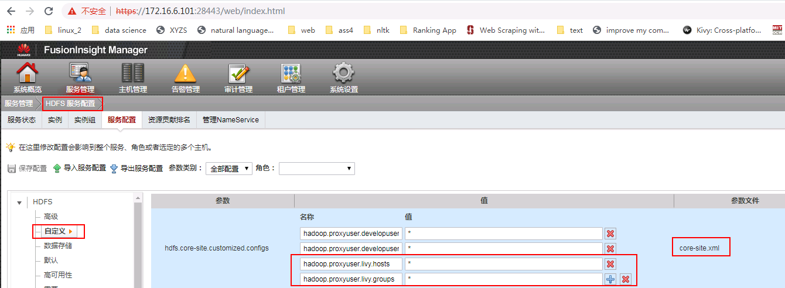

  

  完成后重启相关服务

### 客户端相关检查

- 使用curl -V命令检查客户端curl命令是否支持Kerberos Spnego

  

- 安装对接FI HD集群客户端

- 检查客户端时间与对接FI HD集群时间小于5分钟

### Livy服务端配置

- 安装对接FI HD集群客户端

- 检查Livy服务端时间与对接FI HD集群时间小于5分钟

- 检查livy.conf文件配置

  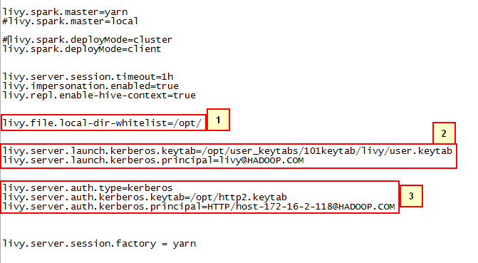

  需要特别注意的是：

  1. livy.file.local-dir-whitelist=/opt/ 配置参数是使用livy batch方式本地提交任务时，需要将本地路径打开白名单

  2. launch.kerberos相关参数为livy实际同FI HD集群交互所需要的配置

  3. auth.kerberos相关参数为livy对外使用kerberos进行访问管控所需要的配置

- 检查livy-client.conf文件配置

  

- 检查livy-env.sh文件配置

  

- 检查spark-blacklist.conf文件配置

  

- 在log4j.properties配置文件中增加如下一条来调整日志级别（可选）

  ```
  log4j.logger.org.eclipse.jetty=DEBUG
  ```

### 使用Livy session方式提交任务

livy session方式对应spark console交互方式，通过提交具体的代码的方式来提交，运行spark任务

- 登录livy服务端使用`bin/livy-server start`启动livy服务

  

  打开Livy端livy-root-server.out日志查看livy是否启动成功

  

- 登录客户端(172.16.2.119)使用 `kinit developuser` 输入密码获取票据

  


- 使用如下命令在livy中起一个pyspark的session

  `curl --negotiate -k -v -u developuser : -X POST --data '{"kind": "pyspark"}' -H "Content-Type: application/json" http://host-172-16-2-118:8998/sessions`

  


- 使用如下命令为session/0提交一段代码

  `curl --negotiate -k -v -u developuser : -X POST -H 'Content-Type: application/json' -d '{"code":"1 + 1"}' http://host-172-16-2-118:8998/sessions/0/statements`

  

- 使用如下命令查看结果：

  `curl --negotiate -k -v -u : http://host-172-16-2-118:8998/sessions/0/statements | python -m json.tool`

  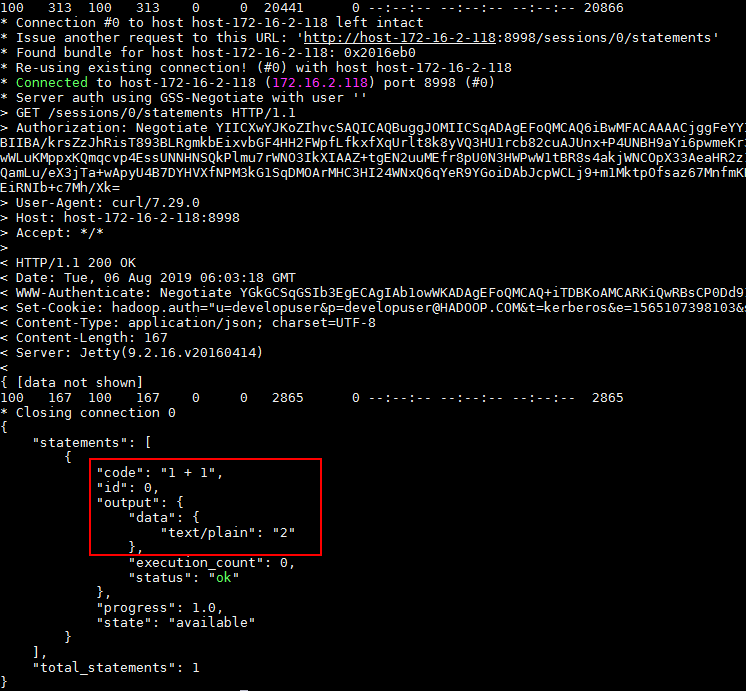

- 使用如下命令关闭session

  `curl --negotiate -k -v -u : http://host-172-16-2-118:8998/sessions/0 -X DELETE`

  

- 登录对接集群的yarn查看结果：

  

- 另外在客户端(172.16.2.119)完成curl命令提交任务之后可以使用klist查看票据信息：

  

  可以看到会增加认证票据HTTP/host-172-16-2-118@HADOOP.COM

### 使用Livy batch方式提交任务样例1

Livy batch方式对应spark-submit交互方式，通过提交一个编译好的jar包，或者是写好的py文件等来提交，运行spark任务

本样例为使用yarn client模式本地提交一个jar包计算pi值

- 登录客户端(172.16.2.119)使用 `kinit developuser` 输入密码获取票据，做过可不用再做

- 在FI HD客户端中找到测试jar包spark-examples_2.11-2.1.0.jar并传到livy服务端/opt/路径下

  

- 在客户端(172.16.2.119)使用如下命令提交spark任务

  `curl --negotiate -k -v -u developuser : -X POST --data '{"file": "file:/opt/spark-examples_2.11-2.1.0.jar", "className": "org.apache.spark.examples.SparkPi", "args": ["100"]}' -H "Content-Type: application/json" http://host-172-16-2-118:8998/batches`

  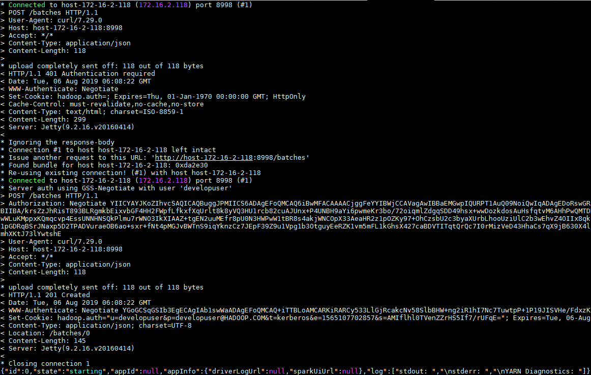

- 打开Livy端livy-root-server.out日志查看结果：

  

- 登录对接集群的yarn查看结果：

  

### 使用Livy batch方式提交任务样例2

本样例为使用yarn client模式本地提交一个py文件计算pi值

- 登录客户端(172.16.2.119)使用 `kinit developuser` 输入密码获取票据，做过可不用再做

- 创建py2.py文件，并上传至Livy服务端/opt/路径下，具体内容如下：

```
import sys
from random import random
from operator import add

from pyspark.sql import SparkSession


if __name__ == "__main__":
    """
        Usage: pi [partitions]
    """
    spark = SparkSession\
        .builder\
        .appName("PythonPi")\
        .getOrCreate()

    partitions = int(sys.argv[1]) if len(sys.argv) > 1 else 2
    n = 100000 * partitions

    def f(_):
        x = random() * 2 - 1
        y = random() * 2 - 1
        return 1 if x ** 2 + y ** 2 <= 1 else 0

    count = spark.sparkContext.parallelize(range(1, n + 1), partitions).map(f).reduce(add)
    print("Pi is roughly %f" % (4.0 * count / n))

    spark.stop()
```

  

- 在客户端(172.16.2.119)使用如下命令提交spark任务


  `curl --negotiate -k -v -u developuser : -X POST --data '{"file": "file:/opt/pi2.py" }' -H "Content-Type: application/json" http://host-172-16-2-118:8998/batches`


  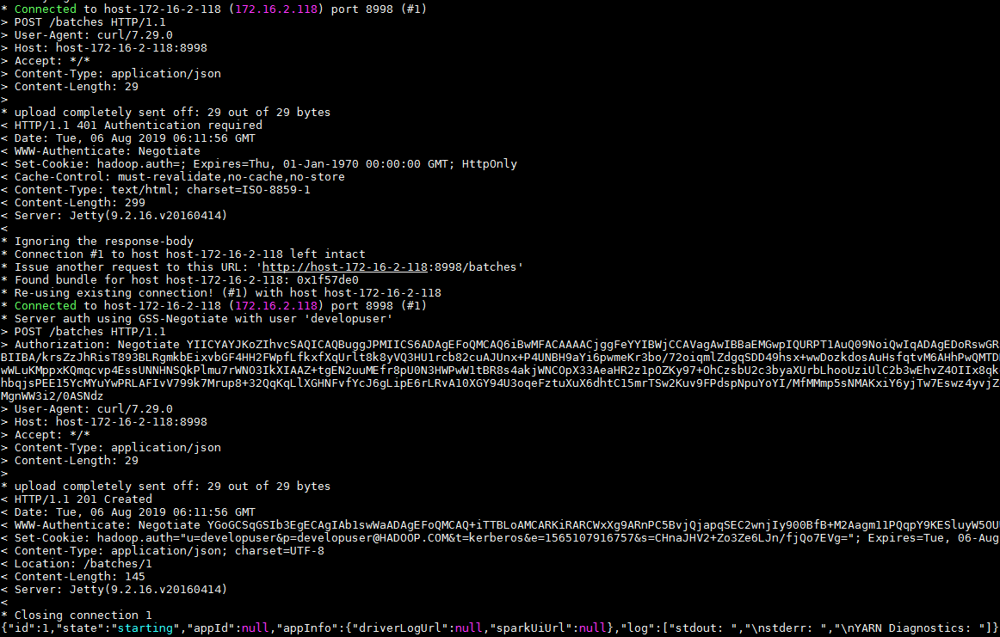

- 打开Livy端livy-root-server.out日志查看结果：

  

- 登录对接集群的yarn查看结果：

  

### 使用Livy batch方式提交任务样例3

本样例为使用yarn cluster模式在集群hdfs路径下提交jar包并运行，计算pi值

- 登录客户端(172.16.2.119)使用 `kinit developuser` 输入密码获取票据，做过可不用再做

- 修改livy.conf文件配置为：

  

- 在对接FI HD集群hdfs的/tmp路径下上传jar包

  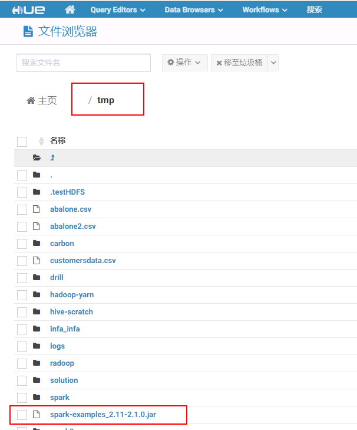

- 重启Livy

- 在客户端(172.16.2.119)使用如下命令提交spark任务


  `curl --negotiate -k -v -u developuser : -X POST --data '{"file": "/tmp/spark-examples_2.11-2.1.0.jar", "className": "org.apache.spark.examples.SparkPi", "args": ["100"]}' -H "Content-Type: application/json" http://host-172-16-2-118:8998/batches`


  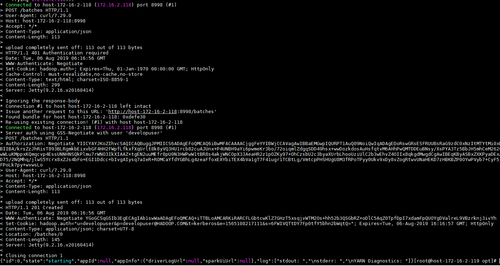

- 打开Livy端livy-root-server.out日志查看结果：

  

- 登录对接集群的yarn查看结果：

  

  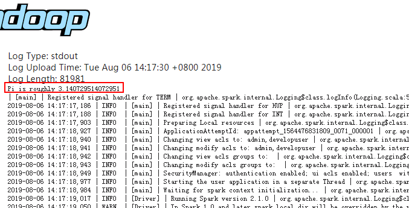

### 使用Livy batch方式提交任务样例4

本样例为使用yarn cluster模式在集群本地路径下提交jar包并运行，计算pi值

- 登录客户端(172.16.2.119)使用 `kinit developuser` 输入密码获取票据，做过可不用再做

- 因为使用yarn cluster本地提交jar包模式，事先并不知道worker在哪个集群节点，所以将jar包spark-examples_2.11-2.1.0.jar分别放到各集群节点的/home路径下：

  

  

  

- 在客户端(172.16.2.119)使用如下命令提交spark任务


  `curl --negotiate -k -v -u developuser : -X POST --data '{"file": "local:/home/spark-examples_2.11-2.1.0.jar", "className": "org.apache.spark.examples.SparkPi", "args": ["100"]}' -H "Content-Type: application/json" http://host-172-16-2-118:8998/batches`


  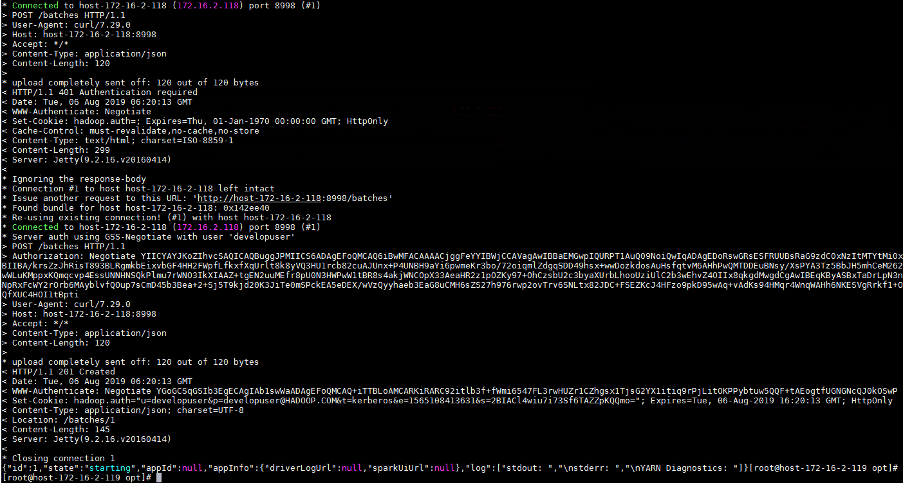

- 打开Livy端livy-root-server.out日志查看结果：

  

- 登录对接集群的yarn查看结果：

  

  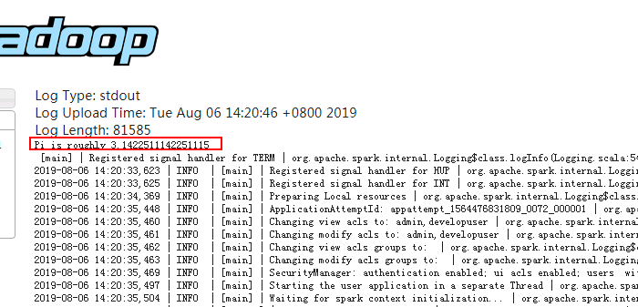

### Windows跳板机配置Kerberos Spnego访问livy web ui

Windows跳板机（172.16.2.111）访问Livy web ui的认证原理同上文客户端（172.16.2.119）使用curl命令访问Livy服务端，提交spark任务一样

- 参考产品文档 -> 应用开发指南 -> 安全模式 -> Spark2x开发指南 -> 环境准备 -> 准备HiveODBC开发环境 -> Windows环境 -> 操作步骤第1到第4步 完成MIT Kerberos的安装配置

  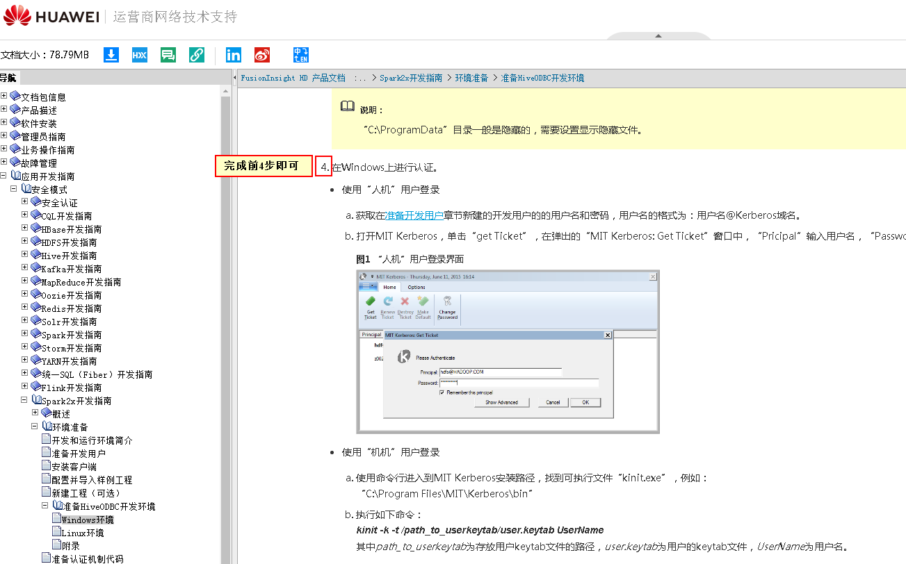

- 配置JCE

  到java官网上下载Java Cryptography Extension (JCE)，然后解压到%JAVA_HOME%/jre/lib/security中替换相应的文件。

  

- 检查livy服务端主机名是否加入hosts文件：

  

- 配置Firefox
  windows下Firefox需要通过访问about:config 页面调整以下参数：

  1. network.negotiate-auth.trusted-uris 允许使用gssapi链接验证的地址

  2. network.auth.use-sspi 关闭sspi验证协议

  

  

- 使用MIT Kerberos完成认证

  

- 登录Livy的web ui地址为http://host-172-16-2-118:8998/ui

  

- 使用之前一个样例提交任务并在Livy web ui检查

  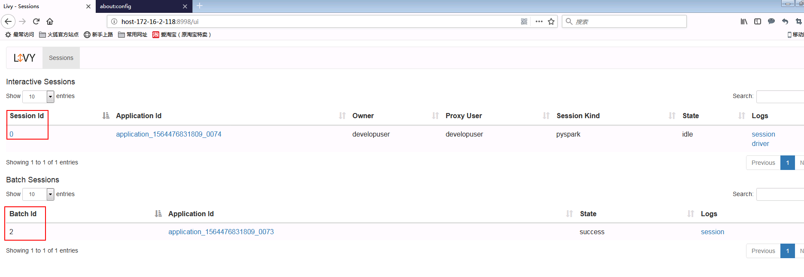

  

- 检查MIT Kerberos生成的服务票据

  
