# FusionInsight HD ES组件与周边生态对接


## 生态简介

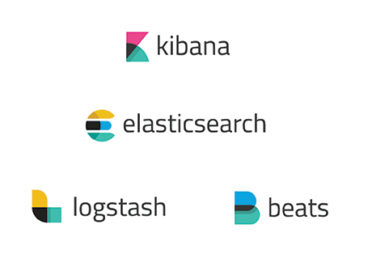

Kibana: 可扩展的用户界面，能够管理整个生态组件（elasticsearch, logstash, beats）以及数据

Elasticsearch: 兼有搜索引擎和NoSQL数据库功能的开源系统，基于JAVA/Lucene构建，开源、分布式、支持RESTful请求

Logstash: 开源的数据收集管道，能够同时从多个源头收集数据，传到Elasticsearch，能够和Elasticsearch产生协同效应

beats: 轻量级的数据搬运工，能够部署在服务器上将数据传输到Logstash或者Elasticsearch

elasticsearch-head: 用户界面，能够查询Elasticsearch中的数据

>注： FusionInsight HD的Elasticsearch组件支持安全模式，但是相关的周边生态Kibana，Logstash，beats， elasticseach-head为开源，暂时无法支持安全模式，故采用安全FI HD集群的非安全ES组件进行对接

# Logstash对接FusionInsight HD ES组件

## 适用场景

> Logstash 6.4.2 <--> FusionInsight HD V100R002C80SPC200 (ElasticSearch组件非安全模式)

## 前提条件

- 已完成FusionInsight HD和客户端的安装。
- FusionInsight HD包含ElasticSearch组件

## 操作步骤

- 登录FusionInsight Manager网页，检查ES组件是否为安全模式，如果是，修改配置使其为非安全模式，完成后点击保存配置重启elasticsearch服务：

  

- 下载logstash 6.4.2, 网址为：https://www.elastic.co/downloads/past-releases

  

- 将下载后的**logstash-6.4.2.zip**使用WinSCP导入主机的`/opt/logstash`路径下，使用`unzip logstash-6.4.2.zip`解压安装包

  

- 到路径`/opt/logstash/logstash-6.4.2/config`下创建一个新的配置文件`logstash-Simple.conf`,内容如下：

```
  # Sample Logstash configuration for creating a simple
  # Beats -> Logstash -> Elasticsearch pipeline.
  input{ stdin{ } }


  output {

    stdout{
      codec => dots {}
    }
    elasticsearch {
      hosts => ["http://172.21.3.101:24100"]
      index => "hellow_world"
      #user => "elastic"
      #password => "changeme"
    }
  }
```

- 到路径`/opt/logstash/logstash-6.4.2`下，执行命令`bin/logstash -f config/logstash-Simple.conf`根据之前的`logstash-Simple.conf`配置文件的内容来启动logstash, 然后在终端手动输入数字1到6：

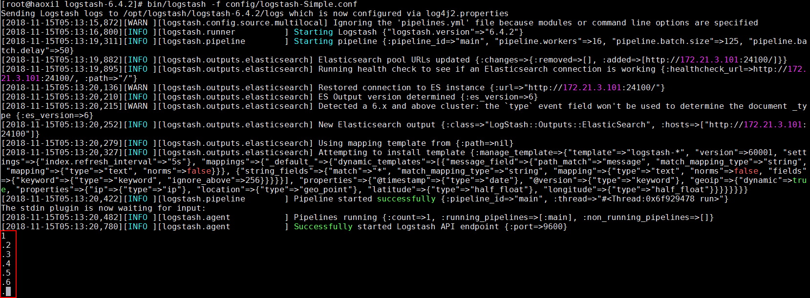

- 登录elasticsearch-head服务器查看结果（对接步骤参见后文）

  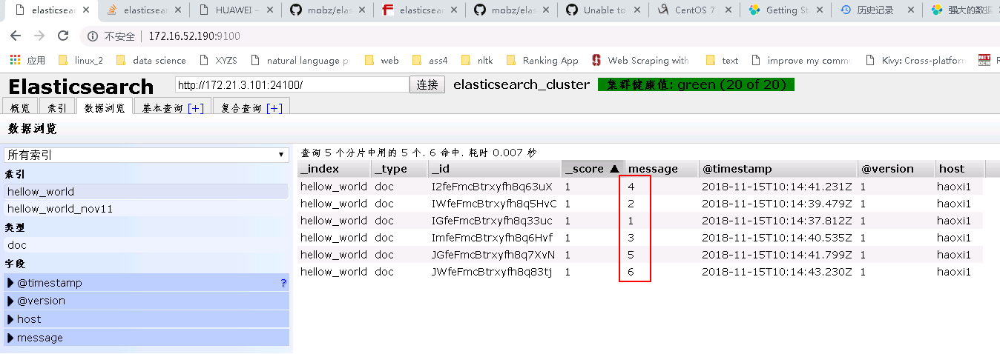


# Kibana对接FusionInsight HD ES组件

## 适用场景
> Kibana 6.1.3 <--> FusionInsight HD V100R002C80SPC200 (ElasticSearch组件非安全模式)

## 前提条件

- 已完成FusionInsight HD和客户端的安装。
- FusionInsight HD包含ElasticSearch组件

## 操作步骤

- 登录FusionInsight Manager网页，检查ES组件是否为安全模式，如果是，修改配置使其为非安全模式，完成后点击保存配置重启elasticsearch服务：

  

- 下载Kibana 6.1.3, 下载网址为：https://www.elastic.co/downloads/past-releases

  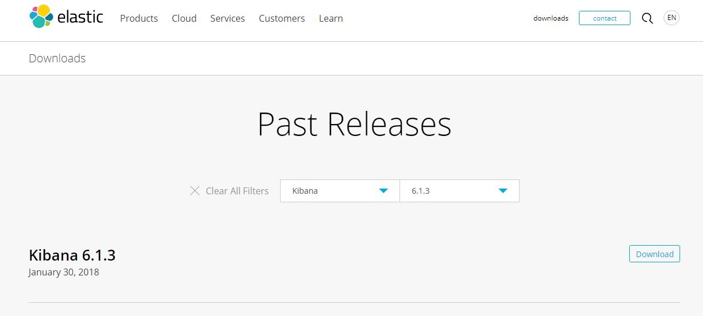

- 将下载后的**Kibana 6.1.3**使用WinSCP导入主机的`/opt`路径下，使用`tar -xzf kibana-6.1.3-linux-x86_64.tar.gz`解压安装包

  

- 使用`vi /opt/kibana-6.1.3-linux-x86_64/config/kibana.yml`添加如下配置选项:

  ```
  server.port: 5601
  server.host: "172.16.52.190"
  server.name: "LinuxTest"
  elasticsearch.url: "http://172.21.3.101:24100"
  ```

  

- 使用`bin/kibana`启动kibana

  


- 访问kibana登录界面，访问地址格式为http://Kibana服务IP地址:5601

  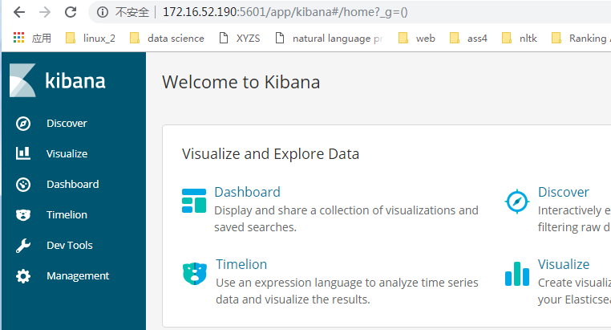

  选择**Dev Tools**

  使用`GET _cat/indices`命令查看集群ES中的indices

  

  使用`GET hellow_world/_search`命令查看结果

  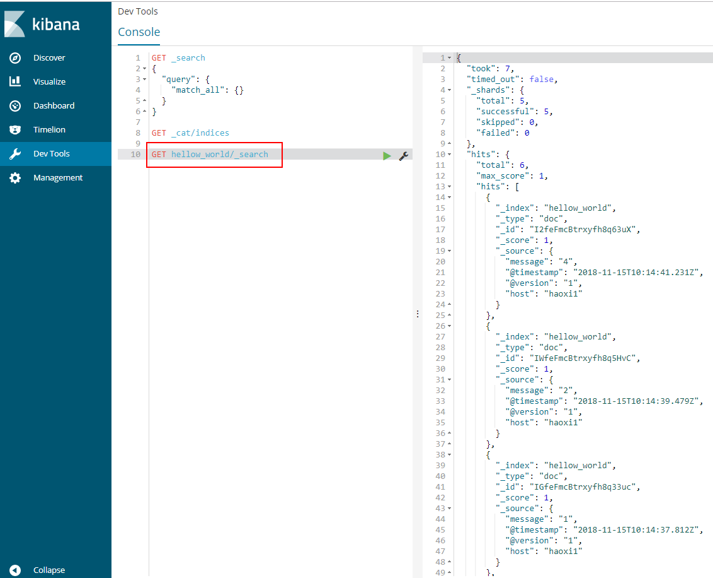

# elasticsearch-head对接FusionInsight HD ES组件

## 适用场景

> elasticsearch-head <--> FusionInsight HD V100R002C80SPC200 (ElasticSearch组件非安全模式)

## 前提条件

- 已完成FusionInsight HD和客户端的安装
- FusionInsight HD包含ElasticSearch组件

## 操作步骤

- 登录FusionInsight Manager网页，检查ES组件是否为安全模式，如果是，修改配置使其为非安全模式，完成后点击保存配置重启elasticsearch服务：

  

- 在FusionInsight Manager，选择服务管理->Elasticsearch服务配置->服务配置(选择全部配置)->自定义，在elasticsearch.yml文件中添加下面两个配置项，完成后点击保存配置重启elasticsearch服务

  ```
  http.cors.enabled = true
  http.cors.allow-origin = "*"
  ```

  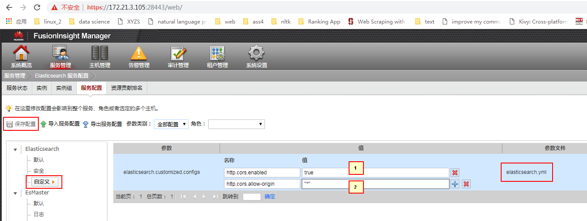

- 使用如下命令下载并且安装**elasticsearch-head**到主机上,并且启动**elasticsearch-head**服务

  ```
  git clone git://github.com/mobz/elasticsearch-head.git
  cd elasticsearch-head
  npm install
  npm run start
  ```

  

- 访问elasticsearch-head界面，访问地址为http://elasticsearch-head服务IP地址:9100, 输入连接信息为`http://172.21.3.101:24100/`,点击连接:

  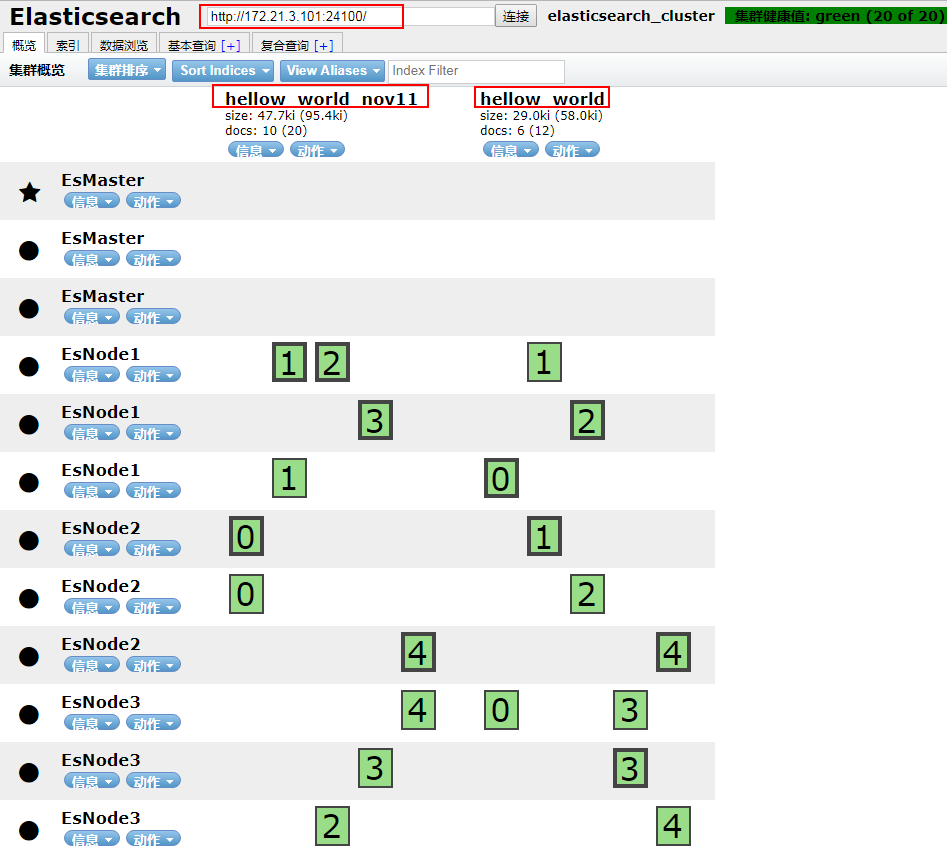

- 查看结果

  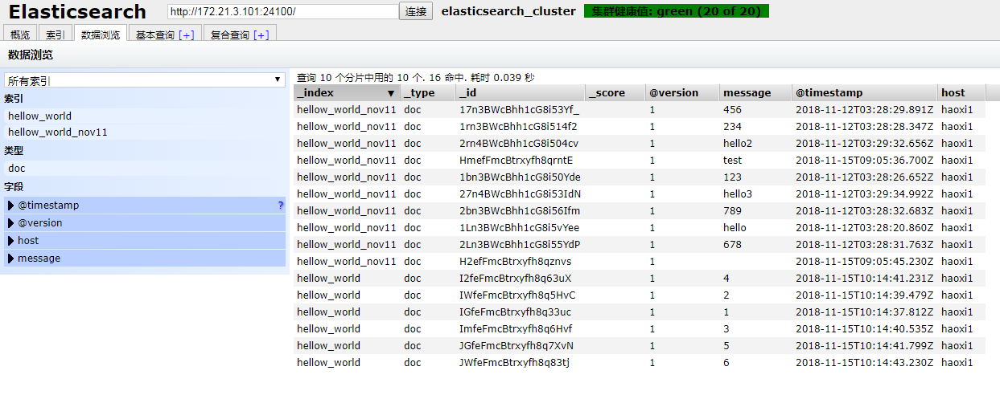


# 在FI HD集群上部署beats

## 适用场景
> filebeat-6.5.1 <--> FusionInsight HD V100R002C80SPC200

## 前提条件

- 已完成FusionInsight HD和客户端的安装。

## 操作步骤

- 下载Filebeat 6.5.1, 下载网址为：https://www.elastic.co/downloads/past-releases

  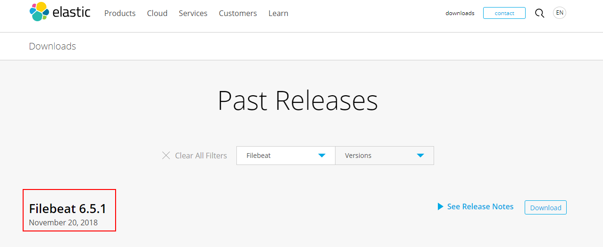

- 将下载后的**Filebeat 6.5.1**使用WinSCP导入FI HD集群节点（172.21.3.103）的`/opt`路径下，使用`tar -xzf filebeat-6.5.1-linux-x86_64.tar.gz`解压安装包

  

- 使用`cd /opt/filebeat-6.5.1-linux-x86_64`进入filebeat安装路径，新建一个配置文件`filebeat_new.yml`,内容如下：

  ```
  filebeat.prospectors:
  - type: log

    enabled: true

    # Paths that should be crawled and fetched. Glob based paths.
    paths:
      - /var/log/Bigdata/zookeeper/quorumpeer/zookeeper-omm-server-host3.log

  path.home: /opt/filebeat-6.5.1-linux-x86_64
  path.config: ${path.home}

  setup.kibana:
    host: "172.16.52.190:5601"

  setup.template.settings:
    index.number_of_shards: 3

  output.logstash:
    hosts: ["172.16.52.190:5046"]
  ```
  注：端口5046可以自己指定，不冲突即可

- 使用命令`./filebeat -e -c filebeat_new.yml`启动filebeat

  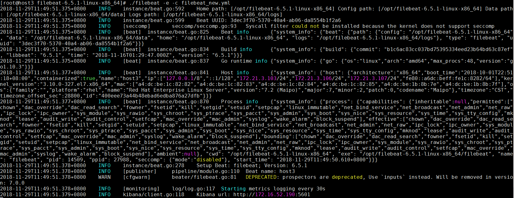

# 应用场景举例说明

## 场景简介


分别在FI HD两个节点上部署filebeat实时获取两台服务器的的日志文件（/var/log/ipmitool.fi.log），通过logstash管道获取并过滤元日志文件为多个字段，并传到FI HD Elasticsearch组件上，最后通过Kibana来查看获取的日志文件


## 前提条件

- 已完成FusionInsight HD和客户端的安装
- FusionInsight HD包含ElasticSearch组件
- 已了解和完成Kibana的安装
- 已了解和完成logstash的安装
- 已了解和完成filebeat的安装


## 操作步骤

- 首先登陆FusionInsight HD集群节点172.21.3.102和172.21.3.103上


- 参考之前的步骤分别部署filebeat到172.21.3.102和172.21.3.103上，并且对应的创建filebeat配置文件`filebeat_new_host2.yml`内容如下：

  ```
  filebeat.prospectors:
  - type: log

    enabled: true

    # Paths that should be crawled and fetched. Glob based paths.
    paths:
      - /var/log/ipmitool*

  path.home: /opt/filebeat-6.5.1-linux-x86_64
  path.config: ${path.home}

  setup.kibana:
    host: "172.16.52.190:5601"

  setup.template.settings:
    index.number_of_shards: 3

  output.logstash:
    hosts: ["172.16.52.190:5045"]
  ```

  配置文件`filebeat_new_host3.yml`内容如下：

  ```
  filebeat.prospectors:
  - type: log

    enabled: true

    # Paths that should be crawled and fetched. Glob based paths.
    paths:
      - /var/log/ipmitool*

  path.home: /opt/filebeat-6.5.1-linux-x86_64
  path.config: ${path.home}

  setup.kibana:
    host: "172.16.52.190:5601"

  setup.template.settings:
    index.number_of_shards: 3

  output.logstash:
    hosts: ["172.16.52.190:5047"]
  ```

- 登陆安装logstash的主机，配置一个新的启动文件`logstash-beats-ipmitool.conf`内容如下：

  ```
  # Sample Logstash configuration for creating a simple
  # Beats -> Logstash -> Elasticsearch pipeline.

  input{
      beats{
         port => "5045"
      }
      beats{
         port => "5047"
      }
   }

  filter{
     grok{
       match =>{"message" => "(?<object>[A-Za-z0-9$.+!*'(){},~@#%&/=:;_?\-\[\]<> ]+)\|(?<object2>[A-Za-z0-9$.+!*'(){},~@#%&/=:;_?\-\[\]<> ]+)\|(?<status>[A-Za-z0-9$.+!*'(){},~@#%&/=:;_?\-\[\]<> ]+)\|(?<number>[A-Za-z0-9$.+!*'(){},~@#%&/=:;_?\-\[\]<> ]+)\|%{GREEDYDATA:additional_info}"}
     }
  }

  output{
    stdout{
      codec => dots {}
    }
    elasticsearch {
      hosts => ["http://172.21.3.101:24100"]
      index => "ipmitool_log"
    }
  }
  ```

- 启动kibana

  

- 使用命令`bin/logstash -f config/logstash-beats-ipmitool.conf`配置文件的内容来启动logstash

- 分别启动172.21.3.102和172.21.3.103上的filebeat来获取日志文件

- 登陆kibana网页界面，选择**Management**下面的**Index Patterns**

  

  在**Create index pattern**下选择刚刚由logstash传输创建的index **ipmitool_log**， 点击 Next step

  

  在step 2中选择**@timestamp**, 点击**Create index pattern**

  

- 在 **Discover** 部分选择刚刚生成的index pattern **ipmitool_log** 可以看到整个日志的情况

  

  可根据不同的字段情况来整体了解日志情况

  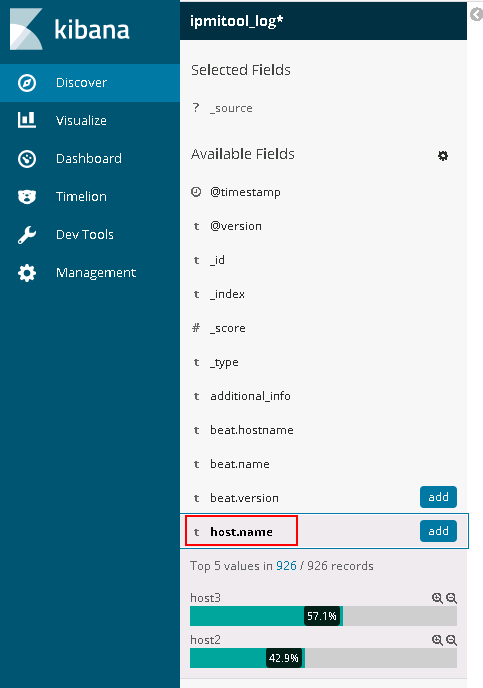

  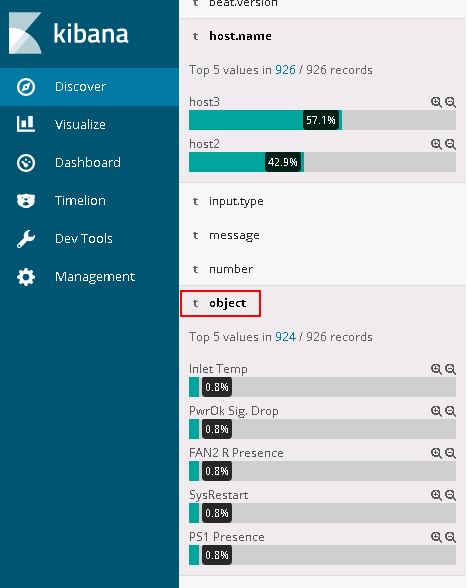

- 完成
