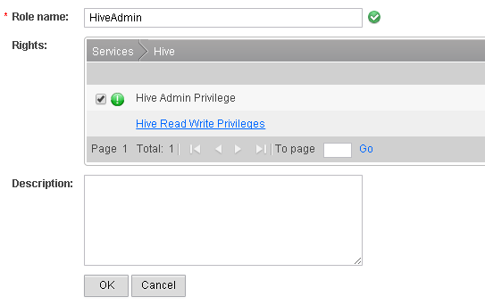
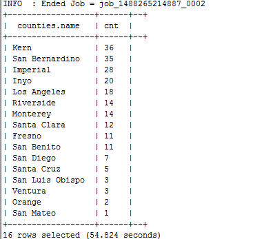
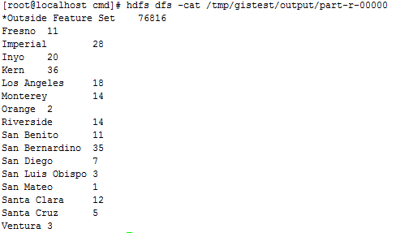

# GIS Tools for Hadoop对接FusionInsight

## 适用场景

> GIS Tools for Hadoop <-> FusionInsight HD V100R002C60U20

## aggregation-hive

参考GIS说明<https://github.com/Esri/gis-tools-for-hadoop/tree/master/samples/point-in-polygon-aggregation-hive>中关于集成Hive的示例，在华为FusionInsight HD中执行该示例。

* 获取gis源代码https://github.com/Esri/gis-tools-for-hadoop/

* 完成FusionInsight HD V100R002C60U20的安装，包含Hive组件。

* 在FusionInsight Manager创建一个HiveAdmin角色，具体请参加《FusionInsight HD 管理员指南》的 **创建Hive角色** 章节。

  

* 在FusionInsight Manager创建一个“机机”用户，具体请参见《FusionInsight HD 管理员指南》的创建用户章节。将用户加入上面创建的角色HiveAdmin。例如，创建用户 testuser 并下载对应的keytab文件user.keytab以及krb5.conf文件

* 安装FusionInsight HD的客户端，具体请参见《FusionInsight HD 管理员指南》的安装和使用客户端章节。

* 将下载的gis tools源码通过WinSCP工具上传到安装有FusionInsight HD客户端所在节点的`/opt`目录下，上传源码目录为gis-tools-for-hadoop-master

* 将下载的gis tools源码通过FusionInsight HD的客户端上传到HDFS文件系统中，将目录gis-tools-for-hadoop-master直接放到HDFS的根目录下，命令参考

  ```shell
  source /opt/hadoopclient/bigdata_env
  kinit -k -t /opt/user.keytab testuser
  hadoop fs -put -f /opt/gis-tools-for-hadoop-master /gis-tools-for-hadoop-master
  ```

* 修改执行hive示例的sql文件，修改后的文件如下

  ```sql
  set role admin;

  add jar hdfs:///gis-tools-for-hadoop-master/samples/lib/esri-geometry-api.jar;
  add jar hdfs:///gis-tools-for-hadoop-master/samples/lib/spatial-sdk-hadoop.jar;

  reload function;
  DROP TABLE earthquakes;
  DROP TABLE counties;

  create temporary function ST_Point as 'com.esri.hadoop.hive.ST_Point';
  create temporary function ST_Contains as 'com.esri.hadoop.hive.ST_Contains';

  CREATE EXTERNAL TABLE IF NOT EXISTS earthquakes (
    earthquake_date STRING,
    latitude DOUBLE,
    longitude DOUBLE,
    depth DOUBLE,
    magnitude DOUBLE,
    magtype string,
    mbstations string,
    gap string,
    distance string,
    rms string,
    source string,
    eventid string
  )
  ROW FORMAT DELIMITED FIELDS TERMINATED BY ','
  STORED AS TEXTFILE
  LOCATION 'hdfs:///gis-tools-for-hadoop-master/samples/data/earthquake-data';

  CREATE EXTERNAL TABLE IF NOT EXISTS counties (
    Area string,
    Perimeter string,
    State string,
    County string,
    Name string,
    BoundaryShape binary
  )                                         
  ROW FORMAT SERDE 'com.esri.hadoop.hive.serde.JsonSerde'              
  STORED AS INPUTFORMAT 'com.esri.json.hadoop.EnclosedJsonInputFormat'
  OUTPUTFORMAT 'org.apache.hadoop.hive.ql.io.HiveIgnoreKeyTextOutputFormat'
  LOCATION 'hdfs:///gis-tools-for-hadoop-master/samples/data/counties-data';

  SELECT counties.name, count(*) cnt FROM counties
  JOIN earthquakes
  WHERE ST_Contains(counties.boundaryshape, ST_Point(earthquakes.longitude, earthquakes.latitude))
  GROUP BY counties.name
  ORDER BY cnt desc;
  ```

* 使用FusionInsight HD客户端执行修改后的sql文件，命令参考

  ```shell
  source /opt/hadoopclient/bigdata_env
  kinit -k -t /opt/user.keytab testuser
  cd /opt
  beeline -f gis-tools-for-hadoop-master/samples/point-in-polygon-aggregation-hive/run-sample.sql
  ```

* 执行结果如下，与GIS开源网站描述一致

  

## aggregation-mr

参考GIS说明<https://github.com/Esri/gis-tools-for-hadoop/tree/master/samples/point-in-polygon-aggregation-mr>中关于集成MR的示例，在华为FusionInsight HD中执行该示例。

* 获取gis源代码https://github.com/Esri/gis-tools-for-hadoop/

* 完成FusionInsight HD V100R002C60U20的安装，包含Hive组件。

* 在FusionInsight Manager创建一个“机机”用户，具体请参见《FusionInsight HD 管理员指南》的创建用户章节。将用户加入上面创建的角色HiveAdmin。例如，创建用户“testuser”并下载对应的keytab文件user.keytab以及krb5.conf文件

* 安装FusionInsight HD的客户端，具体请参见《FusionInsight HD 管理员指南》的安装和使用客户端章节。

* 将下载的gis tools源码通过WinSCP工具上传到安装有FusionInsight HD客户端所在节点的`/opt`目录下，上传源码目录为gis-tools-for-hadoop-master

* 修改`/opt/gis-tools-for-hadoop-master/samples/point-in-polygon-aggregation-mr/cmd/sample-config.sh`如下，其中26004为yarn配置的yarn.resourcemanager.port端口

  ```bash
  #!/bin/bash

  NAME_NODE_URL=hdfs://hacluster
  JOB_TRACKER_URL=162.1.93.103:26004
  SAMPLE_DIR=/tmp/gistest

  JOB_DIR=$SAMPLE_DIR/job
  LIB_DIR=$SAMPLE_DIR/lib
  DATA_DIR=$SAMPLE_DIR/data
  OUTPUT_DIR=$SAMPLE_DIR/output
  ```

* 修改`/opt/gis-tools-for-hadoop-master/samples/point-in-polygon-aggregation-mr/cmd/run-sample.sh`的执行权限，并执行

  ```shell
  source /opt/hadoopclient/bigdata_env
  kinit -k -t /opt/user.keytab testuser
  cd /opt/gis-tools-for-hadoop-master/samples/point-in-polygon-aggregation-mr/cmd/
  chmod u+x run-sample.sh
  sh run-sample.sh
  ```

* 执行完毕得到如下结果文件result.txt

  
