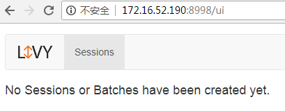
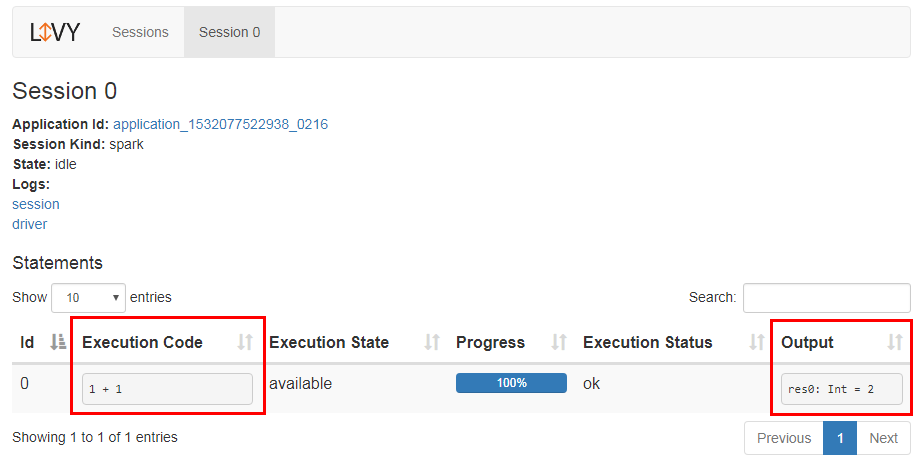
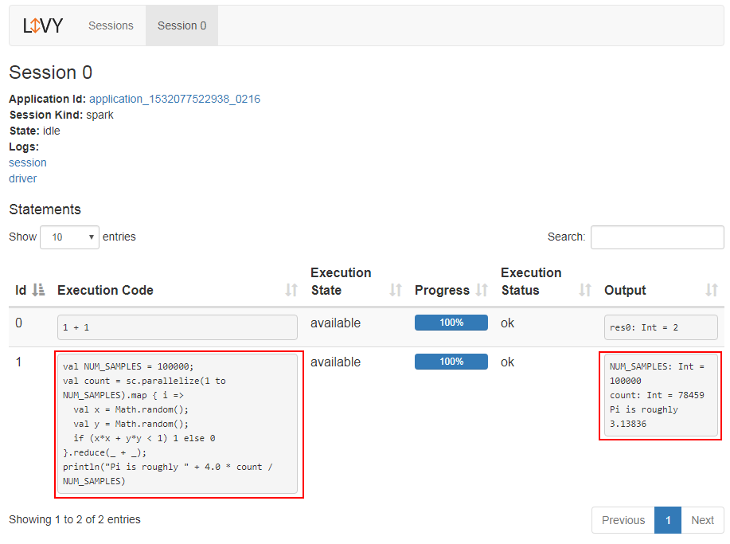
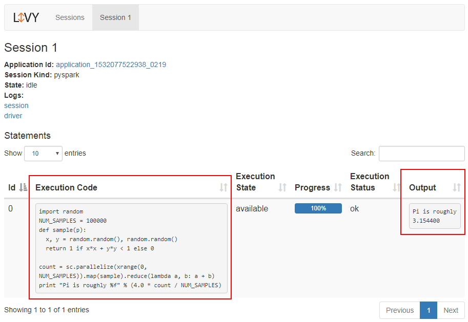
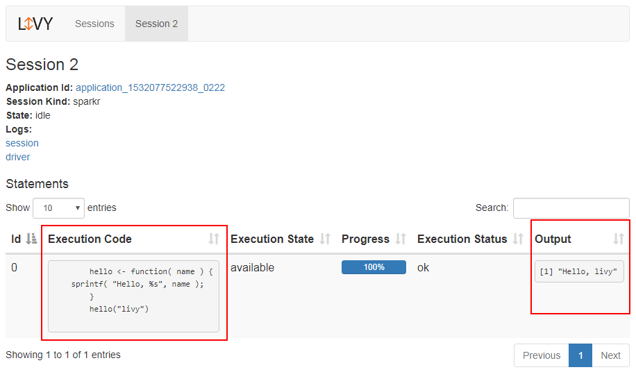

# Apache Livy对接FusionInsight

## 适用场景

> Apache Livy 0.5.0-incubating <--> FusionInsight HD V100R002C80SPC200 (Spark2.x)

## 安装Livy

###操作场景

安装 Apache Livy 0.5.0

###前提条件

- 已完成FusionInsight HD和客户端的安装。

### 操作步骤

- 安装Apache Livy 0.5.0-incubating，在网址`https://livy.incubator.apache.org/download/`下载安装包，使用WinSCP导入主机并用`unzip livy-0.5.0-incubating-bin.zip`解压生成livy-0.5.0-incubating-bin目录

  


- 执行source命令到客户端，获取java配置信息
  ```
  source /opt/hadoopclient/bigdata_env
  echo $JAVA_HOME
  ```

  


- 根据产品文档创建用户developuser，并赋予足够权限，下载用户developuser的keytab文件user.keytab，上传至`/opt/developuser`目录下

- 在`/usr/livy/livy-0.5.0-incubating-bin/conf`路径下新建livy的认证文件jaas.conf，内容如下:
  ```
  Client {
  com.sun.security.auth.module.Krb5LoginModule required
  useKeyTab=true
  keyTab="/opt/developuser/user.keytab"
  principal="developuser"
  useTicketCache=false
  storeKey=true
  debug=true;
  };
  ```
  > 其中用户为在FusionInsight Manager中创建的developuser用户，将developuser的keytab文件user.key放在/opt/developuser/目录下

- 配置Livy环境变量，在profile文件中加入如下变量
  ```
  vi /etc/profile
  export LIVY_HOME=/usr/livy/livy-0.5.0-incubating-bin
  export PATH=$LIVY_HOME/bin:$PATH  

  ```

- 编辑livy.conf文件，位置`/usr/livy/livy-0.5.0-incubating-bin/conf`

  ```
  cd /usr/livy/livy-0.5.0-incubating-bin/conf
  cp livy.conf.template livy.conf
  vi livy.conf

  ```

  加入如下内容：
  ```
  livy.spark.master = yarn
  livy.spark.deploy-mode = client
  livy.server.session.timeout = 1h
  livy.impersonation.enabled = true
  livy.repl.enable-hive-context = true
  #livy.server.auth.type = kerberos
  livy.server.auth.kerberos.keytab=/opt/developuser/user.keytab
  livy.server.auth.kerberos.principal=developuser@HADOOP.COM
  livy.server.launch.kerberos.keytab=/opt/developuser/user.keytab
  livy.server.launch.kerberos.principal=developuser@HADOOP.COM

  ```

- 编辑livy-client.conf文件，位置`/usr/livy/livy-0.5.0-incubating-bin/conf`

  ```
  cd /usr/livy/livy-0.5.0-incubating-bin/conf
  cp livy-client.conf.template livy-client.conf
  vi livy-client.conf
  ```

  加入如本机ip地址：
  ```
  livy.rsc.rpc.server.address =172.16.52.190

  ```
- 编辑livy-env.sh文件，位置`/usr/livy/livy-0.5.0-incubating-bin/conf`

  ```
  cd /usr/livy/livy-0.5.0-incubating-bin/conf
  cp livy-env.sh.template livy-env.sh
  vi livy-env.sh

  ```
  加入如下内容：
  ```
  export JAVA_HOME=/opt/hadoopclient/JDK/jdk1.8.0_162
  export SPARK_HOME=/opt/hadoopclient/Spark2x/spark
  export SPARK_CONF_DIR=/opt/hadoopclient/Spark2x/spark/conf
  export HADOOP_CONF_DIR=/opt/hadoopclient/HDFS/hadoop/etc/hadoop
  export LIVY_SERVER_JAVA_OPTS="-Djava.security.krb5.conf=/opt/developuser/krb5.conf -Djava.security.auth.login.config=/usr/livy/livy-0.5.0-incubating-bin/conf/jaas.conf -Dzookeeper.server.principal=zookeeper/hadoop.hadoop.com -Dzookeeper.request.timeout=12000"
  export SPARK_LOCAL_IP=172.16.52.190
  ```

- 编辑spark-blacklist.conf文件，位置`/usr/livy/livy-0.5.0-incubating-bin/conf`
  ```
  cd /usr/livy/livy-0.5.0-incubating-bin/conf
  cp spark-blacklist.conf.template spark-blacklist.conf
  vi spark-blacklist.conf
  ```

  注销掉如下内容：
  ```
  spark.master
  spark.submit.deployMode
  ```

  

- 启动和停止Livy，在路径`/usr/livy/livy-0.5.0-incubating-bin`下

  ```
  bin/livy-server start

  ```

  

  启动成功后可以在http://172.16.52.190:8998访问到Livy服务器：

  


## 测试运行Livy样例代码

###操作场景

测试运行Livy样例代码，包括Spark Shell，PySpark，SparkR

样例代码参考网址`https://livy.incubator.apache.org/examples/`

###前提条件

- 已完成FusionInsight HD和客户端的安装。
- 已完成Anaconda和R在客户端主机上的安装。

>若没有安装Anaconda和R，请参考Zeppelin0.8.0对接FusionInsight HD V100R002C80SPC200 (Spark2.x)指导文档中连接Spark和SparkR部分相关内容

### 运行Spark样例操作步骤
- 输入命令`python`启动Anaconda

  

- 输入如下python代码启动一个Livy session
  ```
  import json, pprint, requests, textwrap
  host = 'http://172.16.52.190:8998'
  data = {'kind': 'spark'}
  headers = {'Content-Type': 'application/json'}
  r = requests.post(host + '/sessions', data=json.dumps(data), headers=headers)
  ```

  

  

- 当一个session完成启动后， 它将会变为闲置状态
  ```
  session_url = host + r.headers['location']
  r = requests.get(session_url, headers=headers)
  r.json()
  ```

  

- 下面通过传递一个简单JSON命令行的方式来执行Scala
  ```
  statements_url = session_url + '/statements'
  data = {'code': '1 + 1'}
  r = requests.post(statements_url, data=json.dumps(data), headers=headers)
  r.json()
  statement_url = host + r.headers['location']
  r = requests.get(statement_url, headers=headers)
  pprint.pprint(r.json())
  ```

  可以在Session0状态栏看到之前运行的样例代码以及结果

  

  也可以在终端看到以JSON格式返回的结果

  

- 更新Scala再次运行
  ```
  data = {
    'code': textwrap.dedent("""
      val NUM_SAMPLES = 100000;
      val count = sc.parallelize(1 to NUM_SAMPLES).map { i =>
        val x = Math.random();
        val y = Math.random();
        if (x*x + y*y < 1) 1 else 0
      }.reduce(_ + _);
      println(\"Pi is roughly \" + 4.0 * count / NUM_SAMPLES)
      """)
  }

  r = requests.post(statements_url, data=json.dumps(data), headers=headers)
  pprint.pprint(r.json())

  statement_url = host + r.headers['location']
  r = requests.get(statement_url, headers=headers)
  pprint.pprint(r.json())
  ```

  可以在Session0状态栏看到之前运行的样例代码以及结果

  

- 关闭session0
  ```
  session_url = 'http://172.16.52.190:8998/sessions/0'
  requests.delete(session_url, headers=headers)
  ```

### 运行PySpark样例操作步骤

- 继续接着上面的步骤，更改类型为pyspark
  ```
  data = {'kind': 'pyspark'}
  r = requests.post(host + '/sessions', data=json.dumps(data), headers=headers)
  r.json()
  ```
  可以在Session状态栏看到新启动的Session1

  

- 通过传递JSON命令的方式执行Python样例代码，注意要更改statements_url
  ```
  data = {
    'code': textwrap.dedent("""
      import random
      NUM_SAMPLES = 100000
      def sample(p):
        x, y = random.random(), random.random()
        return 1 if x*x + y*y < 1 else 0

      count = sc.parallelize(xrange(0, NUM_SAMPLES)).map(sample).reduce(lambda a, b: a + b)
      print "Pi is roughly %f" % (4.0 * count / NUM_SAMPLES)
      """)
  }
  statements_url = 'http://172.16.52.190:8998/sessions/1/statements'
  r = requests.post(statements_url, data=json.dumps(data), headers=headers)
  pprint.pprint(r.json())
  ```

  可以在Session1状态栏看到之前运行的样例代码以及结果

  

- 关闭session1
  ```
  session_url = 'http://172.16.52.190:8998/sessions/1'
  requests.delete(session_url, headers=headers)
  ```

### 运行SparkR样例操作步骤

- 继续接着上面的步骤，更改类型为sparkr
  ```
  data = {'kind': 'sparkr'}
  r = requests.post(host + '/sessions', data=json.dumps(data), headers=headers)
  r.json()
  ```  

  可以在Session状态栏看到新启动的Session2

  

- 通过传递JSON命令的方式执行R样例代码，注意要更改statements_url
  ```
  data = {
    'code': textwrap.dedent("""
  	hello <- function( name ) {
      sprintf( "Hello, %s", name );
  	}
  	hello("livy")

      """)
  }
  statements_url = 'http://172.16.52.190:8998/sessions/2/statements'
  r = requests.post(statements_url, data=json.dumps(data), headers=headers)
  pprint.pprint(r.json())
  ```

  可以在Session2状态栏看到之前运行的样例代码以及结果

  

- 关闭session2
  ```
  session_url = 'http://172.16.52.190:8998/sessions/2'
  requests.delete(session_url, headers=headers)
  ```
